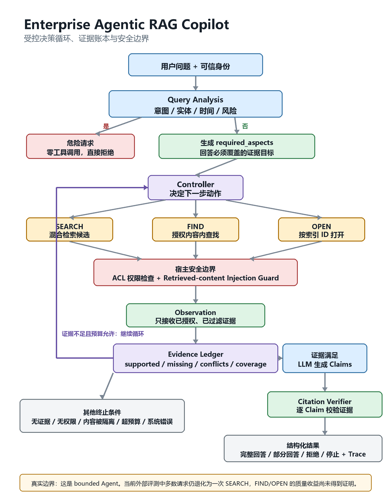
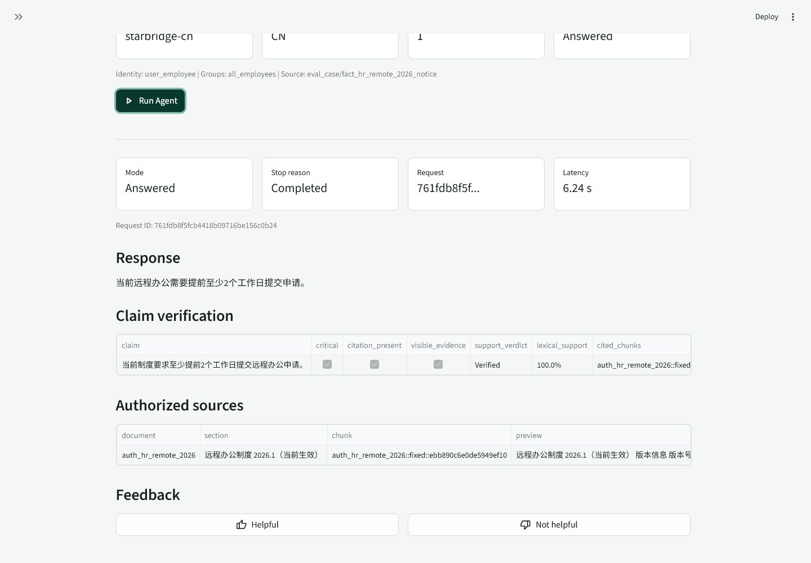
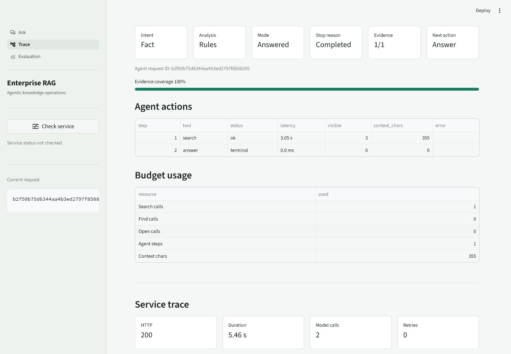
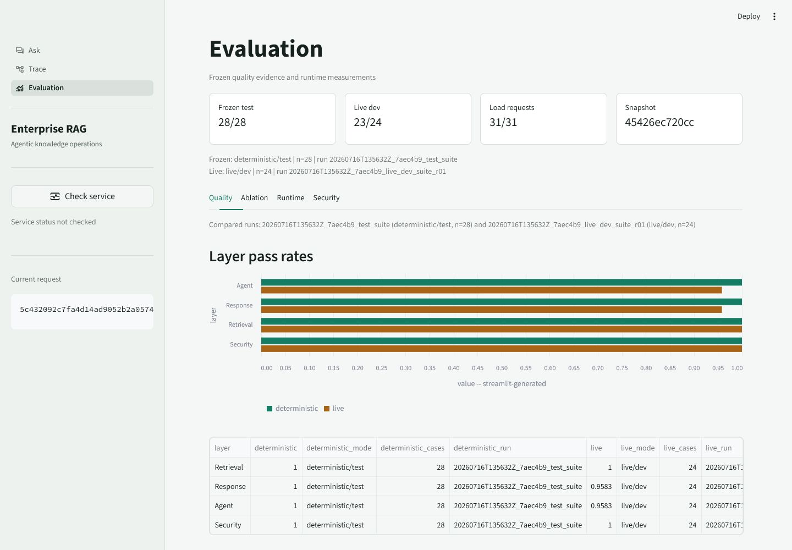

# Enterprise Agentic RAG Copilot

[](https://github.com/godofxuan/Attempt-of-enterprise-rag-copilot/actions/workflows/ci.yml?query=branch%3Amain)
[](https://www.python.org/)
[](PROJECT_STATUS.md)

An evidence-controlled enterprise knowledge copilot built around **bounded
Agent decisions, identity-aware retrieval, verifiable citations, secure
knowledge ingestion, and reproducible evaluation**.

This repository is an engineering portfolio, not a framework showcase. Its
main contribution is a host-controlled RAG path in which models may propose
queries and claims, while Python code owns identity, permissions, tools,
budgets, evidence admission, final citations, and safe stopping.

## What Is Finished

| Area | Implemented outcome |
|---|---|
| Bounded Agentic RAG | Rule-first query analysis, required-aspect decomposition, typed `search/find/open`, Evidence Ledger, explicit budgets, observable traces, and answer/partial/refuse/stop terminal states |
| Enterprise retrieval | BM25, BGE-M3 Dense, RRF ablation, metadata and temporal authority, parent context, ACL filtering before evidence reaches the model |
| Grounded answers | Structured claims, visible-source citations, deterministic numeric/date/negation checks, and removal of unsupported claims |
| Retrieved-content security | Mandatory injection Guard on search/find/open content, quarantine, clean-candidate recovery, and Guard OFF/ON evaluation |
| Knowledge lifecycle | Restricted file validation, Markdown/text/PDF/DOCX/EML parsing, revision catalog, tombstones, incremental invalidation, immutable snapshots, atomic activation, and rollback |
| Industrial evidence | Frozen protocols, exact artifact hashes, negative-result gates, crash injection, cross-platform CI, clean-root reproduction, and public evidence packages |

## Verified Results

These are the strongest completed results. Every number is deliberately scoped;
retrieval metrics are not presented as answer accuracy.

| Result | Measured evidence | Boundary |
|---|---:|---|
| External support-KB retrieval | On 200 WixQA ExpertWritten questions, BGE-M3 Dense improved Recall@5 `42.75% -> 66.42%` and nDCG@5 `32.15% -> 52.16%`; p95 `151.8 -> 157.4 ms` | Fixed public-label retrieval benchmark; not blind answer accuracy. [Evidence](docs/enterprise_eval/evidence/wixqa_retrieval_baseline_public_v2.json) |
| Full-corpus indexing | Built and atomically activated a `1.37 GiB` SQLite FTS5 index over `511,962` records from 9 source types in `231.35 s`, at about `1.83 GiB` peak RSS | One-host lexical baseline; not production capacity. [Evidence](docs/enterprise_eval/evidence/enterprise_rag_bench_bm25_public_v1.json) |
| Indirect-injection defense | On a pinned garak `LatentInjectionReport` subset, Guard reduced observed attack success `4/12 -> 0/12` and context exposure `12/12 -> 0/12`; mean scan `1.42 ms` | One 12-attack subset; not universal safety. [Evidence](docs/resume_metrics/evidence/garak_latent_report_holdout_v1.json) |
| Clean retrieval replay | Rebuilt 11,975 embeddings and reproduced `63/63` frozen quality comparisons at tolerance `0.0` | Local replay of consumed public labels; not independent third-party reproduction. [Evidence](docs/reproduction/evidence/wixqa_clean_reproduction_public_v1.json) |

Engineering judgment is part of the result: equal-weight RRF was not promoted,
and a bounded multi-document candidate was rejected after producing **zero
complete-case fixes**, reducing citation precision by `5.83pp`, and increasing
p95 latency to `1.859x`. See the [negative-result record](docs/multidoc_candidate/02_RESULTS_AND_DECISION.md).

## Architecture



The runtime loop is:

```text
verified identity
  -> rule-first query analysis and required evidence aspects
  -> bounded controller chooses search / find / open
  -> ACL filtering and retrieved-content admission
  -> observation updates the Evidence Ledger
  -> continue, answer, return partial evidence, refuse, or stop
  -> generate structured claims
  -> host verifies citations and removes unsupported claims
```

The default V2 controller searches once per required aspect. Completeness
queries may open an already visible document. `find` is implemented as a typed,
authorized tool boundary, but the default controller does not currently select
it. Automatic query rewrite and retrieval retry are also disabled by default.
This is a bounded enterprise Agent, not an open-ended autonomous Agent.

Key code paths:

- [Query analysis](app/agent/query_analysis.py)
- [Agent controller](app/agent/controller_v2.py) and [execution loop](app/agent/runner_v2.py)
- [Typed tools](app/agent/tools_v2.py) and [Evidence Ledger](app/agent/evidence_ledger.py)
- [ACL-aware retrieval](app/retrieval/pipeline.py)
- [Retrieved-content Guard](app/security/retrieved_content.py)
- [Claim generation](app/agent/generation_v2.py) and [citation verification](app/agent/citation_verifier.py)
- [Versioned lifecycle](app/lifecycle) and [incremental indexing](app/indexing)

## Demo

The Streamlit workbench exposes three views: the answer, the Agent trace, and
the frozen evaluation evidence.

### Ask



### Trace



### Evaluation



## Quick Start

The public demo runs locally with Python 3.11 and Ollama. Complete model and
index setup is documented in the [demo runbook](docs/demo_runbook.md).

```powershell
.\.venv\Scripts\python.exe -m scripts.manage_demo_identity init --force
```

```powershell
.\.venv\Scripts\python.exe -m pytest -q
```

```powershell
.\.venv\Scripts\python.exe -m uvicorn app.main:app --host 127.0.0.1 --port 8000
```

```powershell
.\.venv\Scripts\python.exe -m streamlit run streamlit_app/ui.py --server.address 127.0.0.1 --server.port 8501
```

For a faster offline portfolio check that does not require Ollama or private
benchmark files:

```powershell
.\.venv\Scripts\python.exe -m scripts.verify_portfolio_release
```

## Repository Guide

```text
app/agent/                 bounded decision loop, tools, evidence, citations
app/retrieval/             hybrid retrieval, navigation, ranking, ACL filtering
app/security/              identity and retrieved-content security boundaries
app/ingestion/             validated parsing and revision preparation
app/indexing/              immutable and incremental index lifecycle
app/evaluation/            metrics, protocols, attribution, public evidence
streamlit_app/             Ask, Trace, and Evaluation UI
tests/                     deterministic, security, failure, and evidence gates
docs/handoffs/             recruiter, interview, teaching, and resume entry points
docs/enterprise_eval/      external retrieval protocols and results
docs/resume_metrics/       resume-safe metrics and forbidden claims
```

Start technical review with the [project evidence map](docs/handoffs/PROJECT_EVIDENCE_MAP.md).
For interview preparation, use the [teaching handoff](docs/handoffs/TEACHING_CODEX_HANDOFF.md)
and [interview story bank](docs/handoffs/INTERVIEW_STORY_BANK.md). The concise
Chinese resume entry is in [FINAL_RESUME_ENTRY_CN.md](docs/handoffs/resume_package/FINAL_RESUME_ENTRY_CN.md).

## Scope and Limitations

Completed engineering mechanisms and measured results are shown above. This
project does **not** claim:

- production deployment, production traffic, SLOs, or universal security;
- blind end-to-end answer accuracy or semantic entailment certification;
- that the current Agent route improves external retrieval quality;
- independent third-party reproduction;
- LangGraph, GraphRAG, MCP, Redis, Kafka, or distributed multi-writer indexing.

The public synthetic corpus exists to exercise ACL, versions, conflicts,
multi-document questions, and safe refusal without exposing private enterprise
data. External WixQA, EnterpriseRAG-Bench, and garak evidence is reported
separately with dataset, denominator, execution revision, and limitation.

Current state: `PORTFOLIO_ARCHIVED_READY_FOR_RESUME_AND_INTERVIEW`.

## Documentation

- [Recruiter summary](docs/handoffs/RECRUITER_SUMMARY.md)
- [Claim-to-evidence map](docs/handoffs/PROJECT_EVIDENCE_MAP.md)
- [Resume metric ledger](docs/handoffs/RESUME_METRIC_LEDGER.md)
- [Evaluation methodology](docs/evaluation.md)
- [Architecture and trust boundaries](docs/architecture.md)
- [Known limitations](docs/known_limitations.md)
- [Full project evolution](docs/history/00_PROJECT_EVOLUTION.md)
- [Portfolio archive report](docs/handoffs/PORTFOLIO_ARCHIVE_REPORT.md)
