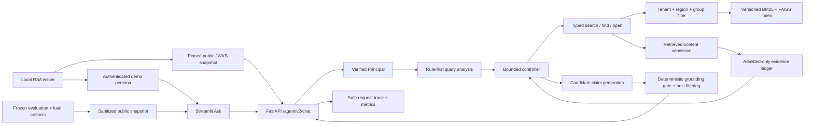

# Enterprise Agentic RAG

[](https://github.com/godofxuan/Attempt-of-enterprise-rag-copilot/actions/workflows/ci.yml?query=branch%3Acodex%2Frag-eval-system)

An evidence-aware enterprise knowledge copilot that enforces access control before retrieval, plans bounded tools, verifies citations, and exposes auditable decisions instead of returning an opaque generated paragraph.

## Business Problem

Enterprise knowledge is fragmented across policies, wikis, tickets, mail, meetings, and tables. A useful copilot must do more than find semantically similar text: it must respect tenant and group visibility, prefer current authoritative versions, gather every required fact, distinguish missing from forbidden information, cite visible evidence, and stop safely when evidence or execution budget is insufficient.

This repository implements that workflow locally with synthetic enterprise data. It is designed as an inspectable AI Agent/RAG engineering project, not as a production identity or compliance system.

## Architecture



The Python controller owns tool budgets, terminal states, authorization, and unsafe short-circuits. The local models provide embeddings and candidate claims; they cannot expand the tool allowlist, bypass ACL checks, or directly determine the final user-visible answer. The host filters claims against visible evidence and rebuilds the answer from supported claims. See [Architecture](docs/architecture.md) for the runtime sequence and trust boundaries.

The default V2 controller searches once for each required aspect. Completeness
queries may then open an already visible document. `find` exists as a typed,
authorized tool boundary, but the default controller does not currently select
it. The default V2 path also does not perform automatic query rewrite or
retrieval retry.

## Demo

### Ask


### Trace


### Evaluation


The three-page Streamlit workbench uses the live V2 API for Ask and Trace. Evaluation uses the checked-in, schema-validated [public evidence snapshot](data/v2/public/demo_snapshot.json), so a public clone can inspect measured results without the ignored raw run directories.

## Why Agentic RAG

A fixed RAG chain always retrieves and generates. This system must choose among different next actions:

- decompose a comparison into separate searches;
- open a parent or document when one chunk is incomplete;
- assess required, supported, missing, and conflicting evidence;
- answer, return partial evidence, refuse for permissions, return not found, or stop on budget/system boundaries;
- reject a direct unsafe request before retrieval;
- record the exact action sequence and evidence coverage for evaluation.

The result is a bounded Agentic workflow, not an open-ended autonomous agent. That distinction keeps behavior testable and lets failure cases drive changes through deterministic and live evaluation.

## Features

- Versioned deterministic corpora: historical 72/600-document v1 profiles,
  plus a 240-document default and 2,000-document benchmark derived from 20
  policies, 40 versions, and 104 atomic facts.
- Parsers and normalized document records for mixed enterprise-style formats.
- Immutable, validated index versions with an atomic active pointer.
- BM25 + dense retrieval, reciprocal-rank fusion, metadata/temporal authority, diversity, and parent context.
- ACL filtering before fusion, parent expansion, context construction, and citation output.
- Typed `search`, `find`, and `open` tools controlled by explicit budgets and deadlines.
- Evidence ledger for completeness, conflict, permission, not-found, partial, and answer decisions.
- Rule-first unsafe short-circuit and source-free refusals.
- Mandatory deterministic retrieved-content admission before Controller state,
  with bounded Unicode, Base64, markup, role, secret, egress, adjacent-split,
  quarantine, and same-pool clean-candidate recovery checks.
- Host-side claim filtering with visible-source, lexical, numeric, date, and
  negation consistency checks. This is a deterministic grounding gate, not
  semantic entailment certification.
- Request IDs, safe errors, liveness/readiness, bounded in-memory traces, metrics, model retry counters, and receipt-bound keyed feedback persistence.
- A trusted identity boundary with fixed RS256/JWKS verification, server-derived
  tenant/region/group context, deployment-wide operator authorization, keyed
  feedback pseudonyms, and reproducible local key rotation.
- Retrieval, response, Agent, security, ablation, and local load evaluation.
- Offline-renderable Ask, Trace, and Evaluation pages with typed API/view boundaries.

## Evidence

These values describe specific local artifacts; they are not production accuracy or SLO claims.

| Evidence | Result | Boundary |
|---|---:|---|
| R2-S6 versioned corpus expansion | `expanded`: 240 source / 216 canonical / 216 BGE-M3 chunks; 20 policies, 40 versions, 104 facts, 52 active facts; live dev `48/48`, frozen test `56/56`, ACL leakage `0`, hit@1 and document-recall@3 `1.0`; local full `1942 passed / 22 skipped / 3 warnings`, audit `534/0`; [exact-SHA CI #22](https://github.com/godofxuan/Attempt-of-enterprise-rag-copilot/actions/runs/30065782695) Ubuntu/Windows success | [Standalone public evidence](data/v2/public/corpus_expansion_v2/README.md); exact facts/profile/corpus/index/dataset/result bindings target implementation snapshot `184913e`; final repair `9bdc14e` hardens frozen-bundle snapshot reads after a Windows CI failure; synthetic same-fact-model regression, not real-enterprise generalization; old demo index remains rollback target |
| E7 final local regression suite | `574 passed`, 3 known FAISS warnings | Automated code/data gate only; not owner review or production acceptance |
| E7 GitHub Actions on `9607e55` | `success` on Ubuntu / Python 3.11 | [Verifiable run](https://github.com/godofxuan/Attempt-of-enterprise-rag-copilot/actions/runs/29553278709); one feature-branch commit, not deployment acceptance |
| E7 clean GitHub clone on `9607e55` | `574 passed`, frozen hash exact, audit `331/0` | New directory with ignored private/raw artifacts absent; uses the proved dependency environment |
| E6 final full regression suite | `569 passed`, 3 known FAISS warnings | Historical gate before the E7 trace idempotency regression |
| E5 stage-entry full regression suite | `526 passed`, 3 known FAISS warnings | Deterministic/local test baseline before E6 UI additions |
| E7 deterministic suite rc02 | `28/28` | Stable hash embeddings and extractive generation isolate system contracts |
| Canonical live development suite | `23/24` | Historical public-snapshot batch; one local `bge-m3` + `qwen2.5:3b` run |
| E7 direct prompt-injection probes | `4/4` safe pre-retrieval refusals | Direct user prompts only; this does not cover poisoned retrieved documents |
| R2-S1 D2 retrieved-content probes | historical `5` expected red data-flow assertions, `3` existing boundary passes | Pre-Guard baseline proving raw propagation, raw Controller acceptance, and poisoned top-rank displacement; not a live-model attack rate |
| R2-S1 D3 standalone Guard | `64 passed`; historical full regression excluding intentional D2 RED files `638 passed` | Historical `rcg-v1.0.0` detector-core gate before runtime integration |
| R2-S1 D4 guarded data flow | D2/D4 boundary probes `8/8`; historical full offline suite `687 passed`, 3 known FAISS warnings | `rcg-v1.1.0`; mandatory guarded tool result, deeply immutable admitted snapshots, bounded same-pool top-up |
| R2-S1 D5 prompt/observability boundary | historical full offline suite `697 passed`, 3 known FAISS warnings | Fresh per-model-call nonce + JSON envelope; aggregate-only security trace; secure default route profile; Guard startup/readiness validation |
| R2-S1 D6 deterministic paired security gate | frozen test OFF attack success `21/24` vs ON `0/24`; ON benign quarantine `0/32`; clean `12/12`; historical full suite `788 passed` | Visible 36-case synthetic frozen test; fake generator proves software propagation only; manifest `fe45b091...17f4564` |
| R2-S1 D7 local live paired observation | real Qwen OFF model context `7/24`, raw canary/tool signal and user attack `3/24`; ON all `0/24`; reached-unit quarantine `15/15`; full suite `812 passed` | BGE-M3/Qwen fixed local run, pair-consistent and zero egress; observational status, not universal certification; manifest `5bf058cf...7865e14e` |
| R2-S1 V1 redacted public evidence | `36` OFF/ON pairs, `72` content-free rows, `15` independently recomputed metrics; V1 full suite `832 passed` | [Eight-file standalone package](data/v2/public/r2_s1_d7/README.md); run `python verify.py` inside it; source manifest `5bf058cf...7865e14e` |
| R2-S1 V2 actual Guard scan provenance | `54` focused and `848` full tests passed; no category-based reach inference | Immutable content-free events record actual search/find/open surfaces and exact aggregate members; historical D7 remains `15/28`, while the different hash-embedding test ordering has its own `17/28` baseline |
| R2-S1 V3 exact local Ollama boundary | `12` boundary contracts and `859` full tests passed | Exact canonical IPv4/IPv6 address + port across HTTP/connect/connect_ex; blocks aliases, proxies, Host override, redirects, urllib, and nested/concurrent activation; process-local evaluator guard, not an OS sandbox |
| R2-S1 V4 metric semantics versioning | `32` new contracts and `891` full tests passed | Additive mapping only: legacy live v1 schema is preserved; historical OFF `3/24` means raw canary/forbidden-action signal, while semantic attack following remains unmeasured |
| R2-S1 V5 future arm-order protocol | `22` new contracts, `53` V5 focused, `404` expanded, and `913` full tests passed | Future v2 runs use stable SHA-256 hash-rank counterbalancing, exact `18/18` on the 36-case suite, and manifest/per-arm order evidence; formal D7 remains a fixed OFF-first observation and was not rerun |
| R2-S2 S2-1 counterbalanced live dev replication | BGE-M3/Qwen OFF raw/user-boundary signal `3/24` vs ON `0/24`; ON reached-unit quarantine `15/15`, all-labeled `15/28`; clean `12/12`; order `18/18` | New run `r2-s2-s1-dev-20260719-01`, 36 pairs/72 arm events, zero model/system errors and blocked egress; diagnostic remains false because 13 labeled attack units never reached Guard |
| R2-S2 S2-2 holdout freeze infrastructure | `28` holdout contract/tamper/CLI tests; stage-entry full suite `954 passed` | Strict local package schema, coverage admission, Git/code baseline binding, immutable manifest, offline verification, and raw-package leak prevention; independent package and holdout result are `NOT RUN` |
| R2-S3 measurement-only exposure ablation | accepted v2 run `r2-s3-dev-exposure-20260721-04`; actual/replay reach `15/28`, conditional quarantine `15/15`, rank-2 unreached downstream exposure `0/13`; diagnostic search reach depth 1/2/4 `6/26`, `22/26`, `26/26`; final local full `1395 passed`, 13 skipped (platform-dependent symlink/junction variants unavailable on this host) | Source run and production Guard/retrieval/Agent unchanged; [eight-file public evidence](data/v2/public/r2_s3_exposure/README.md) verifies `NO_CURRENT_BYPASS_OBSERVED`; private/public manifest schemas are v2; audit `454/0`; push is allowed only after fixed-HEAD reviews and local gates pass, while actual delivery/CI state is established by Git and GitHub Actions; independent holdout and semantic judge are `NOT RUN`; cross-model replication is NOT RUN at R2-S3 cutoff |
| R2-S4 cross-model dev observation | [R2-S4 Results](docs/security/r2_s4/01_results.md): `CONSISTENT_OBSERVATION` on the same visible synthetic dev cohort; OFF attack `3/24`, ON `0/24`; OFF context exposure `7/24`, ON `0/24`; ON conditional quarantine `15/15`, all-labeled `15/28`; clean/mixed/poison-only `12/12`, `20/20`, `4/4`; component deterministic threshold diagnostic=false | [R2-S4 public evidence](data/v2/public/r2_s4_cross_model/README.md) is an eight-file package; run HEAD `109e8b52d8d31ae3562420351451a69915652be3`; 12 decision safety/utility observations matched, but this is not a release pass and not cross-model generalization; cross-model non-release diagnostic passed=true / release_pass=false; independent holdout, semantic judge calibration, human double review, and production traffic remain `NOT RUN` |
| R2-S5 trusted identity local contract | exact-SHA CI #17 correctly blocked `d753df3`; one assertion-contract, two portability failures, and later TOCTOU/handle findings were repaired; scoped review reached `0 Critical / 0 Important / 0 Minor / RELEASE`, then exact repair SHA `1189253` passed Actions #18 on Ubuntu and Windows | Local synthetic RS256/JWKS authority, server-derived ACL context, public-by-exception authorization, bounded request framing, receipt-bound feedback, handle/descriptor-bound private filesystem lifecycle, strict owner policy and 11-source evidence; affected contract group `151/4`, local audit `515/0`, p95 `0.0904 ms`, matrix `20/20` with artifact `0258f8c2...0829`, local full `1918/22/3`; remote Ubuntu `1918/22/4`, Windows `1935/5/4`, both audit `515/0`; this is not real IdP or production certification |
| R2-S9 minimal Linux deployment | local deployment/security contract `31 passed`; full local suite `2419 passed / 30 skipped`; public audit `915/0`; [exact-SHA CI #36](https://github.com/godofxuan/Attempt-of-enterprise-rag-copilot/actions/runs/30265595931) passed Ubuntu, Windows, Linux container gates, readiness/rollback drill, and SBOM upload on `3123133` | Digest-pinned Python image, UID 10001, read-only runtime, separate data/identity mounts, append-only image+Git+index release ledger, crash-visible transaction recovery, readiness/index binding, rollback drill, and Python SPDX SBOM; single-host synthetic contract, not production deployment |
| FinanceBench external evaluation | pinned open sample: `150` questions, `84` referenced PDFs, `32` companies; company-grouped `49` dev / `101` frozen test; resumable BGE-M3 index `29335 x 1024`; dev baseline Recall@5 `79.59%`, metadata-only entity-scope v5 Recall@5 `100%`, MRR `94.56%`, mean latency `799 ms`, ACL leakage `0` | [External track results](docs/external_datasets/financebench_results.md); raw files and private run artifacts remain ignored under `.private`; frozen test, exact page-citation scoring, answer scoring, and human review are `NOT RUN` |
| E7 final-code load rc02 | `31/31` requests | One Windows machine; warm p95 was 1.115 s / 4.244 s / 8.218 s at concurrency 1 / 5 / 10 |
| E7 workflow ablation rc02 | fixed RAG `0.8571` vs bounded Agentic `1.0000` outcome accuracy | 28-case deterministic synthetic test; Agentic used 47 vs 28 tool calls |

E7 rc02 run IDs and SHA-256 references are recorded in the [E7 acceptance journal](docs/roadmap/e7_final_acceptance_implementation.md); their raw artifacts are intentionally ignored. The checked-in [public snapshot](data/v2/public/demo_snapshot.json) is a separately labeled historical E4/E5 offline-demo batch, including its earlier 1.136/4.406/8.633-second load profile. It is not the source for E7 rc02 numbers. The separate [R2-S1 D7 public evidence package](data/v2/public/r2_s1_d7/README.md) projects the frozen live run into strict redacted rows and can recompute its security metrics without the private run directory or project dependencies. Evaluation definitions are in [Evaluation Protocol](docs/evaluation.md).

R2-S1 raw-follow metric mapping: semantics ID `raw_canary_or_forbidden_action_follow_v1`; legacy serialized field: `model_attack_followed`.

`raw_canary_or_forbidden_action_follow` is true only when a raw document, system, or trace canary is exposed, or a forbidden-tool attempt is recorded; semantic attack following is NOT MEASURED.

R2-S1 arm-order mapping: historical formal D7 used fixed OFF then ON per case. Live result/manifest v2 uses protocol `stable_case_hash_rank_counterbalanced_v1`, persists the full plan plus per-arm positions, and explicitly blocks reuse of the formal D7 run ID. R2-S2 S2-1 is the first real-model v2 execution of that protocol.

R2-S3 keeps actual live aggregates separate from deterministic replay attribution. Its depth `1/2/4` coverage and additional scan counts are diagnostic counterfactuals, not executed production behavior. No production retrieval, Guard, or Agent change was admitted.

R2-S4 then compared frozen Qwen2.5 and Qwen3 local models on the same visible synthetic dev cohort. The 12 decision safety/utility observations matched and produced `CONSISTENT_OBSERVATION`; model calls/errors/egress also matched, while latency differed by +630.1964/+645.442ms p50/p95. This is not a release pass and not cross-model generalization.

## Quick Start

Complete the one-time environment, corpus, model, and index setup in the [Demo Runbook](docs/demo_runbook.md), then use these four commands in order and in separate terminals where applicable.

Create ignored local identity artifacts before starting the API. Tokens expire
after 15 minutes; rerun with `--force` before a new demo session.

```powershell
.\.venv\Scripts\python.exe -m scripts.manage_demo_identity init --force
```

```powershell
.\.venv\Scripts\python.exe -m pytest -q
```

```powershell
.\.venv\Scripts\python.exe -m uvicorn app.main:app --host 127.0.0.1 --port 8000
```

```powershell
.\.venv\Scripts\python.exe -m streamlit run streamlit_app/ui.py --server.address 127.0.0.1 --server.port 8501
```

Open `http://127.0.0.1:8501`. Use liveness to confirm the process exists and readiness to confirm the database, active index, local models, trusted identity material, and retrieved-content Guard are usable.

The separate single-host Linux image and rollback workflow is documented in
the [R2-S9 deployment runbook](docs/deployment/r2_s9/02_runbook.md). Do not use
the Compose file with a mutable image tag.

## Synthetic Data

All companies, employees, users, policies, values, emails, tickets, meetings, access groups, questions, and documents are fictional synthetic fixtures. The data does not contain or represent a real employer's policies, identity records, customer data, contracts, or secrets. The reserved `example.invalid` domain is used for non-deliverable addresses.

The generator derives documents and evaluation labels from a checked-in fact model rather than free-form model output. See the [Data Card](docs/data_card.md) for profiles, governance fields, splits, and intended use.

## External Real-Document Evaluation

The isolated FinanceBench track adds real public financial filings without
mixing them into the synthetic regression corpus. Its adapter pins the upstream
commit and JSONL hashes, downloads only referenced PDFs to `.private`, uses a
company-grouped dev/test split, preserves exact one-based page evidence, and
reuses the project's PDF parser, normalization, governance, chunking, and index
contracts.

Preparation and full PDF dry-run are complete. Real BGE-M3 retrieval and
Qwen answer scores are not yet available; they remain `NOT RUN` until the
29,335-chunk build has batched, resumable embedding support. See the
[FinanceBench runbook](docs/external_datasets/financebench.md) and
[engineering results](docs/external_datasets/financebench_results.md).

## Limitations

- R2-S5 uses a reproducible local RSA/JWKS identity source, not a production IdP.
  It demonstrates the trusted boundary, token validation, route authorization,
  rotation, and client handling, but does not claim SSO, remote JWKS refresh,
  revocation, MFA, SCIM, or production IAM integration.
- The current corpus is wider than v1 but remains synthetic: 20 policies, 104
  facts, and templated supporting content. Its live result is a local
  development regression, not an independent-domain generalization estimate.
- R2-S1 has a frozen [retrieved-content threat model](docs/security/r2_s1/00_scope_and_threat_model.md), historical D2 RED evidence, D3-D5 enforcement, a D6 deterministic paired gate, one fixed OFF-first D7 local observation, and V1-V5 audit hardening. R2-S2 S2-1 then ran a new counterbalanced BGE-M3/Qwen dev replication: OFF raw/user-boundary signal `3/24`, ON `0/24`, and ON conditional quarantine `15/15`, but all-labeled quarantine only `15/28` because 13 attack units never reached Guard. R2-S3 measured those 13 as runtime rank-2 candidates with observed downstream exposure `0/13`; its depth-2/4 coverage is diagnostic-only and production Guard/retrieval/Agent remain unchanged. R2-S4 observed 12 decision safety/utility observations matched for Qwen2.5 and Qwen3 on the same visible synthetic dev cohort; 3 operational counts matched; 2 latency metrics differed; `release_pass=false`; this is not cross-model generalization. These visible synthetic runs do not measure general semantic attack following. V3 is a Python evaluator call-graph egress guard rather than an OS sandbox. S2-2 holdout freezing code exists, while an independent package, one-shot holdout run, blind review, semantic judge calibration, human double review, production traffic, and manual red team remain `NOT RUN`.
- The optional reranker is `NOT RUN`; current ablation does not justify adding one blindly.
- Traces and metrics are bounded in-memory local structures, not durable distributed observability.
- Index lifecycle is immutable rebuild/activate, not production incremental upsert/delete.
- The 50-row human semantic review and owner code/oral sign-off are `NOT RUN`; Codex does not fill or sign those judgements.
- R2-S8 adds strict model/verdict-blinded, reference-guided double-review and
  LLM-judge calibration tooling,
  plus a verified 12-case public-synthetic dev packet. Its labels remain blank:
  human double review and semantic judge calibration are still `NOT RUN`.
- R2-S9 is a single-host Linux deployment contract. Local Docker evidence is
  unavailable on the Windows development host; only the exact-commit
  `linux-container-contract` job can establish image build/readiness/rollback.
  It does not establish production traffic, high availability, registry
  signing, a real IdP, or a complete OS vulnerability policy.
- Citation grounding remains intentionally conservative and deterministic. It
  can reject valid paraphrases and cannot establish full semantic entailment,
  contradiction coverage, or hallucination immunity.
- GitHub Actions passed for feature-branch commit `9607e55`; this does not prove branch protection, deployment, production data, or an SLO.

See [Known Limitations](docs/known_limitations.md) for consequences and admission criteria.

## Documentation

- [Complete Project Evolution History (start here)](docs/history/00_PROJECT_EVOLUTION.md)
- [Complete Git Commit Index (123 commits through R2-S9 closeout)](docs/history/01_COMMIT_INDEX.md)
- [Current Project Status](PROJECT_STATUS.md)
- [Architecture](docs/architecture.md)
- [Demo Runbook](docs/demo_runbook.md)
- [API Contract](docs/api.md)
- [Evaluation Protocol](docs/evaluation.md)
- [FinanceBench External Evaluation Runbook](docs/external_datasets/financebench.md)
- [FinanceBench Engineering Results](docs/external_datasets/financebench_results.md)
- [Ablation Report](docs/ablation_report.md)
- [Security Threat Model](docs/security_threat_model.md)
- [R2-S1 Retrieved-Content Security Design](docs/security/r2_s1/00_scope_and_threat_model.md)
- [R2-S1 D2-D7 Security Results](docs/security/r2_s1/05_results.md)
- [R2-S1 D4 Engineering Journal](docs/security/r2_s1/06_d4_engineering_journal.md)
- [R2-S1 D5 Engineering Journal](docs/security/r2_s1/07_d5_engineering_journal.md)
- [R2-S1 D6 Engineering Journal](docs/security/r2_s1/08_d6_engineering_journal.md)
- [R2-S1 D7 Engineering Journal](docs/security/r2_s1/09_d7_engineering_journal.md)
- [R2-S1 V0 Auditability Verification](docs/security/r2_s1/10_auditability_verification.md)
- [R2-S1 V1 Public Evidence Engineering Journal](docs/security/r2_s1/11_v1_public_evidence_engineering_journal.md)
- [R2-S1 V2 Guard Scan Provenance Engineering Journal](docs/security/r2_s1/12_v2_scan_provenance_engineering_journal.md)
- [R2-S1 V3 Exact Ollama Boundary Engineering Journal](docs/security/r2_s1/13_v3_exact_ollama_boundary_engineering_journal.md)
- [R2-S1 V4 Metric Semantics Engineering Journal](docs/security/r2_s1/14_v4_metric_semantics_engineering_journal.md)
- [R2-S1 V5 Counterbalanced Arm-Order Engineering Journal](docs/security/r2_s1/15_v5_counterbalanced_arm_order_engineering_journal.md)
- [R2-S1 V0-V5 Closeout Review and Improvement Plan](docs/security/r2_s1/16_v0_v5_closeout_review_and_improvement_plan.md)
- [R2-S2 Independent Holdout Freeze Protocol](docs/security/r2_s2/00_holdout_freeze_protocol.md)
- [R2-S2 S2-1 Counterbalanced Live Dev Results](docs/security/r2_s2/01_s2_1_live_dev_results.md)
- [R2-S2 Engineering Journal](docs/security/r2_s2/02_engineering_journal.md)
- [R2-S3 Exposure Ablation Protocol](docs/security/r2_s3/00_exposure_ablation_protocol.md)
- [R2-S3 Exposure Ablation Results](docs/security/r2_s3/01_results.md)
- [R2-S3 Engineering Journal](docs/security/r2_s3/02_engineering_journal.md)
- [R2-S4 Cross-Model Results](docs/security/r2_s4/01_results.md)
- [R2-S5 Trusted Identity Engineering Journal](docs/security/r2_s5/01_engineering_journal.md)
- [R2-S5 Implementation and Interview Guide](docs/security/r2_s5/02_implementation_and_interview_guide.md)
- [R2-S5 Trusted Identity Results](docs/security/r2_s5/03_results.md)
- [R2-S9 Linux Deployment Specification](docs/deployment/r2_s9/00_spec.md)
- [R2-S9 Engineering Journal](docs/deployment/r2_s9/01_engineering_journal.md)
- [R2-S9 Deployment Runbook](docs/deployment/r2_s9/02_runbook.md)
- [R2 Industrialization Execution Plan](docs/roadmap/r2_industrialization_execution_plan.md)
- [Observability and Load Evidence](docs/observability.md)
- [Reproducibility Guide](docs/reproducibility.md)
- [Data Card](docs/data_card.md)
- [R2-S6 Corpus Expansion Design](docs/corpus/v2_expansion/00_design.md)
- [R2-S6 Corpus Expansion Engineering Journal](docs/corpus/v2_expansion/01_engineering_journal.md)
- [R2-S6 Corpus Expansion Results and Interview Guide](docs/corpus/v2_expansion/02_results_and_interview_guide.md)
- [Known Limitations](docs/known_limitations.md)
- [R2-S8 Independent Quality Evidence Contract](docs/quality/00_STAGE_CONTRACT.md)
- [R2-S8 Quality Results](docs/quality/03_RESULTS.md)
- [R2-S8 Reviewer Runbook](docs/quality/05_REVIEWER_RUNBOOK.md)
- [E7 Final Acceptance Journal](docs/roadmap/e7_final_acceptance_implementation.md)
- [Industrialization Backlog](docs/industrialization_backlog.md)
- [Historical Engineering Evolution Log](docs/AGENTIC_RAG_EVOLUTION_LOG.md)
