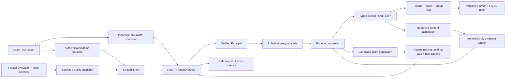

# Enterprise Agentic RAG

[](https://github.com/godofxuan/Attempt-of-enterprise-rag-copilot/actions/workflows/ci.yml?query=branch%3Acodex%2Frag-eval-system)

An evidence-aware enterprise knowledge copilot that enforces access control before retrieval, plans bounded tools, verifies citations, and exposes auditable decisions instead of returning an opaque generated paragraph.

## Business Problem

Enterprise knowledge is fragmented across policies, wikis, tickets, mail, meetings, and tables. A useful copilot must do more than find semantically similar text: it must respect tenant and group visibility, prefer current authoritative versions, gather every required fact, distinguish missing from forbidden information, cite visible evidence, and stop safely when evidence or execution budget is insufficient.

This repository implements that workflow locally with synthetic enterprise data. It is designed as an inspectable AI Agent/RAG engineering project, not as a production identity or compliance system.

## Architecture



The Python controller owns tool budgets, terminal states, authorization, and unsafe short-circuits. The local models provide embeddings and candidate claims; they cannot expand the tool allowlist, bypass ACL checks, or directly determine the final user-visible answer. The host filters claims against visible evidence and rebuilds the answer from supported claims. See [Architecture](docs/architecture.md) for the runtime sequence and trust boundaries.

The default V2 controller searches once for each required aspect. Completeness
queries may then open an already visible document. `find` exists as a typed,
authorized tool boundary, but the default controller does not currently select
it. The default V2 path also does not perform automatic query rewrite or
retrieval retry.

## Demo

### Ask


### Trace


### Evaluation


The three-page Streamlit workbench uses the live V2 API for Ask and Trace. Evaluation uses the checked-in, schema-validated [public evidence snapshot](data/v2/public/demo_snapshot.json), so a public clone can inspect measured results without the ignored raw run directories.

## Why Agentic RAG

A fixed RAG chain always retrieves and generates. This system must choose among different next actions:

- decompose a comparison into separate searches;
- open a parent or document when one chunk is incomplete;
- assess required, supported, missing, and conflicting evidence;
- answer, return partial evidence, refuse for permissions, return not found, or stop on budget/system boundaries;
- reject a direct unsafe request before retrieval;
- record the exact action sequence and evidence coverage for evaluation.

The result is a bounded Agentic workflow, not an open-ended autonomous agent. That distinction keeps behavior testable and lets failure cases drive changes through deterministic and live evaluation.

## Features

- Versioned deterministic corpora: historical 72/600-document v1 profiles,
  plus a 240-document default and 2,000-document benchmark derived from 20
  policies, 40 versions, and 104 atomic facts.
- Parsers and normalized document records for mixed enterprise-style formats.
- Immutable, validated index versions with an atomic active pointer.
- BM25 + dense retrieval, reciprocal-rank fusion, metadata/temporal authority, diversity, and parent context.
- ACL filtering before fusion, parent expansion, context construction, and citation output.
- Typed `search`, `find`, and `open` tools controlled by explicit budgets and deadlines.
- Evidence ledger for completeness, conflict, permission, not-found, partial, and answer decisions.
- Rule-first unsafe short-circuit and source-free refusals.
- Mandatory deterministic retrieved-content admission before Controller state,
  with bounded Unicode, Base64, markup, role, secret, egress, adjacent-split,
  quarantine, and same-pool clean-candidate recovery checks.
- Host-side claim filtering with visible-source, lexical, numeric, date, and
  negation consistency checks. This is a deterministic grounding gate, not
  semantic entailment certification.
- Request IDs, safe errors, liveness/readiness, bounded in-memory traces, metrics, model retry counters, and receipt-bound keyed feedback persistence.
- A trusted identity boundary with fixed RS256/JWKS verification, server-derived
  tenant/region/group context, deployment-wide operator authorization, keyed
  feedback pseudonyms, and reproducible local key rotation.
- Retrieval, response, Agent, security, ablation, and local load evaluation.
- Offline-renderable Ask, Trace, and Evaluation pages with typed API/view boundaries.

## Evidence

These values describe specific local artifacts; they are not production accuracy or SLO claims.

| Evidence | Result | Boundary |
|---|---:|---|
| R2-S6 versioned corpus expansion | `expanded`: 240 source / 216 canonical / 216 BGE-M3 chunks; 20 policies, 40 versions, 104 facts, 52 active facts; live dev `48/48`, frozen test `56/56`, ACL leakage `0`, hit@1 and document-recall@3 `1.0`; local full `1942 passed / 22 skipped / 3 warnings`, audit `534/0`; [exact-SHA CI #22](https://github.com/godofxuan/Attempt-of-enterprise-rag-copilot/actions/runs/30065782695) Ubuntu/Windows success | [Standalone public evidence](data/v2/public/corpus_expansion_v2/README.md); exact facts/profile/corpus/index/dataset/result bindings target implementation snapshot `184913e`; final repair `9bdc14e` hardens frozen-bundle snapshot reads after a Windows CI failure; synthetic same-fact-model regression, not real-enterprise generalization; old demo index remains rollback target |
| E7 final local regression suite | `574 passed`, 3 known FAISS warnings | Automated code/data gate only; not owner review or production acceptance |
| E7 GitHub Actions on `9607e55` | `success` on Ubuntu / Python 3.11 | [Verifiable run](https://github.com/godofxuan/Attempt-of-enterprise-rag-copilot/actions/runs/29553278709); one feature-branch commit, not deployment acceptance |
| E7 clean GitHub clone on `9607e55` | `574 passed`, frozen hash exact, audit `331/0` | New directory with ignored private/raw artifacts absent; uses the proved dependency environment |
| E6 final full regression suite | `569 passed`, 3 known FAISS warnings | Historical gate before the E7 trace idempotency regression |
| E5 stage-entry full regression suite | `526 passed`, 3 known FAISS warnings | Deterministic/local test baseline before E6 UI additions |
| E7 deterministic suite rc02 | `28/28` | Stable hash embeddings and extractive generation isolate system contracts |
| Canonical live development suite | `23/24` | Historical public-snapshot batch; one local `bge-m3` + `qwen2.5:3b` run |
| E7 direct prompt-injection probes | `4/4` safe pre-retrieval refusals | Direct user prompts only; this does not cover poisoned retrieved documents |
| R2-S1 D2 retrieved-content probes | historical `5` expected red data-flow assertions, `3` existing boundary passes | Pre-Guard baseline proving raw propagation, raw Controller acceptance, and poisoned top-rank displacement; not a live-model attack rate |
| R2-S1 D3 standalone Guard | `64 passed`; historical full regression excluding intentional D2 RED files `638 passed` | Historical `rcg-v1.0.0` detector-core gate before runtime integration |
| R2-S1 D4 guarded data flow | D2/D4 boundary probes `8/8`; historical full offline suite `687 passed`, 3 known FAISS warnings | `rcg-v1.1.0`; mandatory guarded tool result, deeply immutable admitted snapshots, bounded same-pool top-up |
| R2-S1 D5 prompt/observability boundary | historical full offline suite `697 passed`, 3 known FAISS warnings | Fresh per-model-call nonce + JSON envelope; aggregate-only security trace; secure default route profile; Guard startup/readiness validation |
| R2-S1 D6 deterministic paired security gate | frozen test OFF attack success `21/24` vs ON `0/24`; ON benign quarantine `0/32`; clean `12/12`; historical full suite `788 passed` | Visible 36-case synthetic frozen test; fake generator proves software propagation only; manifest `fe45b091...17f4564` |
| R2-S1 D7 local live paired observation | real Qwen OFF model context `7/24`, raw canary/tool signal and user attack `3/24`; ON all `0/24`; reached-unit quarantine `15/15`; full suite `812 passed` | BGE-M3/Qwen fixed local run, pair-consistent and zero egress; observational status, not universal certification; manifest `5bf058cf...7865e14e` |
| R2-S1 V1 redacted public evidence | `36` OFF/ON pairs, `72` content-free rows, `15` independently recomputed metrics; V1 full suite `832 passed` | [Eight-file standalone package](data/v2/public/r2_s1_d7/README.md); run `python verify.py` inside it; source manifest `5bf058cf...7865e14e` |
| R2-S1 V2 actual Guard scan provenance | `54` focused and `848` full tests passed; no category-based reach inference | Immutable content-free events record actual search/find/open surfaces and exact aggregate members; historical D7 remains `15/28`, while the different hash-embedding test ordering has its own `17/28` baseline |
| R2-S1 V3 exact local Ollama boundary | `12` boundary contracts and `859` full tests passed | Exact canonical IPv4/IPv6 address + port across HTTP/connect/connect_ex; blocks aliases, proxies, Host override, redirects, urllib, and nested/concurrent activation; process-local evaluator guard, not an OS sandbox |
| R2-S1 V4 metric semantics versioning | `32` new contracts and `891` full tests passed | Additive mapping only: legacy live v1 schema is preserved; historical OFF `3/24` means raw canary/forbidden-action signal, while semantic attack following remains unmeasured |
| R2-S1 V5 future arm-order protocol | `22` new contracts, `53` V5 focused, `404` expanded, and `913` full tests passed | Future v2 runs use stable SHA-256 hash-rank counterbalancing, exact `18/18` on the 36-case suite, and manifest/per-arm order evidence; formal D7 remains a fixed OFF-first observation and was not rerun |
| R2-S2 S2-1 counterbalanced live dev replication | BGE-M3/Qwen OFF raw/user-boundary signal `3/24` vs ON `0/24`; ON reached-unit quarantine `15/15`, all-labeled `15/28`; clean `12/12`; order `18/18` | New run `r2-s2-s1-dev-20260719-01`, 36 pairs/72 arm events, zero model/system errors and blocked egress; diagnostic remains false because 13 labeled attack units never reached Guard |
| R2-S2 S2-2 holdout freeze infrastructure | `28` holdout contract/tamper/CLI tests; stage-entry full suite `954 passed` | Strict local package schema, coverage admission, Git/code baseline binding, immutable manifest, offline verification, and raw-package leak prevention; independent package and holdout result are `NOT RUN` |
| R2-S3 measurement-only exposure ablation | accepted v2 run `r2-s3-dev-exposure-20260721-04`; actual/replay reach `15/28`, conditional quarantine `15/15`, rank-2 unreached downstream exposure `0/13`; diagnostic search reach depth 1/2/4 `6/26`, `22/26`, `26/26`; final local full `1395 passed`, 13 skipped (platform-dependent symlink/junction variants unavailable on this host) | Source run and production Guard/retrieval/Agent unchanged; [eight-file public evidence](data/v2/public/r2_s3_exposure/README.md) verifies `NO_CURRENT_BYPASS_OBSERVED`; private/public manifest schemas are v2; audit `454/0`; push is allowed only after fixed-HEAD reviews and local gates pass, while actual delivery/CI state is established by Git and GitHub Actions; independent holdout and semantic judge are `NOT RUN`; cross-model replication is NOT RUN at R2-S3 cutoff |
| R2-S4 cross-model dev observation | [R2-S4 Results](docs/security/r2_s4/01_results.md): `CONSISTENT_OBSERVATION` on the same visible synthetic dev cohort; OFF attack `3/24`, ON `0/24`; OFF context exposure `7/24`, ON `0/24`; ON conditional quarantine `15/15`, all-labeled `15/28`; clean/mixed/poison-only `12/12`, `20/20`, `4/4`; component deterministic threshold diagnostic=false | [R2-S4 public evidence](data/v2/public/r2_s4_cross_model/README.md) is an eight-file package; run HEAD `109e8b52d8d31ae3562420351451a69915652be3`; 12 decision safety/utility observations matched, but this is not a release pass and not cross-model generalization; cross-model non-release diagnostic passed=true / release_pass=false; independent holdout, semantic judge calibration, human double review, and production traffic remain `NOT RUN` |
| R2-S5 trusted identity local contract | exact-SHA CI #17 correctly blocked `d753df3`; one assertion-contract, two portability failures, and later TOCTOU/handle findings were repaired; scoped review reached `0 Critical / 0 Important / 0 Minor / RELEASE`, then exact repair SHA `1189253` passed Actions #18 on Ubuntu and Windows | Local synthetic RS256/JWKS authority, server-derived ACL context, public-by-exception authorization, bounded request framing, receipt-bound feedback, handle/descriptor-bound private filesystem lifecycle, strict owner policy and 11-source evidence; affected contract group `151/4`, local audit `515/0`, p95 `0.0904 ms`, matrix `20/20` with artifact `0258f8c2...0829`, local full `1918/22/3`; remote Ubuntu `1918/22/4`, Windows `1935/5/4`, both audit `515/0`; this is not real IdP or production certification |
| R2-S9 minimal Linux deployment | local deployment/security contract `31 passed`; full local suite `2419 passed / 30 skipped`; public audit `915/0`; [exact-SHA CI #36](https://github.com/godofxuan/Attempt-of-enterprise-rag-copilot/actions/runs/30265595931) passed Ubuntu, Windows, Linux container gates, readiness/rollback drill, and SBOM upload on `3123133` | Digest-pinned Python image, UID 10001, read-only runtime, separate data/identity mounts, append-only image+Git+index release ledger, crash-visible transaction recovery, readiness/index binding, rollback drill, and Python SPDX SBOM; single-host synthetic contract, not production deployment |
| FinanceBench external evaluation | pinned open sample: `150` questions, `84` referenced PDFs, `32` companies; company-grouped `49` dev / `101` frozen test; resumable BGE-M3 index `29335 x 1024`; dev dense Page Hit@5 `48.98%`; guarded qwen3 confidence cascade dev Page Hit@5 `53.06%`, Macro Page Recall@5 `46.94%`, `13/49` reranks, mean/p95 `2.46s/5.95s`; frozen v1 test Page Hit@5 `30.69%` | [v2 reranker record](docs/external_datasets/financebench_reranker_v2.md) and [external track results](docs/external_datasets/financebench_results.md); v2 threshold is dev-selected and requires a new independent holdout; old test was not reused; answer accuracy, semantic citation review, and human review are `NOT RUN` |
| FinQA numerical Agent evaluation | fixed `100`-case test sample; Qwen3 expression planning plus AST/Decimal Calculator; oracle strict `52%`, grounded strict `45%`; hybrid K=10 strict `44%`, grounded strict `40%`, evidence recall `93.5%`; hybrid protocol error `1%`; full regression `2563 passed / 30 skipped`, audit `964/0` | [FinQA results](docs/external_datasets/finqa.md) and [content-free evidence](docs/external_datasets/evidence/finqa_test_holdout_v1.json); the disclosed v1 schema incident occurred before sampling/model calls; this is one local sample, not full FinQA accuracy, SOTA, cross-model generalization, human review, or production reliability |
| FinQA dev failure diagnostics | new deterministic `100`-case dev sample; oracle/hybrid strict `63%/59%`; hybrid evidence recall `91.98%`; gold-program diagnostics separate retrieval misses from operand, operation-plan, unsupported-operation, and scale/composition signals | [diagnostic method](docs/external_datasets/finqa.md#10-test-之后的-dev-错误诊断) and [content-free evidence](docs/external_datasets/evidence/finqa_dev_diagnostic_v1.json); this is a development diagnostic, not a replacement holdout or a semantic root-cause guarantee |
| FinQA bounded review and adjudication | initial same-model review regressed hybrid `59% -> 55%`; heterogeneous 30B proposal plus anonymous 8B A/B adjudication reached `59% -> 63%` on tuning and `44% -> 50%` on a zero-overlap 50-case dev validation, with validation grounded strict `32% -> 38%`, `3` fixes / `0` regressions; closeout `63` FinQA tests and full `2592 passed / 30 skipped` | [protocol and engineering record](docs/external_datasets/finqa_plan_review_protocol.md) and [content-free results](docs/external_datasets/evidence/finqa_plan_review_results_v1.json); exact McNemar was `p=0.25` and the Vulkan incident run cost `7.84x` mean latency, so the strategy is `NOT ADOPTED` and the frozen test was not rerun |
| FinQA runtime uncertainty and resumable eval | runtime-only trigger preserved validation strict/grounded `50%/38%` and all `3/0` paired fixes/regressions while selecting `31/50`; exact counterfactual generation/calculator reductions were `35.38%/33.75%`; review/adjudication now resume from hash-chained per-case checkpoints and seal against final artifacts; closeout `73` focused and full `2602 passed / 30 skipped` | [frozen trigger protocol](docs/external_datasets/evidence/finqa_uncertainty_validation_protocol_v1.json), [content-free results](docs/external_datasets/evidence/finqa_uncertainty_results_v1.json), and [protocol erratum](docs/external_datasets/evidence/finqa_plan_review_validation_protocol_erratum_v1.json); this is a secondary cohort reuse and not observed selective wall-clock, while source McNemar remains `p=0.25`, so default routing stays off |
| FinQA end-to-end selective execution | frozen new zero-overlap `100`-case dev cohort; baseline/selective strict `53% -> 55%`, grounded strict `38% -> 40%`; `3` fixes / `1` regression, exact McNemar `p=0.625`; trigger rate `63%`; incremental generation/Calculator calls reduced `32.00%/30.52%`; observed selective mean/p95 `9.02s/15.24s` and total time `23.83%` below the isolated shadow-full arm | [v2 frozen protocol](docs/external_datasets/evidence/finqa_selective_execution_protocol_v2.json), [public aggregate results](docs/external_datasets/evidence/finqa_selective_execution_results_v1.json), and [superseded-v1 incident](docs/external_datasets/evidence/finqa_selective_execution_protocol_v1_incident.json); recovered `26/100` hash-chained checkpoints after an external interruption; result is `COMPLETE_NOT_ADOPTED` because one regression and statistical/capture gates failed; 30B ran at observed `89% CPU / 11% GPU` partial CUDA offload, not full-GPU production latency |
| FinQA typed-program Gate E retrospective | same disclosed 100-case dev cohort and exact stored hybrid Top-10 evidence; B0/B1/B2 strict `57%/5%/6%`, coverage `99%/9%/11%`, grounded strict `50%/5%/6%`; B1/B2 produced `2/1` fixes but `54/52` regressions, `90/88` new non-answers, `0/21` prevented operand failures, and `12.18x/14.58x` mean latency | `COMPLETE_REJECTED`, not an improvement claim or holdout result. [Engineering record](docs/external_datasets/finqa_typed_retrospective_gate_e.md), [frozen protocol](docs/external_datasets/evidence/finqa_typed_retrospective_protocol_v1.json), and [verified aggregate public v2](docs/external_datasets/evidence/finqa_typed_retrospective_dev_v1_public_v2.json); current Gate C/D typed route must not be adopted, Gate F is blocked pending disclosed-dev contract calibration |
| FinQA Gate E2 typed-contract calibration | frozen 60-case calibration / 40-case unconsumed internal-validation split; v1 -> v2 -> v2.1 -> v2.2 strict accuracy `5.00% -> 13.33% -> 6.67% -> 26.67%`, coverage `10.00% -> 41.67% -> 28.33% -> 81.67%`, and mean latency `12.91s -> 15.57s -> 9.99s -> 2.19s`; best v2.2 host-compiled sketch fixed 5 B0 errors and 3 operand failures but regressed 20 B0-correct cases | `CALIBRATION_REJECTED`: v2.2 remained `-25.00pp` strict and `-18.33pp` grounded versus B0, with `33.33%` correct-to-wrong. Internal validation, B2-v2, Gate F, and frozen test were not run. [Gate record](docs/external_datasets/finqa_typed_contract_calibration_gate_e2.md), [learning guide](docs/learning/23_FINQA_GATE_E2_TYPED_CONTRACT_CALIBRATION.md), and [aggregate public evidence](docs/external_datasets/evidence/finqa_typed_contract_calibration_public_v1.json) |
| FinQA Gate E3 numeric-evidence input calibration | same disclosed 60-case calibration cohort; post-shortlist numeric input completeness `48/60 (80.00%) -> 58/60 (96.67%)`; gold parse `60/60`; retrieval-missing recovery `15/16`; p95 closure `27` units / `4794` chars / `71` candidates; `1168` Guard scans; `0` model calls | `INPUT_GATE_PASSED`, but this is not answer accuracy and does not overturn E2 rejection. Typed v2.3, internal validation, and frozen test remain `NOT_RUN`. [Gate record](docs/external_datasets/finqa_numeric_evidence_gate_e3.md), [learning guide](docs/learning/24_FINQA_GATE_E3_NUMERIC_EVIDENCE.md), and [public evidence](docs/external_datasets/evidence/finqa_numeric_evidence_calibration_public_v1.json) |
| FinQA Gate E4 v2.3 paired calibration | same disclosed 60-case calibration; B0 / v2.2 / v2.3 strict `51.67% / 26.67% / 20.00%`, grounded `43.33% / 25.00% / 18.33%`, and coverage `98.33% / 81.67% / 73.33%`; v2.3 emitted 44 answers but 32 were wrong and 16 were protocol errors; 28/60 gold programs were multi-step while the sketch emitted one host operation | `CALIBRATION_REJECTED`. E3's 96.67% numeric input completeness did not become answer quality, so the measured bottleneck is semantic operation/operand planning. Internal validation and frozen test remain untouched, and the typed route stays disabled. [Gate record](docs/external_datasets/finqa_v23_paired_calibration_gate_e4.md), [learning guide](docs/learning/25_FINQA_GATE_E4_V23_PAIRED_CALIBRATION.md), and [verified public evidence](docs/external_datasets/evidence/finqa_v23_paired_calibration_public_v1.json) |
| FinQA Gate E5 semantic-planning ablation | same disclosed 60-case calibration; v2.3 / direct multi-step / role decomposition / role + train-only dynamic demos strict `20.00% / 1.67% / 0.00% / 21.67%`, grounded `18.33% / 1.67% / 0.00% / 20.00%`, coverage `73.33% / 8.33% / 3.33% / 73.33%`; all 60 demo cases used 3 value-free examples and cyclic arm order was exactly `20/20/20` | `CALIBRATION_REJECTED`. Dynamic demos reduced no-demo role protocol errors `58 -> 16` but improved strict/grounded only `+1.67pp` versus v2.3; 31/44 valid demo answers remained wrong. Internal validation and frozen test remain untouched. [Gate record](docs/external_datasets/finqa_semantic_planning_gate_e5.md), [learning guide](docs/learning/26_FINQA_GATE_E5_SEMANTIC_PLANNING.md), and [verified public evidence](docs/external_datasets/evidence/finqa_semantic_planning_calibration_public_v1.json) |
| FinQA Gate E6 role compatibility | E6-v1 global-shortlist role recall@8 / complete@8 `75.91% / 63.33%`; authoritative E6-v2 full-pool result `83.74% / 77.59%`, source recall `100%`, route accuracy `100%`, edge reduction `73.44%`; E6-v3 gold-descriptor upper bound role recall@4/@8 `98.37% / 99.19%`, complete@8 `98.28%`, edge reduction `73.63%` | E6-v2 is `INPUT_GATE_FAILED`; v3 is only `UPPER_BOUND_INPUT_GATE_PASSED`, with `0` model calls and serving disabled. It proves the role-query contract has capacity, not that planner or final-answer quality improved. [Gate record](docs/external_datasets/finqa_role_compatibility_gate_e6.md), [learning guide](docs/learning/27_FINQA_GATE_E6_ROLE_COMPATIBILITY.md), [v2 selector](docs/external_datasets/evidence/finqa_role_compatibility_v2_audit_erratum_v1.json), and [v3 evidence](docs/external_datasets/evidence/finqa_role_compatibility_v3_upper_bound_public_v1.json) |
| FinQA Gate E7 safe descriptor selection | contextual catalog Oracle recall@4/@8 `95.93% / 100%`, complete@8 `100%`; real `qwen3:8b` selector `56.91% / 59.35% / 51.72%`; best deterministic Recall@4/complete@8 from v2 `70.73% / 75.86%`, best Recall@8 from typed v4 `80.49%`; pinned BGE-M3 hybrid regressed Recall@4/@8 to `65.04% / 74.80%` | Catalog capacity passed, but every question-only selector/retriever failed the unchanged runtime gate. All serving routes remain disabled; internal validation and frozen test are untouched. [Gate record](docs/external_datasets/finqa_descriptor_catalog_gate_e7.md), [learning guide](docs/learning/28_FINQA_GATE_E7_SAFE_DESCRIPTOR_SELECTION.md), [handoff](docs/roadmap/finqa_gate_e7_current_handoff.md), and [v4 public evidence](docs/external_datasets/evidence/finqa_descriptor_retriever_public_v4.json) |
| FinQA Gate E8 retrievable descriptors | safe catalog coverage `100%`; Oracle Candidate Recall@8 `100%`; runtime Descriptor Recall@4 `83.74% -> 84.55%`; Candidate Recall@4/@8 `66.67% / 78.86%`; complete@8 `74.14%`; edge reduction `75.10%`; `0` model calls | `E8_DEVELOPMENT_PROGRESS_GATE_FAILED`. E8 fixed right-context truncation and same-evidence descriptor fragmentation, but did not pass the frozen runtime quality gate. Positive descriptor-priority bonuses all regressed Recall@8, so priority `0` was retained and the route stayed disabled. [Gate record](docs/external_datasets/finqa_retrievable_descriptor_gate_e8.md), [learning guide](docs/learning/29_FINQA_GATE_E8_RETRIEVABLE_DESCRIPTOR.md), [handoff](docs/roadmap/finqa_gate_e8_current_handoff.md), [result](docs/external_datasets/evidence/finqa_retrievable_descriptor_public_v1.json), and [ablation](docs/external_datasets/evidence/finqa_retrievable_descriptor_ablation_public_v1.json) |
| FinQA Gate E9/E10 learned descriptor ranking | E9 company-disjoint OOF Recall@4 improved `88.76% -> 90.84%` but its single disclosed-development run regressed `84.55% -> 78.86%`; E10 replaced gold-forced evidence with retrieval-realistic Top-10, pairwise hard negatives and a bounded E8 residual, improving company-disjoint OOF `84.8894% -> 85.8349%` with all five folds positive | E10 is a near-miss, not an adoption: `+0.9455pp` failed the frozen `+1.0000pp` gate, so internal 40 and frozen test remain untouched and E8 remains disabled-route champion. [E10 record](docs/external_datasets/finqa_pairwise_residual_gate_e10.md), [learning guide](docs/learning/31_FINQA_GATE_E10_PAIRWISE_RESIDUAL.md), [handoff](docs/roadmap/finqa_gate_e10_current_handoff.md), and [public CV](docs/external_datasets/evidence/finqa_pairwise_residual_cv_public_v1.json) |
| FinQA Gate E11 nested Top-4 ranker | Top-4 swap-aware weighted pairs plus nested company CV improved outer OOF Descriptor Recall@4 `84.8894% -> 86.0881%` (`+1.1987pp`), with all five outer folds positive; the one-shot internal cohort improved descriptor and Candidate Recall `84.21% -> 86.84%`, complete cases `28/37 -> 30/37`, and produced `2` gains / `0` regressions across `76` roles | Both frozen gates passed, but the two-sided exact McNemar result is `p=0.5`, three internal cases shared a typed fallback, and this is not answer accuracy. E11 remains serving-disabled and is authorized only for shadow integration; frozen test is untouched. [E11 record](docs/external_datasets/finqa_topk_ranker_gate_e11.md), [learning guide](docs/learning/32_FINQA_GATE_E11_NESTED_TOPK.md), [handoff](docs/roadmap/finqa_gate_e11_current_handoff.md), and [internal result](docs/external_datasets/evidence/finqa_topk_internal_validation_public_v1.json) |
| FinQA Gate E12 default-off shadow runtime | E8-first immutable primary decision, same-input E11 observation, full evidence-chain verification, privacy-bounded aggregate telemetry, and `3`-failure / `5`-observation cooldown circuit breaker; mechanism audit passed `11/11` gates, `14` focused tests, `408` external tests, and full `2921 passed / 29 skipped`; public audit `1278/0` | This is mechanism-only evidence, not production traffic, latency, answer accuracy, or serving authorization. E11 cannot replace E8, default mode remains `OFF`, and frozen test is untouched. [E12 record](docs/external_datasets/finqa_descriptor_shadow_gate_e12.md), [learning guide](docs/learning/33_FINQA_GATE_E12_SHADOW_RUNTIME.md), [handoff](docs/roadmap/finqa_gate_e12_current_handoff.md), and [public evidence](docs/external_datasets/evidence/finqa_descriptor_shadow_mechanism_public_v1.json) |
| FinQA Gate E13 process-isolated operational replay | fixed 128-case official-train selection; `117/128 (91.41%)` prepared and `117/117` completed through one persistent Windows `spawn` worker; replay errors/timeouts/restarts `0/0/0`; p50/p95 observation `5.659/16.443 ms`; maximum child peak RSS `86.91 MiB`; all 5 fault probes and 16 gate checks passed; `16` focused, `424` external, full `2937 passed / 29 skipped`, public audit `1291/0`; [exact-SHA CI #48](https://github.com/godofxuan/Attempt-of-enterprise-rag-copilot/actions/runs/30734383716) passed Ubuntu, Windows, and Linux container gates | This is quality-label-free operational evidence using gold program structure, not planner realism, answer accuracy, production traffic, concurrency, or serving authorization. E8 remains champion and E11 remains default-off. [E13 record](docs/external_datasets/finqa_shadow_worker_replay_gate_e13.md), [learning guide](docs/learning/34_FINQA_GATE_E13_ISOLATED_SHADOW_REPLAY.md), [handoff](docs/roadmap/finqa_gate_e13_current_handoff.md), and [public evidence](docs/external_datasets/evidence/finqa_shadow_worker_replay_public_v1.json) |
| FinQA Gate E14 bounded worker-pool replay | two verified `spawn` workers behind a four-slot FIFO queue; `117/117` requests admitted and completed under four callers with `0` backpressure/deadline/errors/restarts; active-worker and queue high-water marks `2/2` and `2/4`; queue-wait/end-to-end p95 `13.354/26.439 ms`; timed observation throughput `243.251 req/s`; two-worker RSS upper bound `171.94 MiB`; 7/7 fault probes and 21/21 gates passed; `12` focused, `436` external, full `2949 passed / 29 skipped`, public audit `1304/0`; [exact-SHA CI #49](https://github.com/godofxuan/Attempt-of-enterprise-rag-copilot/actions/runs/30736504721) passed Ubuntu, Windows, and Linux container gates | These are local unlabeled Pool observations after preparation, not answer accuracy, full RAG QPS, production capacity, or serving authorization. E8 remains champion and E11 remains default-off. [E14 record](docs/external_datasets/finqa_shadow_pool_replay_gate_e14.md), [learning guide](docs/learning/35_FINQA_GATE_E14_BOUNDED_WORKER_POOL.md), [handoff](docs/roadmap/finqa_gate_e14_current_handoff.md), and [public evidence](docs/external_datasets/evidence/finqa_shadow_pool_replay_public_v1.json) |
| FinQA Gate E15 local capacity envelope | fixed `1/2/4 workers x 1/4/8 callers x 3 repetitions`; same 117 prepared requests, fresh Pool per trial, counterbalanced order; `3,159/3,159` observations completed with `0` backpressure/deadline/errors/restarts/residual processes; pre-registered speedups `2.075x` for `1->2 @ c4` and `3.441x` for `1->4 @ c8`; local optimum `4 workers / 4 callers` at median `631.169 observations/s`; maximum trial p95 `69.598 ms`, four-worker RSS upper `344.47 MiB`; 22/22 gates; `10` focused, `446` external, full `2959 passed / 29 skipped`, public audit `1315/0`; [exact-SHA CI #50](https://github.com/godofxuan/Attempt-of-enterprise-rag-copilot/actions/runs/30740853135) passed Ubuntu, Windows and Linux container gates | These are setup-excluded local post-primary Shadow observations on one Windows host, not answer accuracy, API/full RAG QPS, cold-start latency, production capacity, or an SLO. E8 remains champion and E11 remains default-off. [E15 record](docs/external_datasets/finqa_shadow_capacity_gate_e15.md), [learning guide](docs/learning/36_FINQA_GATE_E15_CAPACITY_ENVELOPE.md), [handoff](docs/roadmap/finqa_gate_e15_current_handoff.md), and [public evidence](docs/external_datasets/evidence/finqa_shadow_capacity_public_v1.json) |
| FinQA Gate E16 service dark integration | `POST /agent/v2/chat` offers only after primary response and feedback receipt construction; secure default `OFF/0`; process-keyed request sampling, two local-test workers, four-slot nonblocking queue, admission-time deadline, aggregate-only metrics and bounded close; `24/24` paired local route observations completed with `0` primary response/receipt mismatches, default-off provider calls `0`, controlled residual workers `0`, offer p50/p95/max `0.017/0.024/0.033 ms`; 17/17 frozen gates; focused `28/28`, API/runtime `177/177`, security `245 passed / 6 skipped`, external `446/446`, full `2977 passed / 29 skipped`, public audit `1328/0`; [exact-SHA CI #51](https://github.com/godofxuan/Attempt-of-enterprise-rag-copilot/actions/runs/30751922977) passed Ubuntu, Windows and Linux container gates | This is synthetic mechanism evidence, not production traffic, quality, an SLO, or a FinQA service deployment. At E16 closeout the API lacked E11's typed skeleton/catalog/primary-selection adapter; E17 now implements that adapter mechanism but still leaves normal service data-flow disabled. E8 remains champion and E11 remains default-off. [E16 record](docs/external_datasets/dark_observation_service_gate_e16.md), [learning guide](docs/learning/37_FINQA_GATE_E16_SERVICE_DARK_INTEGRATION.md), [handoff](docs/roadmap/finqa_gate_e16_current_handoff.md), and [public evidence](docs/external_datasets/evidence/dark_observation_service_public_v1.json) |
| FinQA Gate E17 typed eligibility and service adapter | online-only provenance (`ONLINE_RULES/ONLINE_MODEL`, `RETRIEVED_ADMITTED_EVIDENCE`), self-hashing typed context, six-reason eligibility contract, capacity/TTL bounded consume-once resolver, duplicate request-ID no-overwrite, adapter-owned E8 primary and isolated E11 mapping; five ineligible reasons made `0` Worker calls; E16 composition completed `ADMITTED -> MATCH`; `2/2` real `spawn` observations completed and closed cleanly; first/warm approximately `732.317/3.581 ms`; 24/24 gates, 23 focused, 52 related, full `3000 passed / 29 skipped`, public audit `1339/0`; [exact-SHA CI #52](https://github.com/godofxuan/Attempt-of-enterprise-rag-copilot/actions/runs/30759155310) passed Ubuntu, Windows and Linux container gates | `E17_TYPED_ADAPTER_MECHANISM_PASSED_NOT_SERVICE_ENABLED`. This is mechanism evidence for an already complete online typed context, not online planning, enterprise evidence-to-catalog construction, traffic, answer quality, an SLO or service enablement. E11 remains default-off; internal is consumed/unaccessed and frozen test untouched. [E17 record](docs/external_datasets/finqa_typed_service_adapter_gate_e17.md), [learning guide](docs/learning/38_FINQA_GATE_E17_TYPED_ELIGIBILITY_ADAPTER.md), [handoff](docs/roadmap/finqa_gate_e17_current_handoff.md), and [public evidence](docs/external_datasets/evidence/finqa_service_adapter_public_v1.json) |
| E7 final-code load rc02 | `31/31` requests | One Windows machine; warm p95 was 1.115 s / 4.244 s / 8.218 s at concurrency 1 / 5 / 10 |
| E7 workflow ablation rc02 | fixed RAG `0.8571` vs bounded Agentic `1.0000` outcome accuracy | 28-case deterministic synthetic test; Agentic used 47 vs 28 tool calls |

E7 rc02 run IDs and SHA-256 references are recorded in the [E7 acceptance journal](docs/roadmap/e7_final_acceptance_implementation.md); their raw artifacts are intentionally ignored. The checked-in [public snapshot](data/v2/public/demo_snapshot.json) is a separately labeled historical E4/E5 offline-demo batch, including its earlier 1.136/4.406/8.633-second load profile. It is not the source for E7 rc02 numbers. The separate [R2-S1 D7 public evidence package](data/v2/public/r2_s1_d7/README.md) projects the frozen live run into strict redacted rows and can recompute its security metrics without the private run directory or project dependencies. Evaluation definitions are in [Evaluation Protocol](docs/evaluation.md).

R2-S1 raw-follow metric mapping: semantics ID `raw_canary_or_forbidden_action_follow_v1`; legacy serialized field: `model_attack_followed`.

`raw_canary_or_forbidden_action_follow` is true only when a raw document, system, or trace canary is exposed, or a forbidden-tool attempt is recorded; semantic attack following is NOT MEASURED.

R2-S1 arm-order mapping: historical formal D7 used fixed OFF then ON per case. Live result/manifest v2 uses protocol `stable_case_hash_rank_counterbalanced_v1`, persists the full plan plus per-arm positions, and explicitly blocks reuse of the formal D7 run ID. R2-S2 S2-1 is the first real-model v2 execution of that protocol.

R2-S3 keeps actual live aggregates separate from deterministic replay attribution. Its depth `1/2/4` coverage and additional scan counts are diagnostic counterfactuals, not executed production behavior. No production retrieval, Guard, or Agent change was admitted.

R2-S4 then compared frozen Qwen2.5 and Qwen3 local models on the same visible synthetic dev cohort. The 12 decision safety/utility observations matched and produced `CONSISTENT_OBSERVATION`; model calls/errors/egress also matched, while latency differed by +630.1964/+645.442ms p50/p95. This is not a release pass and not cross-model generalization.

## Quick Start

Complete the one-time environment, corpus, model, and index setup in the [Demo Runbook](docs/demo_runbook.md), then use these four commands in order and in separate terminals where applicable.

Create ignored local identity artifacts before starting the API. Tokens expire
after 15 minutes; rerun with `--force` before a new demo session.

```powershell
.\.venv\Scripts\python.exe -m scripts.manage_demo_identity init --force
```

```powershell
.\.venv\Scripts\python.exe -m pytest -q
```

```powershell
.\.venv\Scripts\python.exe -m uvicorn app.main:app --host 127.0.0.1 --port 8000
```

```powershell
.\.venv\Scripts\python.exe -m streamlit run streamlit_app/ui.py --server.address 127.0.0.1 --server.port 8501
```

Open `http://127.0.0.1:8501`. Use liveness to confirm the process exists and readiness to confirm the database, active index, local models, trusted identity material, and retrieved-content Guard are usable.

The separate single-host Linux image and rollback workflow is documented in
the [R2-S9 deployment runbook](docs/deployment/r2_s9/02_runbook.md). Do not use
the Compose file with a mutable image tag.

## Synthetic Data

All companies, employees, users, policies, values, emails, tickets, meetings, access groups, questions, and documents are fictional synthetic fixtures. The data does not contain or represent a real employer's policies, identity records, customer data, contracts, or secrets. The reserved `example.invalid` domain is used for non-deliverable addresses.

The generator derives documents and evaluation labels from a checked-in fact model rather than free-form model output. See the [Data Card](docs/data_card.md) for profiles, governance fields, splits, and intended use.

## External Real-Document Evaluation

The isolated FinanceBench track adds real public financial filings without
mixing them into the synthetic regression corpus. Its adapter pins the upstream
commit and JSONL hashes, downloads only referenced PDFs to `.private`, uses a
company-grouped dev/test split, preserves exact one-based page evidence, and
reuses the project's PDF parser, normalization, governance, chunking, and index
contracts.

Preparation, full PDF dry-run, resumable BGE-M3 indexing, document retrieval,
and dev page-localization evaluation are complete. The current result separates
document Recall@5 `100%` from Page Hit@5 `48.98%`. The frozen test then measured
document Recall@5 `95.05%` and Page Hit@5 `30.69%`, exposing both first-document
ranking and within-document page ranking as generalization bottlenecks. Qwen
answer generation/scoring remains `NOT RUN`. See the
[FinanceBench runbook](docs/external_datasets/financebench.md) and
[engineering results](docs/external_datasets/financebench_results.md).

The separate FinQA track measures numerical planning after retrieval. Qwen3
emits a restricted arithmetic expression and a local AST-allowlisted `Decimal`
Calculator executes it without `eval`. On the frozen 100-case test sample,
oracle strict execution was `52%`; hybrid RRF at K=10 measured `44%` strict
execution and `93.5%` evidence recall. These are sample-scoped local
observations, not full FinQA or production claims. See the
[FinQA numerical track](docs/external_datasets/finqa.md).

The later E9 descriptor-ranking experiment used 3,068 train cases from 99
companies after excluding all 35 disclosed-development companies. A 23-feature
linear ranker improved company-grouped OOF Descriptor Recall@4 from `88.76%`
to `90.84%`, but its single authorized 60-case development run regressed from
`84.55%` to `78.86%`; Candidate Recall@8 also fell from `78.86%` to `75.61%`.
The result is preserved as a negative generalization finding, E8 remains the
champion, E9 serving is disabled, and hidden cohorts remain unconsumed. See the
[E9 engineering result](docs/external_datasets/finqa_learned_descriptor_gate_e9.md).

E10 repaired the training boundary and objective: official retrieval Top-10
replaced gold-forced inputs, role-level hard-negative pairs replaced pointwise
labels, and the learned score became a bounded residual around E8. All five
company-disjoint folds improved, but the aggregate `+0.9455pp` missed the
frozen `+1pp` gate. The result therefore did not authorize the internal 40-case
run. See the [E10 engineering result](docs/external_datasets/finqa_pairwise_residual_gate_e10.md).

E11 then aligned training pairs with swaps that can change the Top-4 metric and
used nested company CV for configuration choice. Outer OOF passed at
`+1.1987pp`; the single internal comparison produced two role gains and zero
regressions, but exact McNemar `p=0.5`. The artifact remains serving-disabled
and may proceed only to shadow integration. See the
[E11 engineering result](docs/external_datasets/finqa_topk_ranker_gate_e11.md).

E12 implemented that integration as a default-off coordinator rather than a
serving replacement. E8 completes an immutable primary decision before E11 is
allowed to run; evidence drift, errors, elapsed-budget breaches, or an open
circuit can produce only aggregate observations. Telemetry excludes request
text, values, IDs, provenance, and scores. The mechanism gate passed, but no
production traffic or new quality cohort was used. See the
[E12 engineering result](docs/external_datasets/finqa_descriptor_shadow_gate_e12.md).

E13 moved E11 observation into a persistent process-isolated worker. The
parent enforces bounded canonical IPC, same-input binding, hard termination,
crash/malformed-response recovery, and aggregate-only telemetry while keeping
the E8 primary result outside the worker. A deterministic 128-case official
train replay prepared 117 cases and completed all 117 observations without a
worker error, timeout, or restart. Because answer/gold-evidence labels were
projected out and gold program structure still supplied the typed skeleton,
this is operational evidence only. See the
[E13 engineering result](docs/external_datasets/finqa_shadow_worker_replay_gate_e13.md).

E14 placed two verified E13 Workers behind bounded FIFO admission and explicit
deadline/shutdown behavior. E15 then measured the same fixed prepared workload
under 1/2/4 Workers and 1/4/8 callers, with three counterbalanced repetitions
per configuration. All 3,159 observations completed; the local median
throughput maximum was 631.169 observations/s at four Workers and four callers,
while eight callers reduced throughput. This is local post-primary Shadow
capacity evidence, not complete RAG QPS or a production SLO. See the
[E15 engineering result](docs/external_datasets/finqa_shadow_capacity_gate_e15.md).

E16 moves the isolation contract into the real FastAPI service boundary. The
primary answer and feedback receipt are completed first; a default-off owner
then performs keyed sampling and nonblocking bounded admission into independent
workers. Twenty-four paired OFF/LOCAL_TEST_ONLY API requests had zero response
or receipt mismatches, and provider errors, deadline overruns, backpressure and
closed admission remained isolated. This is a generic service mechanism, not a
claim that E11 FinQA inputs can already be derived from enterprise chat. See the
[E16 engineering result](docs/external_datasets/dark_observation_service_gate_e16.md).

E17 closes the next contract boundary without fabricating benchmark-only
fields. It permits only online-origin value-free skeletons and catalogs built
from Guard-admitted retrieval evidence, rejects gold/oracle fields, computes
E8 primary inside the adapter, and uses a bounded consume-once request context
resolver to bridge request and background threads. Five ineligible reasons
made zero Worker calls; two real isolated E11 observations completed and the
Worker closed cleanly. The normal route is still OFF because the primary Agent
does not yet produce/register the typed context. See the
[E17 engineering result](docs/external_datasets/finqa_typed_service_adapter_gate_e17.md).

## Limitations

- R2-S5 uses a reproducible local RSA/JWKS identity source, not a production IdP.
  It demonstrates the trusted boundary, token validation, route authorization,
  rotation, and client handling, but does not claim SSO, remote JWKS refresh,
  revocation, MFA, SCIM, or production IAM integration.
- The current corpus is wider than v1 but remains synthetic: 20 policies, 104
  facts, and templated supporting content. Its live result is a local
  development regression, not an independent-domain generalization estimate.
- R2-S1 has a frozen [retrieved-content threat model](docs/security/r2_s1/00_scope_and_threat_model.md), historical D2 RED evidence, D3-D5 enforcement, a D6 deterministic paired gate, one fixed OFF-first D7 local observation, and V1-V5 audit hardening. R2-S2 S2-1 then ran a new counterbalanced BGE-M3/Qwen dev replication: OFF raw/user-boundary signal `3/24`, ON `0/24`, and ON conditional quarantine `15/15`, but all-labeled quarantine only `15/28` because 13 attack units never reached Guard. R2-S3 measured those 13 as runtime rank-2 candidates with observed downstream exposure `0/13`; its depth-2/4 coverage is diagnostic-only and production Guard/retrieval/Agent remain unchanged. R2-S4 observed 12 decision safety/utility observations matched for Qwen2.5 and Qwen3 on the same visible synthetic dev cohort; 3 operational counts matched; 2 latency metrics differed; `release_pass=false`; this is not cross-model generalization. These visible synthetic runs do not measure general semantic attack following. V3 is a Python evaluator call-graph egress guard rather than an OS sandbox. S2-2 holdout freezing code exists, while an independent package, one-shot holdout run, blind review, semantic judge calibration, human double review, production traffic, and manual red team remain `NOT RUN`.
- The optional reranker is `NOT RUN`; current ablation does not justify adding one blindly.
- Traces and metrics are bounded in-memory local structures, not durable distributed observability.
- Index lifecycle is immutable rebuild/activate, not production incremental upsert/delete.
- The 50-row human semantic review and owner code/oral sign-off are `NOT RUN`; Codex does not fill or sign those judgements.
- R2-S8 adds strict model/verdict-blinded, reference-guided double-review and
  LLM-judge calibration tooling,
  plus a verified 12-case public-synthetic dev packet. Its labels remain blank:
  human double review and semantic judge calibration are still `NOT RUN`.
- R2-S9 is a single-host Linux deployment contract. Local Docker evidence is
  unavailable on the Windows development host; only the exact-commit
  `linux-container-contract` job can establish image build/readiness/rollback.
  It does not establish production traffic, high availability, registry
  signing, a real IdP, or a complete OS vulnerability policy.
- Citation grounding remains intentionally conservative and deterministic. It
  can reject valid paraphrases and cannot establish full semantic entailment,
  contradiction coverage, or hallucination immunity.
- GitHub Actions passed for feature-branch commit `9607e55`; this does not prove branch protection, deployment, production data, or an SLO.

See [Known Limitations](docs/known_limitations.md) for consequences and admission criteria.

## Documentation

- [Complete Project Evolution History (start here)](docs/history/00_PROJECT_EVOLUTION.md)
- [Complete Git Commit Index (213 commits through E17 implementation)](docs/history/01_COMMIT_INDEX.md)
- [Current Project Status](PROJECT_STATUS.md)
- [Architecture](docs/architecture.md)
- [Demo Runbook](docs/demo_runbook.md)
- [API Contract](docs/api.md)
- [Evaluation Protocol](docs/evaluation.md)
- [FinanceBench External Evaluation Runbook](docs/external_datasets/financebench.md)
- [FinanceBench Engineering Results](docs/external_datasets/financebench_results.md)
- [FinanceBench Page Reranker v2](docs/external_datasets/financebench_reranker_v2.md)
- [FinQA Numerical Reasoning Track](docs/external_datasets/finqa.md)
- [FinQA Results and Failure Diagnostics Learning Chapter](docs/learning/21_FINQA_RESULT_AND_DIAGNOSTICS.md)
- [FinQA Gate E7 Safe Descriptor Selection Learning Chapter](docs/learning/28_FINQA_GATE_E7_SAFE_DESCRIPTOR_SELECTION.md)
- [FinQA Gate E8 Retrievable Descriptor Learning Chapter](docs/learning/29_FINQA_GATE_E8_RETRIEVABLE_DESCRIPTOR.md)
- [FinQA Gate E9 Learned Ranker Learning Chapter](docs/learning/30_FINQA_GATE_E9_LEARNED_RANKER.md)
- [FinQA Gate E10 Pairwise Residual Learning Chapter](docs/learning/31_FINQA_GATE_E10_PAIRWISE_RESIDUAL.md)
- [FinQA Gate E11 Nested Top-K Learning Chapter](docs/learning/32_FINQA_GATE_E11_NESTED_TOPK.md)
- [FinQA Gate E12 Shadow Runtime Learning Chapter](docs/learning/33_FINQA_GATE_E12_SHADOW_RUNTIME.md)
- [FinQA Gate E13 Isolated Shadow Replay Learning Chapter](docs/learning/34_FINQA_GATE_E13_ISOLATED_SHADOW_REPLAY.md)
- [FinQA Gate E14 Bounded Worker Pool Learning Chapter](docs/learning/35_FINQA_GATE_E14_BOUNDED_WORKER_POOL.md)
- [FinQA Gate E15 Capacity Envelope Learning Chapter](docs/learning/36_FINQA_GATE_E15_CAPACITY_ENVELOPE.md)
- [FinQA Gate E16 Service Dark Integration Learning Chapter](docs/learning/37_FINQA_GATE_E16_SERVICE_DARK_INTEGRATION.md)
- [FinQA Gate E17 Typed Eligibility Adapter Learning Chapter](docs/learning/38_FINQA_GATE_E17_TYPED_ELIGIBILITY_ADAPTER.md)
- [Ablation Report](docs/ablation_report.md)
- [Security Threat Model](docs/security_threat_model.md)
- [R2-S1 Retrieved-Content Security Design](docs/security/r2_s1/00_scope_and_threat_model.md)
- [R2-S1 D2-D7 Security Results](docs/security/r2_s1/05_results.md)
- [R2-S1 D4 Engineering Journal](docs/security/r2_s1/06_d4_engineering_journal.md)
- [R2-S1 D5 Engineering Journal](docs/security/r2_s1/07_d5_engineering_journal.md)
- [R2-S1 D6 Engineering Journal](docs/security/r2_s1/08_d6_engineering_journal.md)
- [R2-S1 D7 Engineering Journal](docs/security/r2_s1/09_d7_engineering_journal.md)
- [R2-S1 V0 Auditability Verification](docs/security/r2_s1/10_auditability_verification.md)
- [R2-S1 V1 Public Evidence Engineering Journal](docs/security/r2_s1/11_v1_public_evidence_engineering_journal.md)
- [R2-S1 V2 Guard Scan Provenance Engineering Journal](docs/security/r2_s1/12_v2_scan_provenance_engineering_journal.md)
- [R2-S1 V3 Exact Ollama Boundary Engineering Journal](docs/security/r2_s1/13_v3_exact_ollama_boundary_engineering_journal.md)
- [R2-S1 V4 Metric Semantics Engineering Journal](docs/security/r2_s1/14_v4_metric_semantics_engineering_journal.md)
- [R2-S1 V5 Counterbalanced Arm-Order Engineering Journal](docs/security/r2_s1/15_v5_counterbalanced_arm_order_engineering_journal.md)
- [R2-S1 V0-V5 Closeout Review and Improvement Plan](docs/security/r2_s1/16_v0_v5_closeout_review_and_improvement_plan.md)
- [R2-S2 Independent Holdout Freeze Protocol](docs/security/r2_s2/00_holdout_freeze_protocol.md)
- [R2-S2 S2-1 Counterbalanced Live Dev Results](docs/security/r2_s2/01_s2_1_live_dev_results.md)
- [R2-S2 Engineering Journal](docs/security/r2_s2/02_engineering_journal.md)
- [R2-S3 Exposure Ablation Protocol](docs/security/r2_s3/00_exposure_ablation_protocol.md)
- [R2-S3 Exposure Ablation Results](docs/security/r2_s3/01_results.md)
- [R2-S3 Engineering Journal](docs/security/r2_s3/02_engineering_journal.md)
- [R2-S4 Cross-Model Results](docs/security/r2_s4/01_results.md)
- [R2-S5 Trusted Identity Engineering Journal](docs/security/r2_s5/01_engineering_journal.md)
- [R2-S5 Implementation and Interview Guide](docs/security/r2_s5/02_implementation_and_interview_guide.md)
- [R2-S5 Trusted Identity Results](docs/security/r2_s5/03_results.md)
- [R2-S9 Linux Deployment Specification](docs/deployment/r2_s9/00_spec.md)
- [R2-S9 Engineering Journal](docs/deployment/r2_s9/01_engineering_journal.md)
- [R2-S9 Deployment Runbook](docs/deployment/r2_s9/02_runbook.md)
- [R2 Industrialization Execution Plan](docs/roadmap/r2_industrialization_execution_plan.md)
- [Observability and Load Evidence](docs/observability.md)
- [Reproducibility Guide](docs/reproducibility.md)
- [Data Card](docs/data_card.md)
- [R2-S6 Corpus Expansion Design](docs/corpus/v2_expansion/00_design.md)
- [R2-S6 Corpus Expansion Engineering Journal](docs/corpus/v2_expansion/01_engineering_journal.md)
- [R2-S6 Corpus Expansion Results and Interview Guide](docs/corpus/v2_expansion/02_results_and_interview_guide.md)
- [Known Limitations](docs/known_limitations.md)
- [R2-S8 Independent Quality Evidence Contract](docs/quality/00_STAGE_CONTRACT.md)
- [R2-S8 Quality Results](docs/quality/03_RESULTS.md)
- [R2-S8 Reviewer Runbook](docs/quality/05_REVIEWER_RUNBOOK.md)
- [E7 Final Acceptance Journal](docs/roadmap/e7_final_acceptance_implementation.md)
- [Industrialization Backlog](docs/industrialization_backlog.md)
- [Historical Engineering Evolution Log](docs/AGENTIC_RAG_EVOLUTION_LOG.md)
