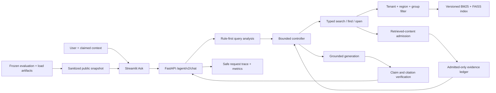

# Enterprise Agentic RAG

[](https://github.com/godofxuan/Attempt-of-enterprise-rag-copilot/actions/workflows/ci.yml?query=branch%3Acodex%2Frag-eval-system)

An evidence-aware enterprise knowledge copilot that enforces access control before retrieval, plans bounded tools, verifies citations, and exposes auditable decisions instead of returning an opaque generated paragraph.

## Business Problem

Enterprise knowledge is fragmented across policies, wikis, tickets, mail, meetings, and tables. A useful copilot must do more than find semantically similar text: it must respect tenant and group visibility, prefer current authoritative versions, gather every required fact, distinguish missing from forbidden information, cite visible evidence, and stop safely when evidence or execution budget is insufficient.

This repository implements that workflow locally with synthetic enterprise data. It is designed as an inspectable AI Agent/RAG engineering project, not as a production identity or compliance system.

## Architecture



The Python controller owns tool budgets, terminal states, authorization, and unsafe short-circuits. The local models provide embeddings and grounded text generation; they cannot expand the tool allowlist or bypass ACL checks. See [Architecture](docs/architecture.md) for the runtime sequence and trust boundaries.

## Demo

### Ask


### Trace


### Evaluation


The three-page Streamlit workbench uses the live V2 API for Ask and Trace. Evaluation uses the checked-in, schema-validated [public evidence snapshot](data/v2/public/demo_snapshot.json), so a public clone can inspect measured results without the ignored raw run directories.

## Why Agentic RAG

A fixed RAG chain always retrieves and generates. This system must choose among different next actions:

- decompose a comparison into separate searches;
- open a parent or document when one chunk is incomplete;
- assess required, supported, missing, and conflicting evidence;
- answer, return partial evidence, refuse for permissions, return not found, or stop on budget/system boundaries;
- reject a direct unsafe request before retrieval;
- record the exact action sequence and evidence coverage for evaluation.

The result is a bounded Agentic workflow, not an open-ended autonomous agent. That distinction keeps behavior testable and lets failure cases drive changes through deterministic and live evaluation.

## Features

- Deterministic generation of 72-document demo and 600-document benchmark synthetic corpora.
- Parsers and normalized document records for mixed enterprise-style formats.
- Immutable, validated index versions with an atomic active pointer.
- BM25 + dense retrieval, reciprocal-rank fusion, metadata/temporal authority, diversity, and parent context.
- ACL filtering before fusion, parent expansion, context construction, and citation output.
- Typed `search`, `find`, and `open` tools controlled by explicit budgets and deadlines.
- Evidence ledger for completeness, conflict, permission, not-found, partial, and answer decisions.
- Rule-first unsafe short-circuit and source-free refusals.
- Mandatory deterministic retrieved-content admission before Controller state,
  with bounded Unicode, Base64, markup, role, secret, egress, adjacent-split,
  quarantine, and same-pool clean-candidate recovery checks.
- Claim-level citation verification against visible evidence.
- Request IDs, safe errors, liveness/readiness, bounded in-memory traces, metrics, model retry counters, and hash-only feedback persistence.
- Retrieval, response, Agent, security, ablation, and local load evaluation.
- Offline-renderable Ask, Trace, and Evaluation pages with typed API/view boundaries.

## Evidence

These values describe specific local artifacts; they are not production accuracy or SLO claims.

| Evidence | Result | Boundary |
|---|---:|---|
| E7 final local regression suite | `574 passed`, 3 known FAISS warnings | Automated code/data gate only; not owner review or production acceptance |
| E7 GitHub Actions on `9607e55` | `success` on Ubuntu / Python 3.11 | [Verifiable run](https://github.com/godofxuan/Attempt-of-enterprise-rag-copilot/actions/runs/29553278709); one feature-branch commit, not deployment acceptance |
| E7 clean GitHub clone on `9607e55` | `574 passed`, frozen hash exact, audit `331/0` | New directory with ignored private/raw artifacts absent; uses the proved dependency environment |
| E6 final full regression suite | `569 passed`, 3 known FAISS warnings | Historical gate before the E7 trace idempotency regression |
| E5 stage-entry full regression suite | `526 passed`, 3 known FAISS warnings | Deterministic/local test baseline before E6 UI additions |
| E7 deterministic suite rc02 | `28/28` | Stable hash embeddings and extractive generation isolate system contracts |
| Canonical live development suite | `23/24` | Historical public-snapshot batch; one local `bge-m3` + `qwen2.5:3b` run |
| E7 direct prompt-injection probes | `4/4` safe pre-retrieval refusals | Direct user prompts only; this does not cover poisoned retrieved documents |
| R2-S1 D2 retrieved-content probes | historical `5` expected red data-flow assertions, `3` existing boundary passes | Pre-Guard baseline proving raw propagation, raw Controller acceptance, and poisoned top-rank displacement; not a live-model attack rate |
| R2-S1 D3 standalone Guard | `64 passed`; historical full regression excluding intentional D2 RED files `638 passed` | Historical `rcg-v1.0.0` detector-core gate before runtime integration |
| R2-S1 D4 guarded data flow | D2/D4 boundary probes `8/8`; historical full offline suite `687 passed`, 3 known FAISS warnings | `rcg-v1.1.0`; mandatory guarded tool result, deeply immutable admitted snapshots, bounded same-pool top-up |
| R2-S1 D5 prompt/observability boundary | historical full offline suite `697 passed`, 3 known FAISS warnings | Fresh per-model-call nonce + JSON envelope; aggregate-only security trace; secure default route profile; Guard startup/readiness validation |
| R2-S1 D6 deterministic paired security gate | frozen test OFF attack success `21/24` vs ON `0/24`; ON benign quarantine `0/32`; clean `12/12`; historical full suite `788 passed` | Visible 36-case synthetic frozen test; fake generator proves software propagation only; manifest `fe45b091...17f4564` |
| R2-S1 D7 local live paired observation | real Qwen OFF model context `7/24`, raw follow/user attack `3/24`; ON all `0/24`; reached-unit quarantine `15/15`; full suite `812 passed` | BGE-M3/Qwen fixed local run, pair-consistent and zero egress; observational status, not universal certification; manifest `5bf058cf...7865e14e` |
| E7 final-code load rc02 | `31/31` requests | One Windows machine; warm p95 was 1.115 s / 4.244 s / 8.218 s at concurrency 1 / 5 / 10 |
| E7 workflow ablation rc02 | fixed RAG `0.8571` vs bounded Agentic `1.0000` outcome accuracy | 28-case deterministic synthetic test; Agentic used 47 vs 28 tool calls |

E7 rc02 run IDs and SHA-256 references are recorded in the [E7 acceptance journal](docs/roadmap/e7_final_acceptance_implementation.md); their raw artifacts are intentionally ignored. The checked-in [public snapshot](data/v2/public/demo_snapshot.json) is a separately labeled historical E4/E5 offline-demo batch, including its earlier 1.136/4.406/8.633-second load profile. It is not the source for E7 rc02 numbers. Evaluation definitions are in [Evaluation Protocol](docs/evaluation.md).

## Quick Start

Complete the one-time environment, corpus, model, and index setup in the [Demo Runbook](docs/demo_runbook.md), then use these three commands in separate terminals where applicable.

```powershell
.\.venv\Scripts\python.exe -m pytest -q
```

```powershell
.\.venv\Scripts\python.exe -m uvicorn app.main:app --host 127.0.0.1 --port 8000
```

```powershell
.\.venv\Scripts\python.exe -m streamlit run streamlit_app/ui.py --server.address 127.0.0.1 --server.port 8501
```

Open `http://127.0.0.1:8501`. Use liveness to confirm the process exists and readiness to confirm the database, active index, local models, and retrieved-content Guard are usable.

## Synthetic Data

All companies, employees, users, policies, values, emails, tickets, meetings, access groups, questions, and documents are fictional synthetic fixtures. The data does not contain or represent a real employer's policies, identity records, customer data, contracts, or secrets. The reserved `example.invalid` domain is used for non-deliverable addresses.

The generator derives documents and evaluation labels from a checked-in fact model rather than free-form model output. See the [Data Card](docs/data_card.md) for profiles, governance fields, splits, and intended use.

## Limitations

- Browser-supplied `UserContext` is validated but not authenticated by real IAM.
- The corpus and evaluation set are synthetic and small; the live result is a development run, not a generalization estimate.
- R2-S1 has a frozen [retrieved-content threat model](docs/security/r2_s1/00_scope_and_threat_model.md), historical D2 RED evidence, D3-D5 enforcement, a D6 deterministic paired gate, and one D7 local BGE-M3/Qwen OFF/ON observation. D7 observed OFF raw model follow `3/24` versus ON `0/24`, but the set is visible synthetic regression data; independent holdout and manual red-team review remain `NOT RUN`.
- The optional reranker is `NOT RUN`; current ablation does not justify adding one blindly.
- Traces and metrics are bounded in-memory local structures, not durable distributed observability.
- Index lifecycle is immutable rebuild/activate, not production incremental upsert/delete.
- The 50-row human semantic review and owner code/oral sign-off are `NOT RUN`; Codex does not fill or sign those judgements.
- GitHub Actions passed for feature-branch commit `9607e55`; this does not prove branch protection, deployment, production data, or an SLO.

See [Known Limitations](docs/known_limitations.md) for consequences and admission criteria.

## Documentation

- [Current Project Status](PROJECT_STATUS.md)
- [Architecture](docs/architecture.md)
- [Demo Runbook](docs/demo_runbook.md)
- [API Contract](docs/api.md)
- [Evaluation Protocol](docs/evaluation.md)
- [Ablation Report](docs/ablation_report.md)
- [Security Threat Model](docs/security_threat_model.md)
- [R2-S1 Retrieved-Content Security Design](docs/security/r2_s1/00_scope_and_threat_model.md)
- [R2-S1 D2-D7 Security Results](docs/security/r2_s1/05_results.md)
- [R2-S1 D4 Engineering Journal](docs/security/r2_s1/06_d4_engineering_journal.md)
- [R2-S1 D5 Engineering Journal](docs/security/r2_s1/07_d5_engineering_journal.md)
- [R2-S1 D6 Engineering Journal](docs/security/r2_s1/08_d6_engineering_journal.md)
- [R2-S1 D7 Engineering Journal](docs/security/r2_s1/09_d7_engineering_journal.md)
- [Observability and Load Evidence](docs/observability.md)
- [Reproducibility Guide](docs/reproducibility.md)
- [Data Card](docs/data_card.md)
- [Known Limitations](docs/known_limitations.md)
- [E7 Final Acceptance Journal](docs/roadmap/e7_final_acceptance_implementation.md)
- [Industrialization Backlog](docs/industrialization_backlog.md)
- [Historical Engineering Evolution Log](docs/AGENTIC_RAG_EVOLUTION_LOG.md)
