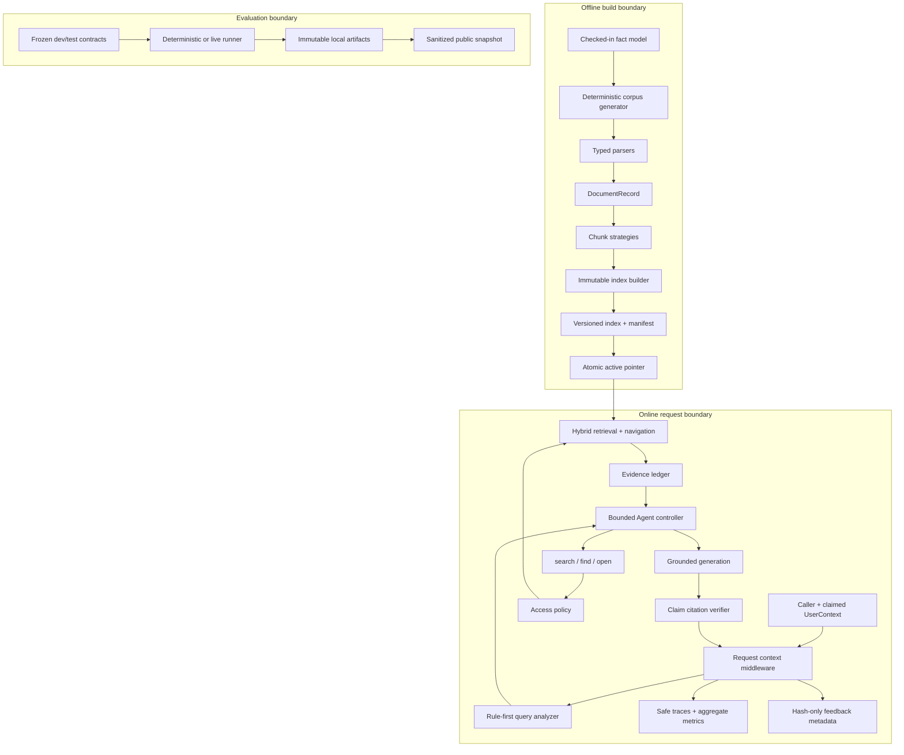
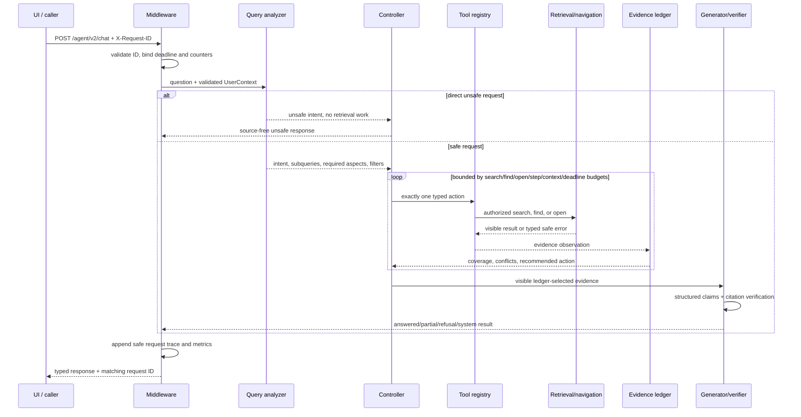

# Enterprise Agentic RAG Architecture

最后更新：2026-07-17

本文描述当前 R1 本地实现。它解释代码中的数据流、控制流和信任边界；计划中的 R2 能力见 [Industrialization Backlog](industrialization_backlog.md)。

## 1. 系统边界



三条边界有意分离：build 产生可验证索引；runtime 只消费 active version；evaluation 复用生产路径但把结果写到独立、不可覆盖的 run。Streamlit 不直接读取内部 index 或原始 run。

## 2. 离线数据与索引生命周期

### 2.1 事实先于文档

`data/v2/facts/company_facts_v1.json` 是 synthetic truth source。`scripts/generate_enterprise_corpus.py` 从事实、profile 和 seed 确定性派生制度、wiki、邮件、工单、会议与表格，并发布 manifest/hash。生成器不让 LLM 自由编写 gold data，因此版本冲突、ACL、authority 和 expected facts 可复算。

### 2.2 统一 DocumentRecord

`app/parsing/` 把不同格式归一到 typed document/section 结构。metadata 在 chunking 前完成 schema 与治理校验，避免检索阶段再从正文猜 tenant、region、ACL、status 或 authority。

### 2.3 Chunk 不只是字符串片段

`app/chunking/` 支持 fixed、heading 和 parent-child 策略。Chunk 保留稳定 ID、section path、source locator、parent relation、版本与治理 metadata。parent-child 让检索命中小片段后可以在同一已授权文档中扩展上下文。

### 2.4 不可变 index version

`scripts/build_indexes_v2.py` 先在 staging 构建 BM25/FAISS 与 metadata artifacts，再验证 schema、维度、hash 和文件集合，最后 promote 到独立 run ID。active pointer 原子切换；已 active 的版本不能被 `--force` 静默覆盖。

这解决“embedding model 改了但旧向量仍被加载”的典型问题：query embedding 维度、manifest 声明和 dense index 维度必须一致，否则 fail closed。

## 3. 在线请求时序



## 4. Query analysis and planning

`app/agent/query_analysis.py` is rule-first:

- deterministic rules identify unsafe intent and stable task shapes;
- fact/process/comparison/completeness/no-answer become typed `QueryAnalysis`;
- comparison creates separate entities, search queries, and required aspects;
- original question remains immutable while search work can be decomposed or rewritten;
- unsafe analysis cannot carry retrieval queries or required aspects.

The controller does not accept an arbitrary model-generated plan. It chooses one action from a fixed `AgentToolName` union and validates action arguments against Pydantic models.

## 5. Retrieval and authorization

`app/retrieval/pipeline.py` and `app/retrieval/navigation.py` implement:

1. query embedding and BM25 tokenization;
2. access filtering by tenant, region, and group before candidate content can enter fusion;
3. dense + sparse ranking and reciprocal-rank fusion;
4. current/retired status, authority, effective dates, and expected policy filters;
5. duplicate/diversity controls and bounded chunks per document;
6. optional authorized parent context;
7. typed find/open by IDs already present in the active snapshot.

ACL is repeated at navigation boundaries. A caller cannot pass a file path to `open`; tools accept typed chunk/parent/document IDs and re-check visibility.

## 6. Evidence-driven control loop

`ControllerState` separates:

- analysis and immutable user context;
- evidence grouped by required aspect;
- latest tool result;
- `EvidenceLedger`;
- explicit budget counters and deadline;
- terminal decision.

The ledger partitions every required aspect into supported or missing; conflicts remain missing until resolved. Coverage is `supported / required`. Its recommendation can be answer, search, find, open, partial, permission, not found, budget, or system.

The public Agent trace receives only counts, coverage, and recommendation. Aspect text, evidence items, document IDs, question, identity, and source preview are intentionally excluded from observability.

## 7. Generation and citation verification

`app/agent/generation_v2.py` receives only visible ledger-selected sources. The model returns structured atomic claims and cited source IDs. `app/agent/citation_verifier.py` then verifies that each citation:

- is present;
- refers to current visible evidence;
- has lexical support;
- maps back to a response claim.

Source-free modes (`unsafe`, `permission`, `not_found`, `system`, `budget`) cannot return sources. Authorization is therefore not delegated to the generator or prompt.

## 8. Service and observability

`app/api/middleware.py` binds a request ID and monotonic deadline in a `ContextVar`. Normal responses, validation failures, explicit API errors, and unhandled errors share the same safe envelope and response ID.

`app/observability/` records allowlisted span names, duration, route template, outcome, status code, model calls/retries/errors, and bounded aggregate latency. It does not retain question, answer, prompt, identity, headers, source metadata, model body, or exception text. Traces are in-memory and bounded, not durable OpenTelemetry traces.

Liveness answers “is the process alive?” Readiness answers “are database, active index, and models usable?” A process can correctly return live=200 and ready=503.

## 9. Presentation boundary

`streamlit_app/api_client.py` validates every response with backend Pydantic models and converts failures to `UiApiError` without raw exception/body text. `demo_cases.py` resolves six frozen EvalCases and one direct security probe by ID. `view_models.py` converts domain models into JSON-safe table rows. Pages only render these boundaries:

- Ask calls the live API after explicit submission;
- Trace renders session Agent trace and explicitly fetched service trace;
- Evaluation reads `data/v2/public/demo_snapshot.json` through strict schema.

Every page renders while the API is offline.

## 10. Evaluation boundary

The E4 runner evaluates retrieval, response, Agent, and security separately. Deterministic mode isolates orchestration with stable hash embeddings/extractive generation; live mode exercises active BGE-M3 and Qwen. Ablation compares retrieval and workflow variants. E5 load profiles use real HTTP and capture only safe metadata.

Raw run directories are ignored because they contain machine/run provenance and detailed cases. `app/evaluation/public_snapshot.py` verifies manifest-declared hashes, extracts allowlisted aggregate fields, and publishes a small deterministic snapshot with run IDs and SHA-256 references.

## 11. Deliberate non-choices

- No LangGraph dependency: the current state machine is small, typed, and easier to audit directly.
- No open-ended tool selection: enterprise authorization and cost require deterministic bounds.
- No vector database yet: the current scale and local lifecycle do not justify operational complexity.
- No reranker yet: the optional variant remains `NOT RUN` until an admitted model improves frozen metrics enough to justify latency.
- No multi-Agent layer: current failures concern evidence, identity, indexing, and observability rather than missing Agent roles.

Related documents: [API](api.md), [Threat Model](security_threat_model.md), [Evaluation](evaluation.md), [Observability](observability.md), and [Known Limitations](known_limitations.md).

## 12. R2-S1 retrieved-content boundary (`D5 IMPLEMENTED`)

R2-S1 D4 implements the frozen boundary between raw retrieval and `Controller.observe` on the default V2 Agent path:

```text
ACL-visible ranked candidates capped at candidate_k
-> bounded body/parent/metadata/find/open/split admission
-> content-free quarantine or deeply immutable admitted snapshot
-> GuardedV2ToolExecution
-> Controller runtime type check
-> admitted-only EvidenceLedger/generation/citation
```

Ranking runs once; quarantine does not consume a top-k/diversity slot, and clean recovery stays inside the same ACL-visible pool. The tool registry checks request/global deadlines after retrieval and after Guard admission, counts only admitted prompt-reachable characters, and fails source-free on a raw execution or unavailable boundary.

R2-S1 D5 extends this path after admission:

```text
admitted records -> bounded JSON serialization
-> fresh per-model-call nonce envelope
-> trusted system contract + post-envelope reminder

GuardedV2ToolExecution -> strict aggregate-only Agent trace projection
```

The default `create_app()` now owns a fixed secure route profile: `/agent/v2/chat` is registered while legacy `/chat`, `/agent/chat`, and HTTP `/ingest` are absent. Historical regression must explicitly construct `create_compatibility_app()`; no request field or environment switch changes the secure profile. Default container construction validates the detector policy, and readiness exposes only `retrieved_guard=ready|error`.

This claim remains limited to `/agent/v2/chat` and its in-process `search/find/open` registry. D5 proves deterministic composition, escaping, route, trace and lifecycle contracts; it does not provide the D6 attack success rate, false-positive rate, or live-model evidence.

See [R2-S1 design](superpowers/specs/2026-07-17-r2-s1-indirect-prompt-injection-design.md), [attack-surface map](security/r2_s1/01_attack_surface_and_trust_boundaries.md), [D4 engineering journal](security/r2_s1/06_d4_engineering_journal.md), and [D5 engineering journal](security/r2_s1/07_d5_engineering_journal.md).
