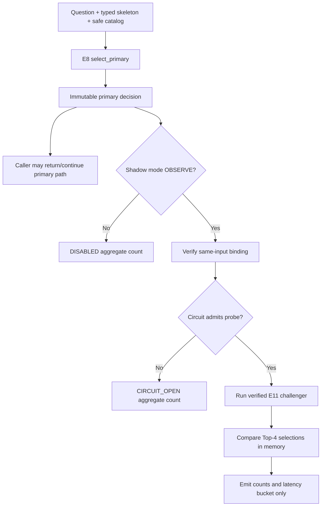

# FinQA Gate E12: Default-off Shadow Runtime

## Decision

```text
mechanism gate                 PASSED
default mode                   OFF
serving champion               E8 deterministic retriever v5
shadow challenger              E11 Top-4 boundary ranker
challenger replacement         FORBIDDEN
production traffic             NOT RUN
frozen test                    UNTOUCHED
next stage                     OPERATIONAL SHADOW REPLAY ONLY
```

E12 converts E11's evaluation artifact into a fail-isolated shadow component.
It does not activate E11 in serving and does not add a FinQA route to the main
enterprise-policy API. The repository has no production FinQA endpoint, so the
honest integration boundary is a reusable coordinator plus a deterministic
mechanism audit.

## Why this gate exists

E11 improved nested outer Descriptor Recall@4 by `1.1987pp` and improved two
of 76 internal roles without a regression. That passed the preregistered
non-regression gate, but exact McNemar was `p=0.5`. Replacing E8 after that
small result would turn a limited experiment into an unjustified release.

Shadow execution separates two decisions:

1. The product decision is returned by the known E8 champion.
2. The E11 challenger is evaluated afterward only to collect bounded
   operational comparison counts.

This allows reliability and divergence to be measured before any promotion
proposal, while preserving the current behavior.

## Frozen protocol

The protocol was written before the E12 implementation and has SHA-256:

```text
20323918a34ca062eb4bfbf015dabd3b21b935bd12028516936c2600e4011ec5
```

It binds the E8 protocol and five E11 artifacts: protocol, nested-CV result,
ranker artifact, one-shot internal result, and internal postmortem. Runtime
loading succeeds only if every file hash and the semantic authorization chain
agree. A valid artifact by itself is insufficient.

The frozen defaults are:

```text
mode                         OFF
observation budget          100 ms
consecutive failures        3
cooldown observations       5
half-open probes            one at a time
hard thread cancellation    not claimed
```

## Runtime flow



`select_primary()` and `observe()` are separate methods. The API shape makes
the ordering explicit: callers cannot obtain a shadow observation without a
primary decision object. The primary object contains an internal SHA binding
of the exact question, skeleton, and catalog; `observe()` recomputes it before
calling E11. A changed input becomes `INPUT_MISMATCH` and no comparison runs.

## Code map

- `finqa_descriptor_shadow_protocol_v1.py` validates the frozen protocol and
  its exact telemetry/circuit contracts.
- `finqa_descriptor_shadow_v1.py` implements evidence-chain loading, the
  default-off coordinator, input binding, circuit breaker, privacy-bounded
  observations, and thread-safe aggregate metrics.
- `audit_finqa_descriptor_shadow_v1.py` performs one real E8/E11 synthetic
  mechanism probe plus deterministic error, timeout, default-off, and circuit
  recovery fault injection.
- `test_finqa_descriptor_shadow_v1.py` covers immutability, privacy, artifact
  tampering, input mismatch, timeout, recovery, and concurrent metric writes.
- `test_finqa_descriptor_shadow_evidence.py` binds the public result to the
  exact implementation hashes.

## Failure isolation

The challenger result is stored only in a local variable inside `observe()`.
The method returns a `FinQAShadowObservationV1`, never a descriptor selection.
Therefore no branch can replace `primary.result`.

The circuit has three states:

```text
CLOSED    run challenger; count consecutive failures
OPEN      skip five observation opportunities
HALF_OPEN allow one probe; success closes, failure reopens
```

`CHALLENGER_ERROR`, `CHALLENGER_TIMEOUT`, and `INPUT_MISMATCH` count as
failures. A timeout is currently elapsed-budget detection after deterministic
CPU execution. It is not hard Python-thread cancellation. This is acceptable
for the mechanism gate because shadow execution occurs after the primary
decision, but a real deployment must use queue/process isolation for hard
resource control.

## Telemetry boundary

Per observation, only seven fields are serializable:

```text
schema_version
outcome
role_count
changed_role_count
common_descriptor_count_at_4
latency_bucket
circuit_state
```

There is no question text, number, descriptor/candidate/evidence/source ID,
provenance, score, or input fingerprint. The registry keeps aggregate counters
only and uses a lock for concurrent updates. Its snapshot model also rejects
unknown outcome, latency, and state keys, preventing later code from using a
free-form metric label as a data exfiltration channel.

## Public mechanism result

```text
focused E12 tests                    14 passed
external-dataset regression          408 passed
full repository regression           2921 passed / 29 skipped
public repository audit              1278 candidates / 0 findings
verified E11 challenger load         READY
real synthetic E8/E11 probe          MATCH
real probe latency bucket            1_TO_LT_5_MS (injected audit clock)
default-off challenger calls         0
error probe                          CHALLENGER_ERROR
timeout probe                        CHALLENGER_TIMEOUT
circuit observations/calls           9 / 4
all mechanism gates                  11 / 11 passed
model calls                          0
```

The injected audit clock makes the evidence byte-reproducible; it is not a
wall-clock benchmark. The synthetic probe result is not model quality or
production traffic evidence. E11's quality claim remains limited to E11's
nested and one-shot internal results.

## Review finding during implementation

The initial aggregate snapshot model accepted arbitrary dictionary keys even
though the registry generated only enum values. That would allow future code
to bypass the intended boundary by constructing a snapshot such as an outcome
named after request content. Before public evidence was generated, the model
was tightened to validate exact key sets and non-negative integer values, and
a regression test was added.

No frozen cohort, private internal cohort, network model, or production route
was accessed by E12.

## Full-regression execution incident

The first full-suite command forced pytest `--basetemp` into the repository's
tracked-root namespace. It ended with `2916 passed / 30 skipped / 4 failed`.
Three identity tests correctly rejected temporary JWKS/HMAC paths that were
inside the repository but outside `.private`. The fourth test expected a
repository-external fixture path to be redacted as `<external>/`, but an
in-repository temp path was correctly rendered as a relative path instead.

The diagnosis used a four-test feedback loop and three ranked hypotheses. All
four failures reproduced with the in-repository temp root. No source code was
changed. Pointing `TEMP` and `TMP` to a D-drive directory outside this
repository made the exact four tests pass, then the full suite passed
`2921/29`. The lesson is that test infrastructure is part of the security
contract: an arbitrary basetemp can invalidate path-boundary tests even when
the application is correct.

## Reproduction

```powershell
& '.\.venv\Scripts\python.exe' -m scripts.audit_finqa_descriptor_shadow_v1
& '.\.venv\Scripts\python.exe' -m pytest `
  tests\external_datasets\test_finqa_descriptor_shadow_protocol_v1.py `
  tests\external_datasets\test_finqa_descriptor_shadow_v1.py `
  tests\external_datasets\test_finqa_descriptor_shadow_evidence.py -q
```

The audit refuses to overwrite the public evidence if rebuilt bytes differ.
For the full suite on Windows, use a D-drive `TEMP`/`TMP` directory outside
the repository rather than forcing `--basetemp` into the project tree.

## Next allowed stage

E13 may add a bounded, unlabeled operational replay over disclosed train-only
inputs to measure divergence, runtime distributions, circuit behavior, and
resource cost. It may not tune E11 from replay outcomes, call the consumed
internal cohort, access frozen test, claim answer accuracy, or promote E11.
Hard timeout and cancellation claims require process or queue isolation.
