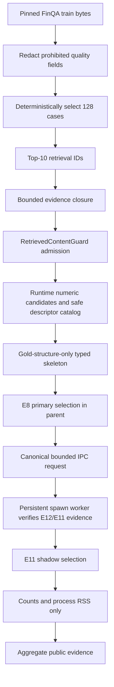

# FinQA Gate E13: Process-Isolated Shadow Operational Replay

## Decision

```text
operational replay gate         PASSED
selected / prepared             128 / 117 (91.41%)
observed / completed            117 / 117 (100%)
worker errors / timeouts        0 / 0
worker restarts in replay       0
observation p50 / p95           5.659 ms / 16.443 ms
maximum worker peak RSS         91,136,000 bytes (86.91 MiB)
serving champion                E8 deterministic retriever v5
shadow challenger              E11 Top-4 boundary ranker
challenger status               SHADOW_DEFAULT_OFF
answer-quality claim            FORBIDDEN
production traffic              NOT RUN
frozen test                     UNTOUCHED
```

E13 closes the main reliability gap left by E12. E12 could identify an
elapsed-budget breach but could not stop a running Python thread. E13 moves
the challenger into a separate persistent process. The parent can terminate
that process after a hard deadline, wait for exit, kill it if termination does
not finish, and start a clean replacement. The E8 primary decision remains in
the parent and cannot be replaced by the worker.

## Frozen input and claim boundary

The final protocol SHA-256 is:

```text
4604572c065d69d8d79f7287cfb206143c01e1ea11c4a6ec85c0bea4ee845f97
```

It pins the official FinQA train bytes at revision
`0f16e2867befa6840783e58be38c9efb9229d742`, all 6,251 case IDs, a seeded
hash selection of 128 cases from 71 companies, a maximum of 10 initially
retrieved units, process budgets, replay gates, fault gates, and the E12
protocol/mechanism evidence hashes.

The replay does not consume `answer`, `exe_ans`, `gold_inds`, annotated rows,
or target labels. Those fields are replaced by fixed placeholders before
`FinQACase` validation. It does use the official gold program structure to
construct a typed skeleton. Therefore it is an unlabeled operational replay,
not a realistic planner evaluation and not an answer-accuracy experiment.

## Runtime data flow



The source-bound constant check no longer uses `gold_inds`. It compares only
program-structure constants with numeric candidates extracted from evidence
that was actually retrieved and admitted by Guard. This prevents the replay
from quietly using gold evidence to make preparation easier.

## Process contract

The worker uses Windows-compatible `multiprocessing.get_context("spawn")` and
a duplex `Pipe`. It is persistent so model/artifact initialization is paid
once, while a lock enforces one in-flight request. Startup is accepted only
after a typed `READY` handshake from a child that successfully verifies and
loads the E11 challenger evidence chain.

Each request is canonical ASCII JSON and is rejected before IPC if it exceeds
1 MiB. Each response is limited to 64 KiB and must validate as a strict typed
response. The response contains only:

```text
MATCH or DIVERGED
role count
changed-role count
common Top-4 descriptor count
zero generation calls
worker process peak RSS
```

The parent recomputes the E12 input binding before sending. A mismatched
question, skeleton, or catalog fails before worker startup. On timeout, crash,
EOF, oversized response, or malformed response, the current worker cannot
return a descriptor selection to the primary path.

## Code map

- `app/external_datasets/finqa_shadow_worker_protocol_v1.py` strictly parses
  the frozen dataset, worker, replay, fault, privacy, and non-claim contract.
- `app/external_datasets/finqa_shadow_worker_v1.py` defines the bounded request,
  response and observation schemas, child entry point, spawn lifecycle, hard
  termination, crash detection, restart, and diagnostics.
- `app/external_datasets/finqa_shadow_replay_v1.py` verifies and projects the
  train input, selects the cohort, prepares safe runtime inputs, runs E8/E11,
  reconciles all aggregate counts, and evaluates replay gates.
- `scripts/audit_finqa_shadow_worker_replay_v1.py` runs the real 128-case
  replay and separate timeout/crash/malformed/oversize fault probes, then emits
  aggregate-only public evidence.
- `tests/external_datasets/test_finqa_shadow_worker_*.py` and
  `test_finqa_shadow_replay_v1.py` cover protocol binding, worker lifecycle,
  label redaction, selection, accounting, fault behavior, and evidence hashes.

## Formal replay result

```text
selected cases                         128
prepared cases                         117
preparation failures                    11
primary failures                         0
attempted/completed observations        117 / 117
MATCH / DIVERGED                         74 / 43
roles / changed roles                   252 / 83
common Top-4 descriptor memberships     940
replay worker errors/timeouts/restarts     0 / 0 / 0
latency p50 / p95 / max                 5.659 / 16.443 / 37.682 ms
worker peak RSS p50 / p95 / max         86.06 / 86.91 / 86.91 MiB
model calls                               0
persisted per-request rows                0
quality labels consumed                   0
fault-injection gates                      5 / 5 passed
all gates                                 16 / 16 passed
```

Preparation succeeded for 91.41% of the selected cohort. A private,
content-free category-only diagnosis of the 11 failures found eight unsupported
capability routes with no typed skeleton, two ambiguous numeric tokens that
failed closed, and one source-bound constant that was neither present in the
admitted runtime candidates nor authorized by the host constant registry.
These failures were not used to tune E11 after the replay.

`74 MATCH / 43 DIVERGED` is not a correctness score. It says that the E8 and
E11 Top-4 descriptor sets were identical in 74 prepared cases and differed in
43. Across 252 roles, 83 role selections changed. The replay contains no answer
labels, so neither arm can be declared better from this result.

The latency timer covers parent request construction, IPC, E11 selection,
response validation, and parent observation construction after preparation
and E8 primary selection. It is not end-to-end RAG latency or concurrent
throughput. RSS is the child process peak since process start, not incremental
memory attributable only to E11.

## Fault injection

Five separate gates passed:

1. A hanging child exceeded 50 ms, the old PID was terminated, and a different
   replacement PID reached `READY`.
2. A child exiting with code 17 was classified as `WORKER_CRASH` and restarted.
3. A child returning `{}` was rejected as a malformed typed response and
   restarted.
4. A request larger than a deliberately reduced bound was rejected before any
   worker process was started.
5. Primary input binding, retriever version, generation-call count, and complete
   selections remained byte-equivalent through all probes.

These probes prove parent-controlled process lifecycle behavior on this local
Windows host. They do not prove an operating-system network sandbox, queue
durability, distributed recovery, or production availability.

## Problems found and resolved

### Train size and one invalid official label

The generic FinQA loader has a 64 MiB budget, while train is 78,216,616 bytes.
E13 switched to the already verified 128 MiB exact-SHA train loader. Full model
validation then found one official `gold_inds` key using `text_-1`. The fix was
not to loosen the shared schema. E13 projects prohibited quality fields to
fixed placeholders before typed runtime validation, because those labels are
outside this experiment's input contract.

### Hidden gold-evidence dependency

The first preparation implementation reused `_source_bound_constant_ids()`,
which reads `gold_inds`. That contradicted the protocol. It was replaced with a
retrieved-and-Guard-admitted candidate comparison. A source scan regression
test forbids future `case.qa.<prohibited field>` reads in the replay module.

### Selection separator mismatch

The initial protocol draft described a NUL separator, while its frozen expected
ID-set hash had been generated with the two ASCII characters backslash and
zero. Tests reproduced the expected hash only with the latter encoding. Before
any formal result, the algorithm name was corrected, the protocol was
refrozen, and the old draft SHA was withdrawn. The final protocol SHA above is
the only one referenced by public evidence.

### Audit object-type assumptions

Two pre-publication audit attempts assumed dataclasses exposed Pydantic
`model_dump_json()`. Both stopped before evidence write. The immutable primary
snapshot was changed to the exact decision fields: input binding, retriever
version, generation-call count, and selections JSON.

### Public schema overwrite

The first successful run expanded a summary dict after setting the public
`schema_version`, so the inner summary version replaced the outer version. That
uncommitted evidence file was withdrawn. The final writer removes the inner
version before expansion, emits `finqa_shadow_worker_replay_public_v1`, and is
bound by an evidence test and SHA-256.

### Malformed-response helper EOF race

The first clean-log review found a lone multiprocessing process prefix after
all fault gates passed. The audit's malformed-response child sent `{}` and
then waited for another Pipe message; closing the Pipe during restart could
raise EOF before parent termination completed. The helper now sends the
malformed response and blocks, leaving termination entirely to the parent.
The final audit log is clean and the accepted evidence was regenerated.

## Evidence

```text
protocol SHA-256  4604572c065d69d8d79f7287cfb206143c01e1ea11c4a6ec85c0bea4ee845f97
public SHA-256    b933f83dff1307828309222c276ea0a5d70372324cdd7822c79dd41b463106d3
```

The public file contains no per-request rows, question text, numeric source
values, case/company/descriptor/candidate/evidence/source IDs, provenance,
ranked scores, or per-request latency.

Closeout verification on the same working tree:

```text
focused E13 tests                    16 passed
all external-dataset tests           424 passed
full repository regression           2937 passed / 29 skipped / 3 warnings
public repository audit              1291 candidates / 0 findings
compileall                            passed
pip check                             no broken requirements
```

The three warnings are the repository's existing SWIG type deprecation
warnings. E13 added no skip or warning relative to E12.

## Reproduction

```powershell
$env:TEMP=Join-Path (Split-Path (Get-Location) -Parent) '.tmp\rag-try-pytest'
$env:TMP=$env:TEMP
& '.\.venv\Scripts\python.exe' -m scripts.audit_finqa_shadow_worker_replay_v1
& '.\.venv\Scripts\python.exe' -m pytest `
  tests\external_datasets\test_finqa_shadow_worker_protocol_v1.py `
  tests\external_datasets\test_finqa_shadow_worker_v1.py `
  tests\external_datasets\test_finqa_shadow_replay_v1.py `
  tests\external_datasets\test_finqa_shadow_worker_evidence_v1.py -q
```

The audit refuses to overwrite different public evidence. Re-running a
wall-clock replay naturally produces different latency bytes and is not a
method for overwriting the accepted result.

## Next allowed stage

E13 does not authorize E11 promotion. The next industrial step should first
verify this spawn contract in remote Windows CI and review the exact commit.
A later version may add a bounded worker pool or queue, durable aggregate
metrics, startup/backpressure SLOs, and an authorized private diagnostic path.
Such work needs a new protocol and evidence name. Real production traffic,
independent answer-quality evidence, and serving promotion remain separate
gates.
