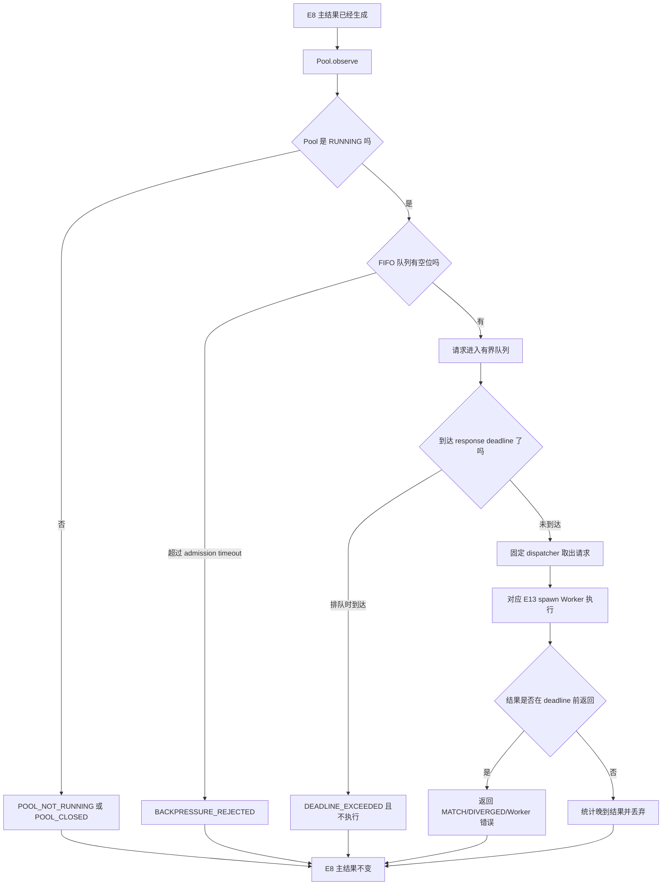

# FinQA Gate E14：有界 Worker Pool、背压与 deadline

这一章不是只告诉你“加了一个线程池”，而是解释为什么企业系统不能让每个请求
随意创建线程或进程、代码具体放在哪里、请求经过哪些状态，以及本阶段的数字到底
能证明什么。

## 1. E13 已经有 Worker，为什么还需要 E14

E13 的结构可以简化成：

```text
请求 -> 一个持久子进程 -> E11 Shadow 结果
```

它已经解决了单次执行隔离：子进程卡死时，父进程可以终止并重启它。但企业服务不
会永远一次只收到一个请求。假设某一秒来了 1,000 个请求，如果每个请求都创建一个
进程，常见结果是：

1. 内存快速增长；
2. 上下文切换消耗 CPU；
3. 所有请求一起变慢；
4. 进程创建失败后又触发更多重试；
5. 主 RAG 请求被一个非关键 Shadow 功能拖垮。

E14 的核心目标不是“尽可能多地并发”，而是**明确系统最多愿意承担多少并发和排队
工作，超过以后如何可预测地失败**。

## 2. 什么叫有界

本阶段冻结了两个上限：

```text
worker_count  = 2
queue_capacity = 4
```

含义是：

- 最多有 2 条 Shadow 观察正在子进程中执行；
- 最多有 4 条已经接纳的请求在 FIFO 队列中等待；
- 队列满后，新请求不会无限等待，而是返回
  `BACKPRESSURE_REJECTED`。

这就是有界。它把最坏资源规模从“取决于流量有多大”变成“由配置决定”。

## 3. 背压是什么

背压不是普通异常，而是下游向上游表达：

> 我当前已经达到处理上限，请不要继续无条件塞入工作。

E14 使用 `reject_newest`：已经进入队列的请求保留顺序，最新请求在 admission timeout
内仍找不到空位就被拒绝。

为什么 Shadow 请求可以拒绝？因为 E8 主结果已经计算完成，E11 只是默认关闭的旁路
观察。丢掉一次 Shadow 观察，比拖慢或破坏用户主请求更合理。

## 4. 完整请求流程



注意最后所有路径都回到“E8 主结果不变”。Shadow 成功或失败都没有权限覆盖主结果。

## 5. 代码具体改在哪里

### 5.1 协议与配置

文件：`app/external_datasets/finqa_shadow_pool_protocol_v1.py`

主要模型：

- `FinQAShadowPoolContractV1`：Worker 数、队列容量、deadline、关闭时间；
- `FinQAShadowPoolReplayGatesV1`：正常回放必须满足的阈值；
- `FinQAShadowPoolFaultGatesV1`：故障注入必须证明的行为；
- `FinQAShadowPoolPublicOutputV1`：什么能公开、什么不能公开。

协议 JSON 在：

`docs/external_datasets/evidence/finqa_shadow_pool_replay_protocol_v1.json`

协议文件在实现前冻结，并绑定 E13 的协议和公开证据哈希。这防止实现完成后看到结果
不好，再偷偷调整门槛。

### 5.2 Pool 核心

文件：`app/external_datasets/finqa_shadow_pool_v1.py`

`FinQABoundedShadowWorkerPoolV1` 是主要入口：

```python
pool = FinQABoundedShadowWorkerPoolV1(
    evidence_dir=evidence_dir,
    config=FinQAShadowWorkerPoolConfigV1(
        worker_count=2,
        queue_capacity=4,
        admission_timeout_seconds=0.25,
        response_deadline_seconds=2.0,
        shutdown_grace_seconds=20.0,
    ),
)
```

重要公开方法：

- `start()`：先启动并验证全部 Worker，再进入 `RUNNING`；
- `observe()`：接纳、排队、等待 deadline、返回观察结果；
- `metrics()`：读取纯聚合计数；
- `diagnostics()`：检查状态、Worker PID、存活 dispatcher 数；
- `close()`：停止接单、处理队列、回收线程和子进程。

### 5.3 并发回放

文件：`app/external_datasets/finqa_shadow_pool_replay_v1.py`

它复用 E13 的数据边界：

1. 只加载官方 FinQA train；
2. 先删除答案、执行答案、gold evidence 等质量标签；
3. 按 E13 的固定算法选 128 条；
4. 用 Guard 允许的检索内容生成 typed input；
5. 先得到 E8 主结果；
6. 再由 4 个 caller thread 提交给 2 个 Shadow Worker；
7. 最后只输出聚合统计。

### 5.4 审计脚本

文件：`scripts/audit_finqa_shadow_pool_replay_v1.py`

运行方式：

```powershell
& '.\.venv\Scripts\python.exe' -m scripts.audit_finqa_shadow_pool_replay_v1
```

脚本会验证上游哈希、运行真实回放、执行七个故障探针、检查 21 个 gate，最后生成：

`docs/external_datasets/evidence/finqa_shadow_pool_replay_public_v1.json`

## 6. 为什么使用两个 dispatcher thread

每个 dispatcher 固定拥有一个 E13 Worker。这样有三个好处：

1. 一个 Worker 永远只有一个 in-flight 请求；
2. 不需要多个线程竞争同一个 pipe；
3. 一个 Worker 的 crash/timeout 不会让另一个 Worker 的锁和连接一起失效。

线程负责调度，真正的 E11 计算在独立 spawn 子进程中运行。线程隔离和进程隔离承担
不同职责，不能混为一谈。

## 7. admission lock 为什么重要

初始实现审查时发现一个潜在竞态：

```text
线程 A：看到状态是 RUNNING
线程 B：执行 close，放入 STOP
线程 A：把请求放在 STOP 后面
dispatcher：读到 STOP 后退出
请求：永远没人处理
```

修复方法不是多加 sleep，而是让“检查状态”和“入队”在同一个 `_state_lock` 临界区
完成。这样 A 和 B 必须有明确顺序：

- A 先拿锁：请求先入队，close 随后负责有序处理；
- B 先拿锁：状态变成 `CLOSING`，A 被明确拒绝。

这类问题是并发面试的重点：正确性来自状态机和锁保护的不变量，不来自运行几次
“看起来没出错”。

## 8. E14 deadline 和 E13 timeout 有什么区别

### E14 response deadline

面向调用方。两秒到了，调用方返回 `DEADLINE_EXCEEDED`，以后到达的 Shadow 结果被
丢弃，不能覆盖先前返回的结果。

### E13 process timeout

面向执行资源。子进程在执行预算内没有响应，父进程终止旧 PID，并启动替代 Worker。

本阶段没有谎称 Python 可以在 response deadline 到达的一瞬间安全杀死正在运行的
dispatcher thread。当前保证是：调用方不会继续等待，晚到输出无效；底层失控进程由
E13 的更强隔离负责处理。

## 9. 七个故障探针分别验证什么

### 9.1 queue bound

让一个 Worker 阻塞，再把一个请求放入容量为 1 的队列。第三个请求不能让队列高水位
超过 1。

### 9.2 overload rejection

第三个请求必须返回 `BACKPRESSURE_REJECTED`，同时前两个已接纳请求仍能完成，E8
主结果在探针前后完全一致。

### 9.3 queued deadline

第一个请求占住唯一 Worker，第二个请求在队列里过期。第二个请求不能进入 Worker，
因此 `executed_count` 仍是 1。

### 9.4 late result

第一个请求已开始执行，但调用方先达到 deadline。Worker 后来返回的结果被计入
`late_result_discarded_count`，不会作为正常结果交付。

### 9.5 slot isolation

两个槽位同时处理请求，一个返回 `WORKER_CRASH`，另一个仍返回 `MATCH`。这证明 Pool
没有把单槽故障升级成全局失败。

### 9.6 closed rejection

`close()` 后再次调用 `observe()`，必须返回 `POOL_CLOSED`，不能偷偷重启 Worker。

### 9.7 no residual workers

关闭后 dispatcher 存活数必须为 0，两个 Worker PID 都必须为 `None`。全量测试完成后
还额外检查了 Windows 进程列表，没有发现 E14 残留进程。

## 10. 指标逐个解释

### `attempted_count`

准备成功并得到 E8 主结果后，实际调用 Pool 的请求数。本次是 117。

### `admitted_count`

成功进入有界系统的请求数，包括正在执行和排队。本次 117，说明正常负载下没有入口
拒绝。

### `completed_count`

最终得到 `MATCH` 或 `DIVERGED` 的请求数。本次 117。

### `active_worker_high_watermark`

同一时刻真正执行过的最大 Worker 数。本次 `2/2`，证明不是配置了两个却始终串行。

### `queue_high_watermark`

观测到的最大等待请求数。本次 `2/4`，说明出现了真实排队，但没有触达容量上限。

### `queue_wait_ms`

从调用 `observe()` 到 dispatcher 开始执行的等待时间；它也包含可能发生的有界
admission 等待。本次 P95 为 `13.354 ms`。

### `end_to_end_latency_ms`

从 Pool 接纳开始到 Shadow 结果返回的时间，包含排队和 Worker 执行。本次 P95 为
`26.439 ms`。

### `throughput_requests_per_second`

117 个 Pool 观察除以本次计时区间，结果约 `243.251 req/s`。这个计时不包含文档解析、
检索准备、E8 主选择或回答生成，所以不能写成“RAG 系统 QPS”。

### `worker_pool_rss_upper_bound_bytes`

分别取两个 Worker 报告的进程历史峰值，再求和，本次为 `180,293,632 bytes`，约
`171.94 MiB`。它不是整个服务进程的内存峰值。

## 11. E13 和 E14 能直接比较快慢吗

不能直接说“E14 比 E13 快多少”。

E13 的 `16.443 ms` 是单 Worker observation P95；E14 的 `26.439 ms` 是包含排队的 Pool
端到端 P95。计时边界不同，而且两次运行的缓存和操作系统调度状态也不同。

本阶段可以诚实地说：

- 两个 Worker 确实同时活跃；
- 正常 117 请求全部完成；
- 本次本机计时区间吞吐约 243 req/s；
- 资源和尾延迟均低于预先冻结的门槛。

要证明扩容收益，必须在同一准备结果、同一运行协议下比较 1/2/4 Worker，并重复多轮。
这就是下一阶段 E15 的必要性。

## 12. 结果好在哪里

1. 资源规模可计算，不会随瞬时请求数无限增长；
2. 正常回放 117/117 完成，没有重启或超时；
3. 两个 Worker 实际并发，不是假并发配置；
4. 七类故障行为都有可执行测试；
5. E8 主路径和质量数据边界保持不变；
6. 本地全仓库 `2949 passed / 29 skipped`。

对应实现提交 `3e5ebb8` 的 GitHub Actions #49 也通过 Ubuntu、Windows 和 Linux
container 三层门禁，总时长 9分41秒。这说明本阶段不仅在当前 Windows 工作区通过，
也能在没有私有 FinQA 文件的 clean checkout 和 Linux 容器中保持公开契约成立。

## 13. 结果还不够好的地方

1. 只测了本机和一种 `2 Worker / 4 caller` 配置；
2. 没有多轮重复，无法给出方差或置信区间；
3. 没有接入真实 API 流量；
4. 没有 durable queue，进程退出后等待任务不会恢复；
5. 没有 Prometheus、OpenTelemetry 或分布式调度；
6. gold program structure 仍绕过真实 planner；
7. 完全没有新增答案质量证据。

因此 E11 仍然是 `SHADOW_DEFAULT_OFF`，E8 仍是 serving champion。

## 14. 开发时遇到的问题

### 测试 catalog 哈希错误

第一个并发测试为了方便填了假 SHA，`RetrievableSafeDescriptorCatalogV3` 立即拒绝。
正确修复是让测试按 canonical JSON 计算真实哈希，而不是关闭安全校验。

### 关闭竞态

代码审查发现 admission 和 shutdown 之间存在理论窗口。修复后，两者共享状态锁，已有
测试继续全部通过。

### 两个线程同时关闭

后续审查又发现两个 shutdown hook 同时调用 `close()` 时，双方都可能投递 STOP；当
dispatcher 已经消费第一批 STOP 并退出后，第二批 STOP 可能填满无人消费的队列。修复
后只有第一个调用方是关闭所有者，其他调用方等待同一个有界完成事件并复用关闭结果。
新增回归测试同时发起两次 close，验证二者都返回、队列为 0、Worker 只被有序关闭。

### 临时证据不是最终证据

第一次真实回放通过后没有立刻宣布完成，而是先清理源码，再删除临时结果并重新执行
审计。最终证据只绑定最终源码哈希。

### 工具缺失

当前虚拟环境没有 `ruff` 和 `black`。没有临时安装依赖，而是执行已有的
`compileall`、最长行扫描、`git diff --check`、聚焦测试、外部数据测试、全量 pytest
和公开审计。该限制必须保留在记录中，不能伪称 formatter 已通过。

## 15. 面试时怎么讲

可以按以下顺序回答：

> E13 只有一个隔离 Worker，无法证明并发请求下的资源上限。我在 E14 冻结了两进程、
> 四等待位的协议，实现 FIFO 有界队列和 reject-newest 背压。每个 dispatcher 固定绑定
> 一个 spawn Worker，保持单 Worker 单 in-flight。调用方有 response deadline，排队过期
> 的任务不执行，执行后晚到的结果也不能覆盖 E8 主结果。真实 117 请求全部完成，两个
> Worker 高水位达到 2，P95 Pool 延迟 26.439 ms，七个故障探针和全仓库 2949 条测试通过。
> 但这不是 RAG QPS 或答案准确率，我下一步会做 1/2/4 Worker 同条件消融。

## 16. 面试官可能追问

### 为什么不用无界 `ThreadPoolExecutor`？

因为 executor 的默认工作队列可能持续增长。任务提交成功不代表系统有能力及时处理，
最终会把流量峰值转换成内存和尾延迟问题。E14 在入口就显式限制等待容量。

### 为什么拒绝最新请求？

FIFO 中的旧请求已经等待更久，保留它们可以维持顺序和公平性。Shadow 不是用户主
结果，新请求快速失败比无限排队更合理。

### 为什么 Worker 用进程，dispatcher 用线程？

线程适合轻量调度和等待 pipe；进程提供崩溃、内存和超时隔离。只用线程无法可靠
终止卡死的本地模型执行，只用大量进程又会带来昂贵启动和内存成本。

### deadline 后底层任务还执行，算不算取消失败？

它是响应取消，不是强制线程抢占。系统保证结果不会交付或覆盖主结果，底层执行仍受
E13 的硬进程超时约束。要实现更强取消，需要可取消 IPC 协议或按请求终止 Worker，
代价是更多重启和冷启动。

### 如何证明没有数据泄漏？

输入先投影掉质量标签；公开 schema 禁止问题、case ID、descriptor ID、worker 分配和
每请求延迟；证据只保存聚合分布；公开仓库审计结果为 0 findings。

### 为什么没有直接上线 E11？

E14 只证明运行机制。此前 E11 的内部改进样本很少且统计显著性不足，冻结测试也未
解封。运行稳定不能替代质量和发布证据。

## 17. 下一步 E15 应该做什么

E15 应该是容量边界实验，而不是继续添加名词：

1. 一次准备固定请求，避免数据处理时间污染比较；
2. 分别使用 1、2、4 Worker；
3. caller concurrency 使用 1、4、8；
4. 每个组合重复多轮，包含预热和冷启动记录；
5. 报告吞吐、P50/P95、queue wait、拒绝率、重启和 RSS；
6. 计算扩容效率，例如从 1 到 2 Worker 是否接近 2 倍；
7. 找到内存增长开始大于吞吐收益的位置；
8. 仍然不访问 internal/frozen quality split。

这一步完成后，简历才能更可信地写“建立有界并发与容量验证方法”，而不是只写
“使用多进程提高性能”。

## 18. 本阶段文件索引

```text
app/external_datasets/finqa_shadow_pool_protocol_v1.py
app/external_datasets/finqa_shadow_pool_v1.py
app/external_datasets/finqa_shadow_pool_replay_v1.py
scripts/audit_finqa_shadow_pool_replay_v1.py
tests/external_datasets/test_finqa_shadow_pool_protocol_v1.py
tests/external_datasets/test_finqa_shadow_pool_v1.py
tests/external_datasets/test_finqa_shadow_pool_replay_v1.py
tests/external_datasets/test_finqa_shadow_pool_evidence_v1.py
docs/external_datasets/evidence/finqa_shadow_pool_replay_protocol_v1.json
docs/external_datasets/evidence/finqa_shadow_pool_replay_public_v1.json
```
