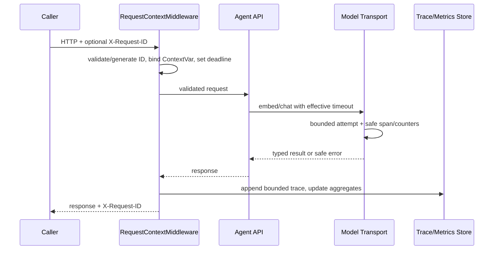

# E5 Observability and Load Evidence

最后更新：2026-07-17

## 1. 目标与边界

E5 解决的是本地单进程服务的三个问题：

1. 某个 HTTP 请求发生了什么；
2. 一段时间内整体延迟、错误和模型调用怎样；
3. 这些证据能否在不保存业务正文的前提下复查。

OpenTelemetry 把 traces、metrics、logs 视为不同但可关联的 signals，并用 context 在执行单元之间携带关联信息。本项目借用了这个分层思路，但实现是轻量本地版本：没有 OTel SDK、collector、exporter、W3C `traceparent` 或跨进程 parent span。参考：[OpenTelemetry Signals](https://opentelemetry.io/docs/concepts/signals/) 和 [Context propagation](https://opentelemetry.io/docs/concepts/context-propagation/)。

## 2. 请求关联流程



入口是 `app/api/middleware.py`。正常、验证失败和未处理异常都走 `finally`，所以 request count、duration 和 context reset 不依赖 endpoint 是否成功。

## 3. Request context

`app/runtime/request_context.py` 使用一个 `ContextVar[RequestContext | None]` 保存：

- `request_id`；
- monotonic start/deadline；
- allowlisted spans；
- `model_calls`、`model_retries`、`model_errors`。

不保存 question、answer、headers、user、prompt 或 model body。middleware 保存 `Token` 并在 finally 调用 `reset_request_context(token)`，因此并发请求和后续请求不会继承前一个请求的数据。

deadline 计算：

```text
remaining = max(0, deadline_at - monotonic_now)
attempt_timeout = min(configured_model_timeout, remaining)
```

如果 remaining 已为 0，transport 在发 HTTP 前失败；backoff 会超过剩余时间时也不会继续睡眠重试。

## 4. Trace

`app/observability/tracing.py` 定义严格 `RequestTrace`：

```json
{
  "request_id": "client.req-123",
  "method": "POST",
  "route": "/agent/v2/chat",
  "status_code": 200,
  "duration_ms": 1240.5,
  "outcome": "answered",
  "model_calls": 2,
  "model_retries": 0,
  "model_errors": 0,
  "spans": [
    {"name": "model.embed", "status": "ok", "duration_ms": 180.0},
    {"name": "model.chat", "status": "ok", "duration_ms": 850.0},
    {"name": "agent.run", "status": "ok", "duration_ms": 1230.0}
  ]
}
```

span 名称固定为：

```text
agent.run
model.chat
model.embed
feedback.persist
readiness.database
readiness.index
readiness.models
```

任意动态 span 名会被拒绝，避免把 question、doc ID 或 tenant 放进名称造成高基数和泄漏。默认 `InMemoryTraceStore` 是 `deque(maxlen=200)`；超出后自动淘汰最旧记录，进程重启后全部丢失。

查询：

```http
GET /observability/traces/{request_id}
```

未知 ID 返回统一 `trace_not_found` 404。该 endpoint 当前无认证，只能本机使用。

## 5. Metrics

`app/observability/metrics.py` 在线程锁内维护：

- 当前 in-flight；
- request total/error；
- 按 `METHOD + registered route template` 的 status class；
- 每 route 的 latency count/sum/p50/p95；
- model calls/retries/errors；
- 当前进程 RSS。

未知 route 一律折叠为 `__unmatched__`，不把攻击者 path 变成无限 label。latency 只保留最近 `metrics_latency_buffer_size` 个样本用于分位数，但 `count/sum` 是进程期累计值。

p50/p95 使用 nearest-rank：先排序，取 `ceil(p * n) - 1`。例如 10 个值时 p95 取第 10 个，因此小样本 p95 常等于 max；这不是插值估计。

查询：

```http
GET /observability/metrics
```

Windows RSS 使用 `GetCurrentProcess` + `GetProcessMemoryInfo`。E5 live 首次发现 ctypes 未声明 `HANDLE` 返回类型，64 位伪句柄被截断并得到 WinError 6；加入 WinAPI `argtypes/restype` 和 Windows-only 回归后恢复为正整数。

## 6. 日志

middleware 只写一行完成日志：

```text
request_complete request_id=... method=POST route=/agent/v2/chat status=200 duration_ms=...
```

不记录 query string、headers、request/response body、identity 或 exception string。未处理异常只映射安全 `internal_error`；开发诊断若需要原始异常，应使用受控本地调试器，而不是把正文长期写入共享日志。

## 7. Model transport observability

`app/runtime/model_transport.py` 把 chat/embed 的 HTTP 调用统一成同一 attempt loop：

| 事件 | counter/span |
|---|---|
| 每次实际 send | `model_calls += 1`，一个 `model.chat/embed` span |
| 第 2 次 attempt | `model_retries += 1` |
| 最终 transport 失败 | `model_errors += 1` |
| structured JSON 第 2 次生成 | 新模型调用；`generation_attempts=2` 写入安全 Agent trace |

transport retry 和 structured generation retry 是两层不同概念。前者处理网络/HTTP 瞬态，后者只处理模型返回 JSON/Pydantic/source-ID shape 不合法。

## 8. Load profile artifact

命令：

```powershell
.\.venv\Scripts\python.exe -m scripts.load_profile `
  --base-url http://127.0.0.1:8000 `
  --profile demo `
  --concurrency 1,5,10 `
  --requests-per-level 10 `
  --run-id <immutable-run-id> `
  --timeout-seconds 30
```

流程：

1. `/health/live`；
2. `/health/ready`，捕获 active index metadata；
3. metrics before；
4. 一条 cold request；
5. 每个 concurrency 档固定数量 warm requests；
6. metrics after；
7. staging 写文件、计算 hash、原子发布。

产物：

```text
load_runs/<run-id>/
  manifest.json
  summary.json
  details.csv
```

`details.csv` 只有：phase、sequence、concurrency、status code、success、mode、request ID、latency、safe error code。HTTP 200 的 `mode=system/budget` 记为失败，分别使用 `agent_system/agent_budget`，不会用“协议返回成功”冒充“业务完成成功”。

## 9. E5 live 结果

主要 artifact：`load_runs/20260716T165304Z_7aec4b9_demo_load_r2/`。

固定条件：Windows 本机；FastAPI 单进程；活动 index `20260716T135632Z_7aec4b9_live_bge_m3_fixed`；64 chunks；bge-m3 1024D；qwen2.5:3b；每档 10 条；客户端 timeout 30 秒。

| phase/concurrency | 请求 | 成功 | p50 | p95 | max |
|---|---:|---:|---:|---:|---:|
| cold / 1 | 1 | 1 | 1.668s | 1.668s | 1.668s |
| warm / 1 | 10 | 10 | 1.091s | 1.136s | 1.136s |
| warm / 5 | 10 | 10 | 3.902s | 4.406s | 4.406s |
| warm / 10 | 10 | 10 | 4.827s | 8.633s | 8.633s |

其他证据：

```text
total                              31/31 successful
model call delta                   62
model retry/error delta            0 / 0
RSS before                         92,991,488 bytes
RSS after                         159,088,640 bytes
RSS delta                          66,097,152 bytes (~63.0 MiB)
summary/details artifact hashes    match
question/identity/body field scan  0 matches
```

解释：每个问题通常产生一次 embed 和一次 chat，所以 31 条对应 62 次模型调用。并发从 1 到 10 时 p95 从 1.136s 增到 8.633s，说明当前单机 Ollama 能完成该小负载，但排队显著放大尾延迟。31/31 不是 SLA，也不能外推到更多文档、其他硬件、长问题或多租户流量。

## 10. Cold-start incident

正式 load 前第一条真实 smoke 返回了安全 `mode=system`：

```text
model.embed span     4625ms
agent.run            5156ms
model errors         0
chat spans           0
```

检索工具的单次 timeout 是 5000ms。Ollama 首次加载 bge-m3 已花 4625ms，加上 BM25/FAISS/对象构造后超过 5 秒，Navigator 返回 safe timeout，Agent fail closed。第二次同题 search 只需 203ms 并 answered。

API 重启后的 r2 cold 只有 1.668s，因为 Ollama 是独立进程，仍保留已加载模型。因此 r2 的 `cold` 是“load profiler 中第一条请求”，不是“操作系统和 Ollama 全冷启动”。面试时必须说清这个条件。

## 11. 运维排查顺序

### live 200、ready 503

查看 `/health/ready` 的 database/index/models 三个安全码。它不返回异常路径；本机进一步检查 active pointer、SQLite 和 `/api/tags`。

### HTTP 200、mode=system

先看 request trace：

- 只有 embed、没有 chat：检查 retrieval timeout/index/embedding；
- chat span error 且 model_errors 增长：检查 transport；
- chat 两次都 ok、`generation_attempts=2`：检查 structured output shape；
- Agent span接近 deadline：检查预算和排队。

### p95 随并发快速上升

先比较 model call delta、server queue、CPU/GPU 占用和 context 长度，不要立即增加 retry。retry 会进一步加重过载。

### RSS 为 null

在非 Windows 平台可能是标准库 probe 不可用；Windows 当前有回归测试。R1 允许 null 并明确报告，不伪造为 0。

## 12. 何时升级到 OpenTelemetry

出现多进程/多服务、持久 retention、跨服务 parent-child trace、集中告警或团队查询需求时，应增加 OTel adapter/collector 和 metrics backend。保留当前 `TraceSink` 边界可以让默认内存实现被替换，但需要重新设计认证、采样、PII policy、label cardinality 和部署，不属于 E5 已完成范围。
