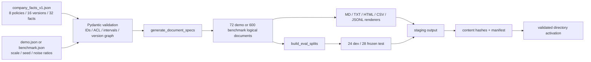

# E1 Enterprise Corpus and Evaluation Implementation

实施日期：2026-07-16
阶段：E1 企业档案与评估集
基线：`7aec4b950e012d3f24b8e1877d6391201e9b8f90`
状态：实现与本地验证完成，未 commit、未 push，等待本人验收

## 1. E1 到底解决了什么

旧项目只有 15 份短 Markdown 和基于字符串规则维护的评测题。它可以证明 RAG/Agent loop 能运行，但不能证明：

- 文档来自同一套不矛盾的企业事实；
- 新旧版本、权威来源、ACL、冲突和误归档是否可控；
- gold answer、gold document 和 forbidden document 是否能从事实追溯；
- 数据生成、split 和结果能否重现。

E1 新增了一个不依赖 LLM 的 deterministic data pipeline：先定义唯一事实骨架，再渲染多来源、多格式、有噪声的逻辑文档，同时从同一事实图生成结构化 eval cases。E1 没有修改旧 parser、chunker、retriever、Agent、索引或模型调用。

## 2. 新数据流



## 3. 代码文件和职责

### `app/corpus/schemas.py`

这是事实层和生成层的 contract，不是普通 DTO 集合。

- `AtomicFact`：一个可独立评分的事实，包含 question、answer、statement 和 qualifiers。
- `PolicyVersion`：版本状态、有效期、authority、supersedes、ACL 和 facts。
- `PolicyFamily`：同一制度的版本链；强制一个 active 版本、禁止 cycle，并禁止 predecessor/successor 有效期重叠。
- `CompanyFacts`：全局校验 tenant、region、department、ACL group、user、policy、version 和 fact ID 引用。
- `CorpusProfile`：文档规模、seed、格式/来源权重、四类噪声比例和 eval split 数量。
- `DocumentSpec/DocumentMetadata`：还未被 parser 处理的逻辑文档，完整保存版本、部门、ACL 和 variant。
- `EvalCase`：保存 UserContext、required facts、gold/distractor/forbidden docs、expected filters 和 answer mode。
- `CorpusManifest/SmokeFixtureManifest`：落盘后的路径、内容 SHA256、字节数和治理 metadata。

所有模型使用 `extra="forbid"`。未知字段不会被静默忽略，因为 silent schema drift 会让评测和生成器对同一 JSON 做出不同解释。

### `app/corpus/generator.py`

`generate_document_specs()` 分两层生成：

1. 对 16 个 policy versions 各生成一份 Markdown authoritative document。这一层与 seed 无关。
2. 使用 seed 生成 supporting 和噪声文档。seed 可以改变来源、格式、选中的事实和顺序，但不能改变 authoritative facts。

demo 的精确 variant 数量：

| variant | 数量 | 行为含义 |
|---|---:|---|
| authoritative | 16 | 每个版本唯一的正式制度 |
| supporting | 33 | Wiki、邮件、工单、会议、表格或制度摘录 |
| duplicate | 5 | 渲染 bytes 与原文完全相同，metadata 指向 `duplicate_of` |
| near_duplicate | 7 | 保留相同 fact IDs，但增加复核表述，bytes 不同 |
| misfiled | 4 | `filed_department != actual_department` |
| stale | 7 | 只引用 retired version facts |

总数为 72，不是目标值或估算值。benchmark dry-run 实际构造 600 个逻辑文档。

### `app/corpus/renderers.py`

`render_document()` 对同一个 `DocumentSpec` 提供五个确定性 renderer：

- Markdown：H1/H2 结构；
- TXT：纯文本 section；
- HTML：经过 `html.escape()` 的 `<article>/<section>`；
- CSV：固定字段 `title/section/fact_id/text` 和 `\n` 行尾；
- JSONL：每行 canonical key order 的 JSON object。

所有输出都使用 UTF-8、稳定字段顺序和末尾换行。renderer 不读取系统时间、绝对路径或随机状态。

### `app/corpus/eval_cases.py`

eval 不是让 LLM 根据文档自由出题，而是从 active/retired versions 和 atomic facts 构造六类 case：

| task type | 总数 | gold contract |
|---|---:|---|
| fact_lookup | 15 | 一个 required fact 和 active authoritative doc |
| version_conflict | 8 | active doc 为 gold，retired doc 为 distractor |
| completeness | 8 | 同一 active policy 的两个 required facts |
| comparison | 8 | 两个政策、两个 active authoritative docs |
| permission | 5 | gold 为空，restricted doc 只出现在 forbidden list |
| no_answer | 8 | required facts 和 gold docs 均为空 |

split 先按 task type 分组洗牌，再按每类约一半分配。最终 dev/test 为 24/28；permission 从最初发现的 4/1 修正为 2/3，避免 security test 只有一个样本。

### `app/corpus/artifacts.py`

`write_corpus()` 的写入顺序是：

1. 在内存构造 documents、eval 和 manifest；
2. 在目标同级 staging 目录写所有文件；
3. 最后写 `manifest.json`；
4. 完整后再把 staging 切换为目标目录。

manifest 不包含 `created_at` 和绝对输出路径，因此同 seed 在两个目录生成的 manifest byte-identical。

覆盖规则：

- 非空目标默认抛 `FileExistsError`；
- `--force` 只接受能被 `CorpusManifest` 校验且 producer 正确的目录；
- 未标记目录即使传 `--force` 也抛 `PermissionError`；
- Windows 目录切换只对 `WinError 5/32` 且目标仍不存在的情况做总计不超过约 0.8 秒的有限重试；其他权限错误原样抛出。

`write_canonical_eval()` 不提供 force。冻结目录非空就拒绝再次生成，防止 test 在调参后被静默覆盖。

### `scripts/generate_enterprise_corpus.py`

这是新的安全 CLI，与当前危险的旧 `scripts/build_indexes.py` 无关。

```text
--profile {demo,benchmark}
--seed <int>
--output-dir <path>
--dry-run
--force
```

`argparse --help` 不进入生成逻辑；`--dry-run` 完整构造并校验逻辑 artifacts，但不创建输出目录。stdout/stderr 显式设置为 UTF-8，避免 Windows 中文路径下的系统代码页解码错误。

## 4. 事实骨架

`data/v2/facts/company_facts_v1.json` 包含：

- 远程办公、差旅报销、安全事件、客户退款；
- 供应商采购、生产发布、薪酬评审、重大合同；
- 每个制度一个 retired 2025 版本和一个 active 2026 版本；
- 3 个全员制度和 5 个 restricted 制度；
- 普通员工、部门用户、外包用户和跨部门审计用户。

用户、公司和域名全部虚构。ACL 规则是 fixture contract，不等同真实 IAM。

## 5. 生成与冻结结果

| Artifact | 结果 |
|---|---|
| facts semantic SHA256 | `5b9ea4d719e97fcc2b288e548ccdd0db971ad594bd46fb937b2d44ab6f437417` |
| demo profile SHA256 | `47330886214c65d3421224a222c490e57c0432737ebefb337c33250af47c3438` |
| benchmark profile SHA256 | `11124ee443a5b3e21d71d12089ef09a2c832f6c63eeaac7a249ecec2c4dc48d3` |
| demo manifest file SHA256 | `0A88D31F40150EC68464F54CBF1F64ED6D373D02E277B1767DC53AB34A5184C5` |
| frozen test SHA256 | `556ffed812cdde0ba7ddc7d625782b3b3bbdbcd4753670a199bd0c3c05743338` |
| smoke fixture | 5 documents / 5 formats / 5 source types |

大 corpus 输出在 `data/generated/demo`，被 `.gitignore` 排除。Git 只保留 facts、profiles、52 个 eval cases、test hash 和 5 份 smoke fixtures。

## 6. TDD 和故障记录

### Schema RED/GREEN

- RED：`ModuleNotFoundError: app.corpus`。
- GREEN：唯一 ID、未知 ACL、无效 interval、version cycle 和跨版本 overlap 均有失败测试。

### Generator RED/GREEN

- RED：`app.corpus.generator` 和 renderers 不存在。
- GREEN：同 seed 等价、不同 seed 不改 authoritative facts、72/600 精确规模、五格式和四类噪声通过。

### Eval RED/GREEN

- RED：`app.corpus.eval_cases` 不存在。
- 中间问题：辅助函数名以 `test_` 开头，被 pytest 当成测试收集；重命名为 `build_test_manifest_line`。
- 设计复核：permission 初始 split 为 4/1；新增失败测试后改为 2/3 分层切分。

### Windows CLI 编码

- 症状：subprocess 成功写盘，但测试读取 stdout 时出现 UTF-8 decode error。
- 原因：Windows child process 使用系统代码页输出包含中文的绝对路径。
- 修复：CLI stdout/stderr 显式 `reconfigure(encoding="utf-8")`。

### Windows staging rename

- 症状：`Path.rename()` 偶发 `WinError 5`；目标目录不存在，父目录 ACL 允许写。
- 证据：最小单测 10/10 通过，但完整 corpus suite 修复前 5 次有 3 次失败，失败随机落在不同 staging rename。
- 根因边界：Windows 文件扫描/沙箱文件系统对刚写目录的瞬时占用，不是目标冲突或永久 ACL 错误。
- 修复：新增“第一次 WinError 5、第二次成功”的确定性回归测试；只在严格条件下做有限退避。
- 验证：修复后完整 corpus suite 连续 5 次全部通过。

## 7. 当前测试证据

- E1 focused：`39 passed`。
- 全项目：`148 passed, 5 warnings`。
- 5 条 warning 仍是既有 3 条 FAISS/SWIG 和 2 条 FastAPI `on_event` deprecation；E1 未新增 warning。

## 8. 当前边界和 E2 输入

E1 只证明数据 contract、生成稳定性、split、hash 和写盘安全。它没有证明：

- 五种格式已被 ingestion parser 正确解析；
- 文档已切成稳定 chunks；
- ACL 已在 retrieval/context 前过滤；
- 新数据上的 retrieval、answer 或 Agent 指标提升；
- 600 文档 profile 的索引时间、内存或查询延迟。

这些是 E2-E5 的工作。E2 必须直接消费 `DocumentMetadata`/manifest 和 smoke fixtures，不能重新发明另一套字段名称。

## 9. 复现命令

```powershell
.\.venv\Scripts\python.exe -m pytest tests\corpus -q -p no:cacheprovider
.\.venv\Scripts\python.exe -m scripts.generate_enterprise_corpus --profile demo --seed 20260716 --dry-run
.\.venv\Scripts\python.exe -m scripts.generate_enterprise_corpus --profile demo --seed 20260716 --output-dir data\generated\demo
.\.venv\Scripts\python.exe -m scripts.generate_enterprise_corpus --profile benchmark --seed 20260716 --dry-run
.\.venv\Scripts\python.exe -m pytest -q -p no:cacheprovider
```

E1 到此停止。未经本人批准，不进入 E2，不构建 v2 索引，不运行 Ollama，不 commit 或 push。

---

## 10. 初学者阅读地图

前九节是阶段总结。本节开始是按代码执行顺序展开的教程。推荐不要一上来读 600 份生成文件，而是按下面顺序：

```text
data/v2/facts/company_facts_v1.json
-> app/corpus/schemas.py
-> data/v2/config/demo.json
-> app/corpus/generator.py
-> app/corpus/renderers.py
-> app/corpus/eval_cases.py
-> app/corpus/artifacts.py
-> scripts/generate_enterprise_corpus.py
-> tests/corpus/
```

先理解“什么是真相”，再理解“怎样把真相变成文档”，最后理解“怎样从同一真相产生评估题”。

### 10.1 术语表

| 术语 | 白话解释 | 本项目例子 |
|---|---|---|
| Pydantic model | 带类型和自动检查的数据对象 | `PolicyVersion` |
| validator | 对单字段类型检查以外的组合规则进行检查 | active 版本不能有 `effective_to` |
| invariant | 无论生成多少数据都必须成立的条件 | 每个 policy 恰好一个 active version |
| source of truth | 其他产物必须以它为准的唯一真相 | `company_facts_v1.json` |
| seed | 控制伪随机顺序的整数 | `20260716` |
| renderer | 把逻辑文档转成某种文件格式 | `_render_html()` |
| manifest | 记录产物身份、路径、hash 和元数据的清单 | `data/generated/demo/manifest.json` |
| staging | 先完整写到临时目录，再整体激活 | `.demo.staging-*` |
| fixture | 小而固定、专门给测试使用的样例 | 五份 smoke 文档 |
| contract test | 检查输入/输出规则，而不是模型语义的测试 | gold doc 必须包含 required facts |

## 11. E1-C01：schema 与不变量

<a id="e1-c01"></a>

### 11.1 先说人话

JSON 能被读取，不代表里面的数据合理。例如，一个制度可以同时有两个 active 版本，旧版结束日期可以早于开始日期，某个 ACL group 可能根本不存在。如果这些错误进入生成器，之后会同时污染文档、评估题和索引，而且很难知道错误起点。

所以 E1 的第一步不是生成文字，而是建立 `app/corpus/schemas.py`。任何 facts、profile、document、eval 或 manifest 都先通过 Pydantic；不合法就立刻失败，不允许“尽量继续”。

证据状态：当前类、validator 和测试为 `[OBSERVED]`；最早“模块不存在”的完整 RED 终端输出为 `[NOT_CAPTURED]`；跨版本 overlap 的 RED/GREEN 行为由现有回归测试直接固定。

### 11.2 完整输入路径

```text
UTF-8 JSON 文件
-> Path.read_text(encoding="utf-8")
-> json.loads: 字符串变成 Python dict/list
-> CompanyFacts.model_validate(...)
-> 子模型 PolicyFamily / PolicyVersion / AtomicFact
-> model_validator 检查跨字段和跨对象关系
-> 返回可信的 CompanyFacts，或抛 ValidationError
```

函数入口在 `app/corpus/generator.py`：

```python
def load_facts(path: Path) -> CompanyFacts:
    return CompanyFacts.model_validate(json.loads(path.read_text(encoding="utf-8")))
```

参数 `path` 是事实文件位置；返回值不是普通 dict，而是已经验证过的 `CompanyFacts`。如果任一层不合法，函数没有“半成功”返回值。

### 11.3 `StrictModel` 为什么禁止额外字段

```python
class StrictModel(BaseModel):
    model_config = ConfigDict(extra="forbid", str_strip_whitespace=True)
```

- `extra="forbid"`：JSON 写错字段名时立即报错。否则把 `effective_from` 错写成 `effect_from`，Pydantic 可能忽略错误字段，后续却误以为数据完整。
- `str_strip_whitespace=True`：字符串首尾空格统一去除，减少 ID 因不可见空格变成两个值。

### 11.4 `PolicyVersion.validate_version()` 逐分支解释

输入是一个已经完成基本类型解析的制度版本。validator 继续检查字段之间是否互相矛盾：

```python
if effective_to is not None and effective_to <= effective_from:
    reject
```

结束日期必须晚于开始日期。等于开始日期也拒绝，因为这个版本没有任何有效时间区间。

```python
if status == "active" and effective_to is not None:
    reject
if status == "retired" and effective_to is None:
    reject
```

active 表示当前仍有效，所以不应该已经有结束日期；retired 表示已结束，所以必须知道何时结束。这是本项目 v1 schema 的明确约束，不是所有现实制度系统唯一可能的建模方式。

随后检查 `acl_groups` 和本版本内 `fact_id` 不重复。`len(list) != len(set(list))` 表示原列表有重复元素。

### 11.5 `PolicyFamily.validate_versions()` 检查版本链

`PolicyFamily` 表示同一项制度的所有版本。它按四步检查：

1. `version_id` 在该 policy 内唯一；
2. `active_versions` 的数量必须恰好为 1；
3. 每个 `supersedes` 必须指向已知版本；
4. 版本链不能成环，有前后关系的有效期不能重叠。

循环检测的白话过程：从某个版本出发，沿 `supersedes` 一直向前走；每走到一个 ID 就放进 `visited`。如果再次遇到同一个 ID，说明 A 指向 B、B 又最终指回 A，版本历史永远走不完，因此拒绝。

区间检查：

```python
predecessor = version_by_id[version.supersedes]
if predecessor.effective_to is None \
        or version.effective_from < predecessor.effective_to:
    raise ValueError("successive version effective intervals overlap")
```

如果前任没有结束日期，却已经出现继任版本，两个版本会同时生效；如果继任开始时间早于前任结束时间，也会重叠。两种情况都可能让检索器不知道当前应选哪份权威文档。

### 11.6 `CompanyFacts.validate_references()` 为什么更长

单个版本合法，不代表整个公司事实图合法。这个 validator 检查全局引用：

- tenant、region、department、ACL 列表本身不重复；
- `user_id`、`policy_id`、`version_id`、`fact_id` 全局唯一；
- 每个用户引用的 tenant/region/group 真实存在；
- 每个 policy 的 tenant/region/department 真实存在；
- 每个版本 ACL group 真实存在；
- 至少有一个 fixture user 能访问每个版本。

最后一条容易忽视。如果定义了一个 `legal_secret` ACL，却没有任何测试用户拥有它，后续就无法构造合法 answered case，也无法验证文档是否可见。schema 在数据入口直接阻止这种“理论存在、无法测试”的权限配置。

### 11.7 Profile 和 DocumentSpec 的边界

`CorpusProfile.validate_profile()` 要求五种格式、六种来源的权重全部显式出现且大于 0；四类噪声比例之和不能超过 0.6。原因是至少保留 40% 的 base documents，避免 profile 把几乎全部文档都变成复制或噪声。

`DocumentSpec.validate_fact_ids()` 比较：

```text
document.fact_ids
vs
所有 section.fact_ids 的集合
```

二者必须一致。否则 manifest 声称文档含某个事实，但正文 section 实际没有它，gold 验证就失去可信度。

### 11.8 TDD 对应关系

| 测试 | 防止的问题 |
|---|---|
| `test_company_facts_accepts_a_valid_versioned_policy` | 合法最小事实可以通过 |
| `test_company_facts_rejects_unknown_acl_group` | 拼错 ACL 不被静默接受 |
| `test_company_facts_rejects_duplicate_fact_ids` | gold 事实 ID 不产生歧义 |
| `test_company_facts_rejects_invalid_effective_interval` | 单版本日期合法 |
| `test_company_facts_rejects_cyclic_supersedes_chain` | 版本链无环 |
| `test_company_facts_rejects_overlapping_successive_versions` | 前后版本不重叠 |
| `test_profile_rejects_ratios_that_consume_the_whole_corpus` | 噪声不会挤掉权威基础文档 |

### 11.9 结果好在哪里，仍然不好在哪里

好结果：非法数据在生成前失败；后续 generator/eval 可以依赖明确不变量，不必每个函数重复防御所有错误。

边界：schema 只能证明结构和预先定义的业务规则一致，不能证明事实内容符合真实公司制度，也不能证明 parser/index/retrieval 已正确使用这些字段。

## 12. E1-C02：facts/profile 唯一事实源

<a id="e1-c02"></a>

### 12.1 先说人话

“公司规定远程办公 3 天”是事实；“某封邮件怎样描述这条规定”是文档表达。事实和文档如果混在一起，随机生成一封邮件时可能顺便把 3 天变成 4 天，之后连标准答案都不可信。

E1 把事实放在 `data/v2/facts/company_facts_v1.json`，把规模和噪声参数放在 `data/v2/config/*.json`。生成文档只能引用 facts，不允许自己创造制度值。

### 12.2 facts 怎样组织

```text
CompanyFacts
├── company / tenants / regions / departments / acl_groups
├── users: 10 个 UserFixture
└── policies: 8 个 PolicyFamily
    └── versions: retired 2025 + active 2026
        └── facts: 每版 2 个 AtomicFact
```

总数因此是：

```text
8 policies * 2 versions = 16 versions
16 versions * 2 facts = 32 atomic facts
```

`AtomicFact` 同时保存：

- `question`：可以生成单事实评估题；
- `answer`：短标准答案；
- `statement`：真正写入文档的完整陈述；
- `qualifiers`：为未来条件字段留出结构化位置。

### 12.3 用远程办公例子追踪

旧版 `hr_remote@2025` 的事实是每周最多 2 天、提前 1 个工作日；当前 `hr_remote@2026` 是每周最多 3 天、提前 2 个工作日。

这不是数据错误，而是故意的版本冲突。后续 retrieval 同时找到两份材料时，应根据 `status`、`effective_from/to`、`supersedes` 和 authority 选择当前版本，而不是选择语义最相似或排第一的旧邮件。

### 12.4 ACL fixture 怎样设计

用户包括普通员工、HR、财务、安全、支持、采购、工程、法务、外部承包商和审计员。

当前 demo 可见性规则：

```text
tenant 相同
and region 相同
and user.groups 与 document.acl_groups 至少一个交集
```

这是确定性测试模型，不等于真实 IAM。它的价值是构造可重复 permission cases，让 E3 可以验证受限 chunk 是否在 fusion/context/trace 前被过滤。

### 12.5 profile 是什么，不是什么

profile 不保存企业真相，只保存“怎样生成这一批材料”：

| 参数 | demo | benchmark |
|---|---:|---:|
| document count | 72 | 600 |
| duplicate ratio | 0.08 | 0.10 |
| near duplicate | 0.10 | 0.12 |
| misfiled | 0.06 | 0.08 |
| stale | 0.10 | 0.12 |
| seed | 20260716 | 20260716 |
| eval dev/test | 24/28 | 24/28 |

格式权重 `4:2:2:1:1` 表示 Markdown 更常见，但不是精确百分比；生成器使用加权随机选择。来源权重同理。

### 12.6 测试怎样证明 facts/profile 合法

`test_checked_in_fact_skeleton_is_complete_and_valid` 真实加载 checked-in JSON 并检查 8/16/32；`test_demo_and_benchmark_profiles_have_explicit_measured_scale` 检查规模显式；`test_facts_include_public_and_restricted_policy_examples` 确保既有全员文档也有受限文档。

好结果：facts/profile 成为可以 hash、审查和版本化的输入。

边界：事实域只有八类制度，中文模板较规整；不能把它说成真实企业内部数据。

## 13. E1-C03：deterministic 文档生成

<a id="e1-c03"></a>

### 13.1 先说人话

生成器的目标不是“尽量生成大约 72 篇”，而是相同 facts、profile、seed 必须得到完全相同的 72 篇；benchmark 必须正好 600 篇。这样一次实验失败时，不能把原因推给每次随机变化的数据。

核心函数：

```python
def generate_document_specs(
    facts: CompanyFacts,
    profile: CorpusProfile,
    seed: int | None = None,
) -> list[DocumentSpec]:
```

- `facts`：已经校验的公司真相；
- `profile`：规模、比例、权重和默认 seed；
- `seed`：可选覆盖 profile seed；
- 返回：内存中的逻辑文档，不写磁盘。

### 13.2 为什么使用局部 `random.Random`

```python
effective_seed = profile.seed if seed is None else seed
rng = random.Random(effective_seed)
```

局部随机对象不会修改 Python 全局 random 状态，其他测试或模块的随机调用也不会改变本生成器顺序。

### 13.3 authoritative 先生成，并且不读 rng

```python
authoritative = [
    _authoritative_document(policy, version)
    for policy in facts.policies
    for version in policy.versions
]
```

8 个 policy 各两个版本，所以固定生成 16 份 authoritative 文档。这里没有 `rng.choice`，因此 seed 改变也不改变权威制度。

### 13.4 用 demo 数字算 `base_count`

四类噪声使用 `int(document_count * ratio)`，即向下取整：

```text
duplicate      int(72 * 0.08) = 5
near_duplicate int(72 * 0.10) = 7
misfiled       int(72 * 0.06) = 4
stale          int(72 * 0.10) = 7
noise total                     23
base_count                      72 - 23 = 49
authoritative                   16
supporting                      49 - 16 = 33
```

最终 `16 + 33 + 5 + 7 + 4 + 7 = 72`。

如果 `base_count < len(authoritative)`，配置连每个版本一份权威文档都放不下，函数抛 `ValueError`，而不是少生成几个版本。

### 13.5 supporting 怎样采样

supporting 只从 `policy.active_version` 取事实，避免普通支撑材料大量复制旧版。前六份强制遍历六种 source type，前五份强制遍历五种 format，保证小 demo 至少覆盖每一种；之后才按 profile 权重采样。

每份通常选一个 fact；当版本有多个 fact 且随机数小于 0.4 时，选全部 facts。这样同时存在单事实短材料和多事实材料。

### 13.6 四种噪声为什么分开

- `duplicate`：深拷贝 base document，正文完全一样，metadata 记录 `duplicate_of`。
- `near_duplicate`：保留相同 facts，但追加“核心要求不变”的说明，使 bytes 不同。
- `misfiled`：`actual_department` 不变，`filed_department` 故意选择其他部门。
- `stale`：只从 retired version 取事实，内容历史上成立，但不应作为当前答案。

它们测试不同问题：exact hash 去重只能解决 duplicate；near duplicate 需要文本相似度；misfiled 测 metadata 与内容冲突；stale 测版本解析。

### 13.7 最后一条 assertion 的作用

```python
if len(documents) != profile.document_count:
    raise AssertionError(...)
```

前面的算术理论上应保证数量。这里是内部自检：以后有人改比例算法或新增 variant，却忘记更新总数，生成器会立即暴露程序错误。

### 13.8 测试证据

- 同 seed 两次序列化必须完全相同；
- demo 必须 72 个唯一 doc ID 和精确 variant 分布；
- 不同 seed 的 authoritative 列表完全相同，而整个 corpus 不同；
- 每个 version 恰好一份 authoritative；
- duplicate/near/misfiled/stale 各自有真实行为，不只是标签；
- benchmark 在内存完整构造 600 份，不依赖写盘。

回填时重新运行 dry-run 得到 demo 72、benchmark 600，标为 `[REPRODUCED]`。

### 13.9 好结果与局限

好结果来自两个设计：真相不进入随机分支；所有随机选择使用同一局部 seed。因而 manifest 可以逐字节复现。

不好或有限的地方：模板可能形成 synthetic shortcut；生成 600 个 `DocumentSpec` 只证明数据层规模，不代表 parser 会产生 5,000-15,000 chunks，也不代表 embedding/index 性能合格。

## 14. E1-C04：五格式 renderer

<a id="e1-c04"></a>

### 14.1 先说人话

如果 Markdown、HTML、CSV 各自直接从 facts 生成，很容易一套模板漏字段、另一套改错值。E1 先生成统一 `DocumentSpec`，renderer 只负责“怎样写成某种格式”，不负责决定事实。

```text
DocumentSpec
-> render_document 根据 document.format 选择函数
-> UTF-8 字符串
-> artifacts 层编码为 bytes 并计算 SHA256
```

### 14.2 `render_document()` 是显式分发表

```python
renderers = {
    "md": _render_markdown,
    "txt": _render_text,
    "html": _render_html,
    "csv": _render_csv,
    "jsonl": _render_jsonl,
}
return renderers[document.format](document)
```

因为 `DocumentFormat` 只允许五个字面值，未知格式会在 schema 阶段被拒绝。显式字典比一串模糊文件后缀判断更容易测试。

### 14.3 五种格式分别保留什么

- Markdown：`# title`、`## section` 和正文行。
- TXT：标题、section 和正文，去掉 Markdown 符号。
- HTML：`article/section/h1/h2/p` 结构；所有用户文本经过 `html.escape`，避免把事实里的 `<` 当标签。
- CSV：每行包含 `title,section,fact_id,text`，使用标准库 `csv.DictWriter` 处理转义。
- JSONL：每行一个稳定 key 顺序的 JSON object，保留 `fact_id`。

`_rows()` 是 CSV/JSONL 的共同中间层。它把 section 中每行与对应 `fact_id` 对齐；没有 fact 的来源说明行使用空字符串。

### 14.4 为什么统一结尾换行

每种 renderer 都保证末尾 `\n`。这让不同平台生成 bytes 更稳定，也避免拼接、diff 和一些文本工具把“末尾无换行”当额外差异。

### 14.5 测试证据

`test_renderers_are_deterministic_and_end_with_newline` 验证同一个 `DocumentSpec` 重复渲染相同且有换行；`test_each_renderer_emits_its_declared_structure` 使用对应 parser/字符串断言检查格式结构；`test_extension_mapping_is_explicit` 固定后缀映射。

### 14.6 E1 在这里不能证明什么

renderer 能生成合法结构，不代表旧 ingestion 能正确读回来。尤其 HTML table、CSV header、JSONL 行、未来 PDF/DOCX page/paragraph locator 都属于 E2 parser contract。E1 只提供输入和 smoke fixtures，不提前声称多格式 ingestion 已完成。

## 15. E1-C05：结构化 eval 与冻结 split

<a id="e1-c05"></a>

### 15.1 先说人话

有文档不等于有评估。评估必须知道：正确答案依赖哪些事实、应该找到哪些文档、哪些旧文档容易误导、哪些文档当前用户无权读取。如果只保存 question/answer，就无法区分“检索没找到”“找到了旧版”“越权读到了答案”还是“LLM 漏答了一项”。

`app/corpus/eval_cases.py` 从同一份 `CompanyFacts` 和 authoritative documents 构造 `EvalCase`，不调用 LLM。这样 gold 标签与文档事实共享可验证的 `fact_id`。

### 15.2 `EvalCase` 关键字段

| 字段 | 白话含义 | 后续用途 |
|---|---|---|
| `question` | 给系统的问题 | 实际执行输入 |
| `task_type` | 这题主要考什么 | 分组指标和失败归因 |
| `answer_mode` | 应回答、权限拒绝或信息不存在 | outcome 评估 |
| `user_context` | 当前用户 tenant/region/groups | ACL filter 输入 |
| `required_fact_ids` | 答案必须覆盖的原子事实 | completeness |
| `gold_doc_ids` | 合法且支持答案的文档 | retrieval recall/ranking |
| `distractor_doc_ids` | 容易误选但不应作为当前答案依据 | 版本/冲突错误 |
| `forbidden_doc_ids` | 系统中存在但用户无权读取 | leakage/security |
| `expected_filters` | 检索应应用的过滤条件 | Agent/retrieval trace |
| `expected_authority_doc_ids` | 冲突时应优先的权威文档 | conflict resolver |

### 15.3 六类题怎样产生

1. `fact_lookup`：每个 active fact 一题，考单事实检索和回答。
2. `version_conflict`：gold 是 active authoritative，distractor 是 retired authoritative。
3. `completeness`：同一 policy 的两个 active facts 都必须回答。
4. `comparison`：跨两个 policy、两个 gold documents 比较第一项数值事实。
5. `permission`：contractor 请求受限制度；只有 forbidden doc，没有 gold/expected answer。
6. `no_answer`：询问 facts 中不存在的“2027 年额度自动翻倍”。

总候选分布经固定裁剪后为：

```text
fact_lookup       15
version_conflict   8
completeness       8
comparison         8
permission         5
no_answer          8
total             52
```

### 15.4 permission 与 no-answer 的代码差别

`_permission_cases()` 先拿到 `user_contractor`，跳过全员制度，只处理受限 active versions。它反向断言 contractor 确实不可访问；若可访问，数据配置本身有错，直接抛异常。

permission case：

```text
answer_mode = permission
gold_doc_ids = []
forbidden_doc_ids = [受限 active authoritative doc]
expected_answer = None
```

`_no_answer_cases()` 选择能合法访问该 policy 的用户，但问题引用一个 facts 中没有的 2027 规则：

```text
answer_mode = not_found
gold_doc_ids = []
forbidden_doc_ids = []
expected_answer = None
```

两类都不输出事实答案，但停止原因完全不同。permission 不能泄露“其实答案是什么”；no-answer 应说明可访问知识中没有证据。

### 15.5 `build_eval_splits()` 逐步解释

函数签名：

```python
def build_eval_splits(
    facts: CompanyFacts,
    documents: list[DocumentSpec],
    profile: CorpusProfile,
    seed: int | None = None,
) -> tuple[list[EvalCase], list[EvalCase]]:
```

执行顺序：

1. `_authoritative_by_version()` 建立 `version_id -> DocumentSpec`，并检查同一 version 没有多份 authoritative。
2. 六个 builder 各自产生 candidates。
3. 按 `task_type` 分组，每组使用同一 seed 独立 shuffle。
4. 如果候选多于 profile 要求，从当前最大类别尾部稳定裁剪，直到总数为 52。
5. 每类先取一半给 dev，再调整各类数量，使 dev 精确为 24，同时尽量保证两边都有样本。
6. `interleave()` 使用队列轮流拿各 task，避免文件前半全是同一类题。
7. 返回 dev 24 和 test 28。

这里不是机器学习意义上自动保证所有潜在分布平衡，而是一套面向当前 52 题的确定性分层规则。新增类别或极少样本时需要重新审查边界。

### 15.6 从 fact 追到一条 eval JSON

以 `hr_remote_2026_days` 为例：

```text
facts JSON
  answer = "3 天"
  version = hr_remote@2026 active
  acl = all_employees
-> generator
  auth_hr_remote_2026 contains this fact_id
-> _fact_lookup_cases
  case_id = fact_hr_remote_2026_days
  gold_doc_ids = [auth_hr_remote_2026]
  required_fact_ids = [hr_remote_2026_days]
  user = user_employee
-> serialized into data/v2/eval/dev.json
```

同一个 active fact 还可进入 completeness、comparison 或 version conflict case，但 task 目标和 gold/distractor 关系不同。

### 15.7 为什么 test 使用 bytes hash

```python
text = json.dumps(payload, ensure_ascii=False, indent=2, sort_keys=True) + "\n"
test_bytes = text.encode("utf-8")
sha256(test_bytes)
```

排序 key、固定缩进、UTF-8 和末尾换行使序列化稳定。当前 frozen hash：

```text
556ffed812cdde0ba7ddc7d625782b3b3bbdbcd4753670a199bd0c3c05743338
```

`write_canonical_eval()` 对非空目录直接拒绝，也没有 `force` 参数。要修改 frozen test，必须创建新 dataset version 并解释原因，不能静默覆盖。

### 15.8 测试真正证明什么

测试证明：数量和 split 无重叠；两边覆盖六类任务；answered gold 对用户可见且包含 required facts；permission forbidden 对用户不可见；version conflict gold active、distractor retired；序列化和 hash 稳定。

它没有证明：embedding 能找到 gold、LLM 能正确回答、ACL 已在 runtime 执行、test 对真实企业问题有统计代表性。

## 16. E1-C06：manifest、安全写盘与 CLI

<a id="e1-c06"></a>

### 16.1 先说人话

“能生成文件”还不够。程序如果写到一半崩溃，目标目录会混有新旧文件；`--force` 如果实现粗暴，用户输错路径可能删掉自己的目录；`--help` 如果触发建库，也是不安全 CLI。

E1 把“构造内容”和“激活产物”分开：先在内存完成 manifest 和 bytes，再写 staging，最后整体替换目标目录。

### 16.2 `_build()` 只构造，不激活

```text
facts/profile/seed
-> generate_document_specs
-> build_eval_splits
-> render each document to UTF-8 bytes
-> calculate per-file SHA256/byte_count
-> build CorpusManifest
-> return manifest + rendered bytes + eval cases
```

manifest 不写生成时间和绝对路径，因为这两项每次运行都会变化，破坏 byte-stable reproducibility。它记录 producer、generator version、profile、seed、facts/profile hash、精确分布和每份文档治理 metadata。

### 16.3 写盘前先验证目标

`_validate_target(path, force)` 的分支：

1. resolved path 是磁盘根或 home：无条件拒绝；
2. path 存在但不是目录：拒绝；
3. path 不存在或为空目录：允许首次写入；
4. 非空且没有 `--force`：拒绝；
5. 非空且有 `--force`：必须先通过 `_validate_owned_output()`。

`_validate_owned_output()` 读取原目录 `manifest.json` 并通过 `CorpusManifest` 校验，且 `producer` 必须是 `enterprise_agentic_rag_v2`。因此 `--force` 不是“允许删除任何目录”，而是“允许替换我自己以前生成且仍可识别的 corpus”。

### 16.4 为什么 manifest 最后写入 staging

`_write_stage()` 先写 documents，再写 eval 三件套，最后写根 manifest。manifest 相当于“这一批完成”的标记。虽然目录只有在最后 activation 后才对外可见，但把完成标记最后写仍能减少将半成品误认为有效 corpus 的机会。

### 16.5 activation 怎样保护旧目录

```text
目标不存在
-> rename staging -> output

目标是空目录
-> 删除空目录
-> rename staging -> output

目标是合法旧 corpus
-> rename old output -> backup
-> rename staging -> output
-> 成功后删除 backup
-> 若新激活失败，尝试把 backup 恢复
```

这不是完整的跨进程 transaction，也没有 active pointer，但比逐文件原地覆盖更容易保持“要么旧批次，要么新批次”。完整 staging index/active/rollback 属于 E2 的索引生命周期决策。

### 16.6 Windows rename retry 为什么严格受限

`_rename_with_retry()` 只在以下条件同时成立时重试：

- 异常是 `PermissionError`；
- `winerror` 为 5 或 32；
- target 仍不存在；
- 还有预设 delay。

总 delay 约 0.88 秒。Linux 权限错误、目标竞争出现、其他 Windows 错误或最后一次失败都会原样抛出。这样不会用无限重试掩盖真实权限和并发问题。

### 16.7 CLI 从参数到结果

入口：`python -m scripts.generate_enterprise_corpus`。

- `--profile` 只允许 demo/benchmark；
- `--seed` 可覆盖 profile seed；
- 非 dry-run 必须给 `--output-dir`；
- `--dry-run` 和 `--force` 不能同时使用；
- 预期的文件/权限/配置错误打印到 stderr 并返回 exit code 2；
- stdout/stderr 在 Windows 显式 UTF-8；
- 成功只输出结构化 JSON summary。

`--help` 只构造 argparse parser，不加载 facts、更不调用 `write_corpus()`，测试还把工作目录指向临时位置确认没有写文件。

### 16.8 好结果和边界

好结果：相同 seed 的两个输出目录 manifest bytes 一致；每个文件 hash 和治理 metadata 可验证；默认不覆盖；错误 `--force` 被拒绝。

边界：E1 corpus activation 不等于 E2 index active pointer；没有跨进程锁，多进程同时写同一目标仍不属于当前支持场景。

## 17. E1-C07：checked-in 产物与 Git 边界

<a id="e1-c07"></a>

### 17.1 先说人话

把 600 份生成文档全部提交到 Git，会让仓库臃肿、diff 噪声大，而且它们本来就能从 facts/profile/seed 复现。但如果什么生成物都不提交，CI 又无法快速测试五种 parser 输入和 frozen eval。

所以 E1 区分“必须版本化的输入/小 fixture”和“可重复生成的大产物”。

### 17.2 提交边界

应该保留在 Git：

- facts 和 demo/benchmark profiles；
- generator、renderers、schemas 和 tests；
- dev/test eval 与 test SHA256；
- 五份 smoke documents 和 smoke manifest；
- data card 和实施记录。

应该忽略：

- `data/generated/` 的完整 72/600 corpus；
- `eval_runs/` 的每次运行结果；
- indexes、日志、模型和本地数据库等既有忽略项。

### 17.3 为什么是五份 smoke fixture

smoke fixture 每种格式一份，并覆盖多种 source type。E2 parser tests 可以在毫秒级检查格式 contract，不必每次生成 72 份。测试还会在临时目录重新生成 fixture，与 checked-in bytes 精确比较，防止实现改了却忘记更新样例或 manifest。

### 17.4 legacy metadata 为什么不删除

`data/eval/metadata.json` 增加 lifecycle：旧 test 标为 regression-only，并指向 `data/v2/eval` successor。没有改写旧问题或结果，这保留了历史可追溯性，也避免两个 test 都被宣传成全新 held-out。

## 18. E1-C08：data card、学习材料与阶段验收

<a id="e1-c08"></a>

### 18.1 先说人话

代码能跑不代表别人知道数据从哪来、能用于什么、不能用于什么。合成企业语料尤其容易被误解成真实内部资料，或把本地 benchmark 指标夸大成线上效果。

`docs/data_card.md` 明确数据为虚构/合成、事实规模、噪声、ACL 模型、split/hash、复现命令、可接受用途和已知限制。

### 18.2 三种文档职责

- data card：解释数据本身。
- 本实施记录：解释工程为什么这样做、代码怎样工作。
- 私有学习卡：让本人运行实验、回答面试题，不进入公开 Git。

Codex 生成了代码和答案，不代表本人已经掌握。因此学习卡始终保留“未验收，不得标记为已掌握”，只有本人完成实验和口述后才能自行更新。

### 18.3 E1 验收证据

`[REPRODUCED]` 回填时再次得到：

```text
tests/corpus: 39 passed
full pytest: 148 passed, 5 existing warnings
demo dry-run: 72 documents
benchmark dry-run: 600 documents
frozen test hash: 556ffed8...43338
```

测试数量只是入口，真正重要的是它们分别覆盖 schema、引用、确定性、噪声行为、ACL、冻结 hash、写盘安全和 checked-in output 一致性。

## 19. E1 故障复盘

### 如何阅读故障复盘

每个 Incident 按“症状 -> 假设 -> 最小实验 -> 修复 -> 回归 -> 不确定性”记录。这样面试时讲的是调试过程，不是只背最后一行答案。

<a id="e1-i01"></a>
### E1-I01：pytest 把 helper 当测试

**症状：** pytest collection 报 `fixture 'test_bytes' not found`，看起来像测试缺 fixture。

**原因：** 生产 helper 原名以 `test_` 开头，被导入测试模块后出现在 pytest 可收集 namespace。pytest 把它当测试函数，并把参数 `test_bytes` 当 fixture 名。

**修复：** 改名为 `build_test_manifest_line(test_bytes)`。行为仍是计算 SHA256 manifest 行，但名字不再满足 pytest 测试发现规则。

**回归：** `test_eval_serialization_and_test_hash_are_byte_stable` 显式调用 helper。首次完整 RED 输出未保存，标记 `[NOT_CAPTURED]`。

<a id="e1-i02"></a>
### E1-I02：Windows CLI 中文输出解码

**症状：** corpus 已经写成功，测试读取 subprocess 输出时却出现 UnicodeDecodeError。

**初始误区：** 容易误判为生成器写文件失败，实际失败发生在父进程解码 stdout/stderr。

**修复：** CLI `main()` 在支持时调用 `sys.stdout.reconfigure(encoding="utf-8")` 和 stderr 对应设置。这样 JSON 里的中文绝对路径也按测试预期编码。

**回归：** CLI 测试真实启动模块并解析 JSON 输出。

<a id="e1-i03"></a>
### E1-I03：staging rename 间歇性 WinError 5/32

**症状：** 目标目录不存在且父目录可写，`source.rename(target)` 仍偶发权限错误；失败位置不固定。

**排查：** 单项测试连续运行 10 次全过，但修复前完整 corpus suite 连续 5 轮出现 3 次随机失败。检查目标不存在、父 ACL 可写，说明不是稳定配置错误。

**最可信解释：** Windows 文件扫描器或沙箱文件层短暂持有刚写完的目录句柄。由于没有直接观察持锁进程，根因标 `[INFERRED]`，不写成绝对结论。

**修复：** 只对 WinError 5/32、target 不存在做有限退避。其他异常立即抛出。

**回归：** 测试模拟第一次 rename 抛 WinError 5、第二次成功；修复后 corpus suite 连续 5 轮通过。

<a id="e1-i04"></a>
### E1-I04：跨版本有效期重叠未被拒绝

**症状：** 初版 schema 能拒绝单版本 `effective_to <= effective_from`，却允许新版开始时间早于旧版结束时间。

**原因：** `PolicyVersion` 只能看到自己，跨版本关系属于 `PolicyFamily` 职责。

**TDD：** 先增加 `test_company_facts_rejects_overlapping_successive_versions`，它在缺少检查时失败；再在 `validate_versions()` 取得 predecessor 并比较两个区间。

**结果：** 版本链不只是 ID 连通，时间语义也一致。

<a id="e1-i05"></a>
### E1-I05：permission split 最初为 dev 4/test 1

**症状：** 总数 24/28 正确，两边也都有 permission，但 test 只有一个安全样本，稍有偶然性就让 leakage 指标失真。

**原因：** 初始分配只优先满足全局数量，没有把稀少类别的 test 覆盖当独立质量要求。

**TDD：** 增加明确断言 `dev permission == 2`、`test permission == 3`，先失败；再按 task type 计算 dev counts 并受两边至少一个样本约束地调整。

**代价：** 当前 5 个 permission 仍然很小，2/3 只是比 4/1 更合理，不构成统计充分性。

<a id="e1-i06"></a>
### E1-I06：patch 工具回执 aborted，但文件已落盘

**症状：** 用户看到工具停止，容易以为 data card 没写完。

**处理原则：** 工具回执和文件系统状态冲突时，不根据任一方猜测。重新读取目标文件、检查 metadata lifecycle、检查后台进程，再运行 5 个 repository input tests。

**结果：** 文件实际完整，测试通过，继续执行。平台内部为何返回 aborted 只能标 `[INFERRED]`，不是项目代码根因。

<a id="e1-i07"></a>
### E1-I07：PowerShell JSON 编码产生“假失败、假成功”

**症状：** `Get-Content | ConvertFrom-Json` 报中文 JSON 无效，但命令末尾仍打印 `json=6/6`。

**两个原因：** Windows PowerShell 5 的 `Get-Content` 默认按系统代码页解释无 BOM UTF-8，中文变成乱码；`ConvertFrom-Json` 的错误又是 non-terminating，后续成功输出仍会执行。

**修复验证：** 改用 Python：

```python
json.loads(path.read_text(encoding="utf-8"))
```

任一异常会让 Python 返回非零状态。六个 JSON 随后真实通过，标 `[REPRODUCED]`。

**教训：** 验收命令不仅要“最后打印成功”，还要确保中间错误会终止命令；编码属于输入 contract 的一部分。

## 20. E1 明确局限

<a id="e1-l01"></a>
### E1-L01：synthetic shortcut

文档和题目都源自同一 facts，模板措辞可能让系统依赖表面模式。后续需要改写、多格式 parser、噪声和人工抽检，但不能完全等同真实企业分布。

<a id="e1-l02"></a>
### E1-L02：尚未 ingestion/index

E1 生成输入和 manifest，没有让 v2 parser/chunker/embedding/index 消费 72/600 文档。任何 v2 chunk count 和 retrieval 指标此时都不存在。

<a id="e1-l03"></a>
### E1-L03：ACL 只是数据 contract

eval 已定义 UserContext 和 forbidden docs，但旧 `hybrid_search` 尚未执行 pre-fusion ACL filter。不能宣传权限零泄漏。

<a id="e1-l04"></a>
### E1-L04：没有质量提升数字

E1 没有运行新的 retrieval、answer、Agent 或 latency eval。它让后续能力可测，但不等于模型或检索已经提升。

<a id="e1-l05"></a>
### E1-L05：600 不等于生产规模

600 个确定性逻辑文档是 R1 本地 benchmark profile。尚未测 chunk 数、索引时间、内存、p95 或并发，不使用“生产级高并发”表述。

## 21. 面试表达与本人实验

### 21.1 两分钟版本

“E1 先用 Pydantic 定义版本、事实、ACL、文档、评估和 manifest contract，再建立 8 个制度族、16 个版本和 32 个原子事实。生成器用固定 seed 产生 72/600 份多来源、多格式材料，authoritative facts 不进入随机分支，噪声分成 exact duplicate、near duplicate、misfiled 和 stale。评估从同一 facts 构造 required facts、gold、distractor、forbidden 和 UserContext，并冻结 28 题 test hash。写盘采用 staging 和受所有权约束的 force。39 个 E1 测试与 148 个全仓库测试通过，但 E1 只证明数据 contract 和复现性，parser/index/ACL runtime 和检索提升要到后续阶段验证。”

### 21.2 你必须亲手完成的实验

追踪 `hr_remote_2026_days`：

1. 在 facts 找到 active/retired 数值和 ACL；
2. 在生成 manifest 找到 authoritative 和 supporting docs；
3. 打开正文确认 statement；
4. 在 dev/test 找到 fact、conflict、completeness 或 comparison cases；
5. 解释为什么 retired doc 是 distractor，contractor 的 restricted doc 是 forbidden；
6. 改用不同 seed dry-run，确认权威事实不变但 supporting 分布变化。

### 21.3 五个追问

1. **为什么不用 LLM judge 生成 gold？** gold 必须可追溯且稳定；LLM judge可在 E4 辅助评价自然语言质量，但不能代替原子事实和文档权限检查。
2. **Pydantic 能防止所有数据错误吗？** 不能，只能防已编码规则；事实是否现实、模板是否造成 shortcut 仍需人工和实验。
3. **hash 为什么不是安全签名？** 这里用 SHA256 检测内容变化，不做身份认证或防恶意篡改。
4. **staging 是否绝对原子？** 目录 rename 在同文件系统通常是原子步骤，但当前没有跨进程锁和完整 active pointer；E2 需定义索引生命周期。
5. **为什么 148 tests 不是项目效果？** 测试证明代码契约没有回归；效果还需要同数据 retrieval/answer/agent/security 指标和 live evidence。
