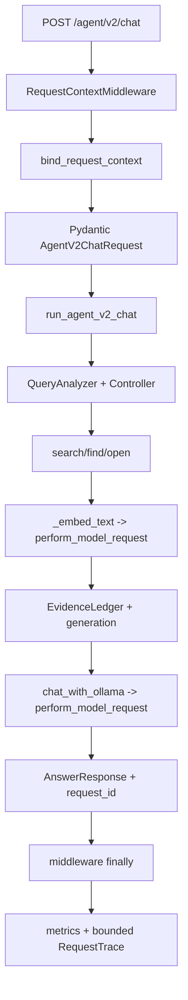

# E5 初学者代码教程与面试问答

最后更新：2026-07-17

## 1. E5 到底做了什么

E3 让 Agent 会检索、判断证据、调用有界工具并回答；E4 让这些行为可以分层评估。E5 解决的是“它作为一个服务怎么可靠地活着、失败和被观察”。

改造前：

```text
HTTP 请求
-> endpoint try/except
-> 固定 180/120 秒模型 timeout
-> 出错时可能把 str(exc) 返回给用户
-> /health 永远 ok
-> 无 request ID、无聚合 metrics、feedback 保存正文
```

改造后：

```text
HTTP 请求
-> middleware 校验 request ID，绑定 deadline ContextVar
-> endpoint 调用有界 Agent
-> embed/chat 共用 deadline-aware transport
-> lifespan 管理 DB/index/model readiness
-> finally 生成安全 trace 和 metrics
-> 统一错误不回显正文
-> feedback 只写 hash
-> CI 做 deterministic 门禁
-> load profiler 生成不可覆盖证据
```

一句面试总结：

> 我没有把本地 RAG 直接包装成“生产级”，而是把服务运行边界拆成生命周期、请求上下文、模型传输、错误、隐私观测、确定性 CI 和本机负载证据，并为每个边界写了失败测试。

## 2. 一次 V2 请求的完整代码路径



对应文件：

| 层 | 文件 | 责任 |
|---|---|---|
| app factory | `app/main.py` | 组装依赖、lifespan、路由 |
| HTTP context | `app/api/middleware.py` | request ID、deadline、trace/metrics finally |
| HTTP error | `app/api/errors.py` | 422/404/500 安全结构 |
| request state | `app/runtime/request_context.py` | ContextVar、remaining time、模型计数 |
| model network | `app/runtime/model_transport.py` | timeout、retry、safe error |
| readiness | `app/runtime/resources.py` | DB/index/models probe + TTL |
| trace | `app/observability/tracing.py` | strict span/trace、bounded store |
| metrics | `app/observability/metrics.py` | counters、p50/p95、RSS |
| feedback | `app/db.py` | SQLite hash metadata |
| load | `scripts/load_profile.py` | cold/warm 并发和 immutable artifact |
| CI | `.github/workflows/ci.yml` | 无 Ollama 的 deterministic gates |

## 3. `create_app()` 为什么重要

旧 `app/main.py` 在模块全局直接建 app，再用 `@app.on_event("startup")`。问题有两个：

1. 测试无法注入 fake resources/metrics/trace；
2. startup 与 shutdown 的资源关系分散。

现在：

```python
def create_app(container: ServiceContainer | None = None) -> FastAPI:
    service = container or build_service_container(get_settings())
```

测试传 `ServiceContainer(FakeResources, test metrics, test trace)`，生产不传则使用真实配置。这个叫 dependency injection，不是为了“模式高级”，而是让 IO 边界可替换、可单测。

lifespan：

```python
@asynccontextmanager
async def lifespan(application: FastAPI):
    service.resources.start()
    try:
        yield
    finally:
        service.resources.close()
```

`yield` 前只执行一次 startup，后面执行 shutdown。FastAPI 官方也推荐 lifespan 统一管理共享资源，而不是继续使用已弃用的 event decorators。

## 4. Liveness 与 readiness

### Liveness

问题是：“这个进程还能不能响应 HTTP？”

它不能检查 Ollama/FAISS/DB，因为依赖暂时坏了不代表进程必须被重启。`/health/live` 永远不 refresh probe。

### Readiness

问题是：“现在能不能接业务请求？”

`RuntimeResources` 分别执行：

```text
database -> init schema + SELECT 1
index    -> load active pointer/manifest/artifacts/snapshot
models   -> GET Ollama /api/tags and compare configured names
```

一项失败就 `status=not_ready`、HTTP 503。对外只给 `ok/error`，不把异常路径放进 health body。

### TTL 为什么存在

如果每次 ready 都完整加载 index、读磁盘并访问 Ollama，健康检查本身会成为负载。`readiness_ttl_seconds=5` 表示 5 秒内复用最近 snapshot，过期才 refresh。

## 5. ContextVar 是什么

全局变量只有一份：两个并发请求会互相覆盖 request ID。普通函数参数最清楚，但要把 request ID 穿过每层函数，改动很大。

`ContextVar` 是“当前执行上下文里的变量”：不同并发任务看到各自值。middleware：

```python
token = bind_request_context(request_id, deadline_ms=15000)
try:
    await app(...)
finally:
    reset_request_context(token)
```

`token` 不是 request ID；它记录“设置前的值”，reset 后可以恢复外层上下文。测试覆盖 nested bind/restore 和请求结束后为 None。

当前 context 只存安全 metadata 和可变 counters/spans，不存业务正文。

## 6. Deadline、timeout 和 budget 不是同一个东西

| 名称 | 控制范围 | 示例 |
|---|---|---|
| API deadline | 整个 HTTP 请求剩余时间 | 15s |
| model timeout | 单次 chat/embed socket 最长时间 | 12s |
| tool timeout | 单次 search/find/open 的业务预算 | search 5s |
| Agent budget | 调用次数、steps、context chars | search 最多 3 次 |

模型 attempt 实际 timeout：

```text
min(model_request_timeout_seconds, API remaining seconds)
```

如果 API 只剩 0.2 秒，即使模型配置是 12 秒，也只传 0.2 秒。否则一个子调用就能突破整个请求 deadline。

注意：Python 对已经进入 FAISS/native/model client 的同步线程不能安全强杀。E5 保证的是网络 socket timeout、调用前 remaining check 和 Agent 有界循环，不是任意函数的硬实时取消。

## 7. 模型 transport retry

旧 chat/embed 各自写 retry，timeout 还分别硬编码 180/120 秒。现在都调用：

```python
perform_model_request(
    send=...,
    operation="chat" or "embed",
    timeout_seconds=12,
    max_attempts=2,
    backoff_seconds=0.1,
)
```

只重试：

```text
requests timeout
connection error
HTTP 429 / 502 / 503 / 504
```

普通 400 不重试，因为请求/schema 错误再发一次通常不会自愈。错误对象只带：

```text
code
status_code
retryable
attempts
```

不带 response body、URL、prompt 或路径。

## 8. Transport retry 与 structured retry 的区别

这是常见面试题。

### Transport retry

请求没有得到可用 HTTP/网络结果。例如连接中断、503。由 `model_transport.py` 处理。

### Structured retry

HTTP 200 且模型返回了文字，但文字不是合法 JSON/Pydantic/source ID。例如少字段或引用不存在。由 `GenerationV2ResponseBuilder` 最多再生成一次。

为什么分开：如果 builder 遇到 transport error 又重试，而 transport 自己也重试，最坏调用数会乘起来且难以解释。现在 builder 不重复 transport error；两层 attempts 分开计数。

第二次 structured prompt 不包含第一次 raw output，避免把可能的秘密或攻击内容再次拼入 prompt。两次 shape 都失败时返回 source-free `system`。

## 9. 统一错误为什么不能返回 `str(exc)`

真实异常常包含：

```text
<ollama-model-dir>/models/blobs/sha256-...
http://localhost:11434/api/embed
模型响应 body
用户输入
```

旧 `/chat`、`/ingest`、`/agent/chat`、`/feedback` 会把它原样放进 HTTP 500。现在 500 永远是：

```json
{
  "error": {
    "code": "internal_error",
    "message": "The service could not complete the request.",
    "request_id": "...",
    "retryable": false
  }
}
```

客户端拿 request ID 找安全 trace；开发者本机用受控诊断。安全和可调试不是二选一，关键是关联 ID，而不是把所有内部细节公开。

## 10. Middleware finally 做了什么

请求结束时读取：

```text
method
registered route template
status code
duration
safe outcome/error code
model counters
allowlisted spans
```

然后：

1. `metrics.request_finished(...)`；
2. `traces.append(RequestTrace(...))`；
3. 写一条 safe completion log；
4. reset ContextVar。

route 必须是注册模板。例如 `/observability/traces/{request_id}`，不能使用真实 path `/observability/traces/attacker-secret`，否则 label 高基数且可能泄漏。

实现审查时 middleware 曾直接读取 `_allowed_routes` 私有字段。后改为 `MetricsRegistry.normalize_route()` 公开方法，让 trace 和 metrics 共用同一规则，避免模块私有耦合。

## 11. Trace 为什么有界

如果每次请求永久存一条 trace，单进程运行越久内存越大。`deque(maxlen=200)` 自动丢最旧记录：

```text
append 201st
-> oldest record evicted
-> length remains 200
```

tradeoff：本地调试简单，无外部依赖；进程重启后丢失，也不支持多实例。R2 再通过 `TraceSink` adapter 接 OTel/backend。

span 也用 allowlist，不能动态写 `search tenant-a doc-123`。低基数是指标签可能值的数量受控，否则 metrics 时序数量会爆炸。

## 12. p50/p95 是什么

p50：一半请求不超过这个延迟，中位体验。

p95：95% 请求不超过这个延迟，观察尾部排队。用户往往被慢的尾部请求影响，所以只看平均值不够。

nearest-rank 例子：延迟 `[10, 20, 30, 40, 100]`：

```text
p50 index = ceil(0.50 * 5) - 1 = 2 -> 30
p95 index = ceil(0.95 * 5) - 1 = 4 -> 100
```

只有 10 个样本时 p95 通常就是 max，所以 E5 数字只适合本机演示，不是精密容量估计。

## 13. Feedback 为什么存 hash

旧表存完整 question/answer。新 `feedback_events` 存：

```python
sha256(question.encode("utf-8")).hexdigest()
sha256(answer.encode("utf-8")).hexdigest()
```

用途是知道某 request 的反馈、关联相同文本，而不把正文再复制一份到数据库。

限制：hash 不是加密。问题候选很少时，攻击者可以预先算 hash 做字典匹配。因此面试不能说“SHA256 后就是完全匿名数据”。

## 14. Load profiler 怎么保证证据可信

### 不覆盖

目标目录存在时，在任何 HTTP 前抛 `FileExistsError`。不能用第二次好结果覆盖第一次失败。

### 两阶段写入

```text
.<run-id>.staging-<uuid>
-> summary.json
-> details.csv
-> calculate SHA256
-> manifest.json
-> rename to <run-id>
```

中途失败清 staging。manifest 不 hash 自己，只记录 summary/CSV 的 hash 和字节数。

### 不保存正文

HTTP response 只白名单抽取 status/mode/request ID/error code。即使 fake response 含密码、路径、answer、source，artifact 扫描也应为 0。

### 成功口径

HTTP 200 不一定业务成功：

```text
answered/unsafe/permission/not_found -> successful outcome
system                              -> agent_system failure
budget                              -> agent_budget failure
invalid shape                       -> response_shape_error
```

这个规则正是第一次 live smoke 返回 `mode=system` 后补出的 failure-driven test。

## 15. Live 负载结果怎么解释

主要 run：`20260716T165304Z_7aec4b9_demo_load_r2`。

```text
cold 1     p95 1.668s    1/1 success
warm 1     p95 1.136s   10/10 success
warm 5     p95 4.406s   10/10 success
warm 10    p95 8.633s   10/10 success
model calls delta        62
RSS delta                ~63.0 MiB
```

为什么 31 请求有 62 model calls：每个问题一次 embedding + 一次 generation chat。

为什么并发越高 p95 越大：FastAPI 可以并发接收，但本地 Ollama/CPU/GPU 计算资源有限，请求排队。并发提高不等于单请求更快。

为什么不能说 QPS：当前 summary 没有严格测量每档 wall-clock throughput，而且每档只有 10 条。这里证明的是延迟/错误趋势，不是容量上限。

## 16. 第一次 cold smoke 为什么失败

观测证据：

```text
model.embed            4625ms, ok
agent.run              5156ms
model.chat spans       0
search timeout budget  5000ms
result                 mode=system, sources=[]
```

解释：embedding HTTP 成功不代表整个 search 在 5 秒内完成。embedding 冷加载占 4.625 秒，再加 BM25、FAISS 和对象构造超过工具预算，Navigator 返回 timeout，Agent fail closed。

同题第二次：search 203ms、answered。说明不是文档/ACL永久错误，而是 Ollama cold model load。

为什么 r2 cold 又成功：只重启了 API，Ollama 独立进程仍保留模型。因此“API cold”不等于“Ollama cold”。

## 17. RSS bug 的代码级根因

旧 Windows probe：

```python
process = ctypes.windll.kernel32.GetCurrentProcess()
```

ctypes 未声明返回类型时默认按 32 位 `c_int`。64 位 Windows 的伪句柄应是全 64 位的 `-1`；截断后传给 `GetProcessMemoryInfo` 得 WinError 6 invalid handle，于是函数吞异常并返回 None。

修复：

```text
GetCurrentProcess.restype = HANDLE
GetProcessMemoryInfo.argtypes = [HANDLE, POINTER(counters), DWORD]
GetProcessMemoryInfo.restype = BOOL
```

Windows-only test 要求当前进程 RSS 是正整数。修复后 live RSS before/after 可用。

## 18. CI 为什么不启动 Ollama

CI 的职责是快速、稳定地验证 contract。把本地 3B 模型、数 GB 下载、CPU/GPU 差异放进 CI，会让结果依赖 runner 性能和网络，也增加成本。

因此：

```text
CI -> deterministic fixtures/hash model/fake transport/full tests
local live -> bge-m3/qwen/index/smoke/load
```

不是“CI 越多越好”，而是每类证据放在适合的环境。

## 19. 本阶段真实故障清单

| 症状 | 根因 | 修复 |
|---|---|---|
| tracing 隐私测试把 `answered` 误报含 `answer` | test oracle 做宽泛 substring | 改 exact JSON key，production 不动 |
| deadline transport unit 误判已过期 | context fake clock 与 transport real clock 不一致 | 两层注入同一 `MutableClock` |
| generation 实际 2 attempts 却记录 1 | helper 抛异常前 tuple 未赋值 | safe internal exception 携带整数 attempts |
| load profiler import circular | `runtime.__init__` eager import resources 反向依赖 tracing | `__getattr__` lazy exports |
| `.gitignore` 一次写成 `loadnload_runs` | 机械手误 | 验证前更正，并加入配置测试思维 |
| full pytest 同名 module mismatch | 两个目录都有 `test_metrics.py`，默认 prepend | `--import-mode=importlib` |
| 108 个 `tmp_path` setup WinError 5 | Windows pytest temp ACL 关闭继承 | 只修用户 TEMP 下专用目录 ACL |
| first live smoke mode=system | bge-m3 cold load使 search 超 5 秒 | 保留失败；用 trace 解释；warm 成功 |
| load 把 HTTP 200 system 当成功 | 协议成功与业务成功混淆 | system/budget 单独记失败 |
| RSS null | WinAPI HANDLE 被 ctypes 截断 | 声明 FFI 类型 + Windows regression |

这张表比“开发过程很顺利”更适合面试，因为它展示了观测、假设、实验、修复和回归测试。

## 20. 面试问答

### Q1：为什么要分 live 和 ready？

答：live 只判断进程是否能响应，用于决定是否重启；ready 判断 DB/index/models 是否能服务，用于决定是否接流量。如果把 Ollama 暂时失败当成 liveness failure，编排器可能不断重启一个本身健康的 API，扩大故障。

### Q2：为什么用 ContextVar，不用全局变量？

答：全局变量在并发请求间共享，会串 request ID/counters；ContextVar 按执行上下文隔离，并可用 token 在 finally 恢复。它适合横切 request metadata，但业务数据仍应显式传参。

### Q3：为什么验证客户端 request ID？

答：否则攻击者可以注入换行、超长值、路径或敏感文本污染日志和 trace。白名单合法 ID，其他替换 UUID，既支持调用链关联又控制输入。

### Q4：timeout 和 deadline 有什么区别？

答：timeout 通常限制单次调用，deadline 是整个请求绝对剩余时间。子调用 timeout 必须取配置与 remaining 的较小值，否则多个合法子调用叠加后会突破整体预算。

### Q5：为什么只重试部分状态码？

答：timeout/connection/429/502/503/504 有瞬态可能；400 多半是 payload/schema 错，再发相同请求不会好。有限 retry 还要服从 deadline，避免 retry storm。

### Q6：为什么模型 JSON 错误可以再生成一次？

答：网络成功但 shape 不合法属于模型输出随机性，第二次给严格 shape 指令可能自愈；最多一次保证成本有界。它不能用来重试普通 no-answer 或 unsupported claim，否则会诱导模型硬答。

### Q7：trace 里为什么没有 question？

答：request ID 已足够关联，正文进入 trace 会扩大敏感数据复制和访问面。需要质量复查时用受控 eval artifact/人工流程，不应默认把全部用户内容变成 telemetry。

### Q8：为什么 metrics route 不能用原始 URL？

答：`/traces/a`、`/traces/b` 会形成无限 label，高基数占内存；原始 path 还可能含 secret。统一成 `/traces/{request_id}` 或 `__unmatched__`。

### Q9：p95 为什么比平均值重要？

答：平均值会被快请求稀释，p95 反映尾部排队。E5 并发 10 的 p95 8.633 秒，明显高于 p50 4.827 秒，说明资源排队不均。

### Q10：31/31 成功能证明生产稳定吗？

答：不能。样本只有 31、单机、固定短问题、同一模型和暖态 Ollama，没有长时间 soak、故障注入、多租户或容量拐点。它是可复查的本机 profile，不是 SLA。

### Q11：为什么不用 Prometheus/OpenTelemetry？

答：R1 的当前缺口先是安全错误、deadline、readiness 和无正文 telemetry。外部 collector 会增加部署但不能替代这些边界。代码保留 `TraceSink`，进入多服务/持久查询需求时再接 OTel。

### Q12：feedback hash 算匿名化吗？

答：不能直接这样说。它避免明文重复存储，但相同文本 hash 相同，低熵问题可被字典枚举。还需要 retention、access control、salt/HMAC 或隐私评审，取决于业务目的。

### Q13：为什么 system prompt 不能做 ACL？

答：prompt 可能被注入、泄漏或模型忽略。权限必须由确定性 Python policy 在检索前执行，prompt 只指导生成。prompt 中也不应存 credential 或权限真值。

### Q14：第一次 cold failure 是不是应该简单把 timeout 调大？

答：不应只看一次失败就调参。先用 trace 定位到 embed cold load，再区分 API cold 和 Ollama cold。可选方案包括 readiness warm-up、独立 cold budget、模型常驻或调大 search timeout，但每个都会改变启动时间/资源/延迟契约，需要新的 profile 后决定。E5 先保留事实，不隐藏。

### Q15：为什么 RSS 增长约 63 MiB？是不是泄漏？

答：一轮短 load 前后增长只能说明进程工作集扩大，可能来自 FAISS、jieba、Python allocator、response objects 或缓存；不能凭两个点断言 memory leak。需要重复多轮/长时间采样、GC和 heap profiler 才能判断是否持续无界增长。

### Q16：统一 500 会不会让调试更难？

答：客户端只看安全 code/request ID；内部用同 ID 查 allowlisted spans和聚合 counters。生产调试不应依靠把 exception body直接发给用户。当前本地 trace 仍有限，未来接受控 backend。

### Q17：为什么 CI 固定直接依赖但还不算完整 lock？

答：直接包版本固定能减少主要漂移，但它们的传递依赖和 wheel hash仍未锁。严格供应链需要 constraints/lockfile、hash、SBOM和漏洞扫描。面试时要说明层级。

### Q18：你怎么证明改动没破坏 Agent 安全？

答：新 API 9 tests、legacy/V2 integration 17 tests、完整 security 27 tests先通过；随后 full suite 从 E5 前 462 增至最终 526，frozen hash不变。还要强调测试证明已编码 contract，不证明所有未知攻击。

### Q19：为什么保留第一次失败 artifact？

答：覆盖失败会制造幸存者偏差。immutable run 让 reviewer看到修复前后条件、hash和结果；新代码用新 run ID，文档解释 supersession。

### Q20：E5 后下一步是什么？

答：E6 才做展示和公开仓库收口：Streamlit 展示 route/plan/tools/evidence/trace，README/架构图/API demo、公开数据边界和 GitHub 结构。E5 停在服务与证据，不提前把 UI 当核心能力。

## 21. 你应当能手画的架构

```text
FastAPI lifespan
  -> RuntimeResources(DB, active index, model tags)

HTTP
  -> RequestContextMiddleware(request ID + deadline)
  -> Pydantic request
  -> bounded Agent(search/find/open)
  -> shared model transport(embed/chat)
  -> AnswerResponse
  -> middleware finally(metrics + trace + log + reset)

side paths
  feedback -> SHA256 metadata -> SQLite
  load CLI -> live/ready/metrics/chat -> immutable artifacts
  CI -> pins + hash + compile + deterministic pytest (no Ollama)
```

如果你只能背文件名，面试官一追问就会断。你应该能沿这张图解释：数据在哪里进入、授权在哪里发生、时间在哪里受限、错误如何脱敏、证据在哪里生成、还有哪些边界没做。
