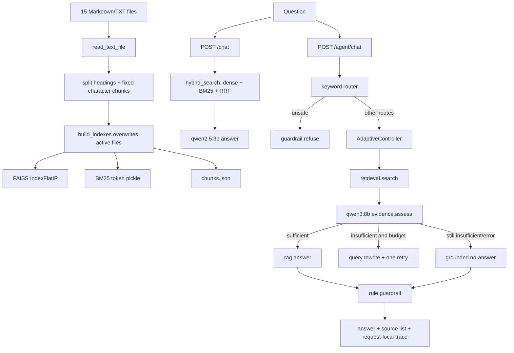
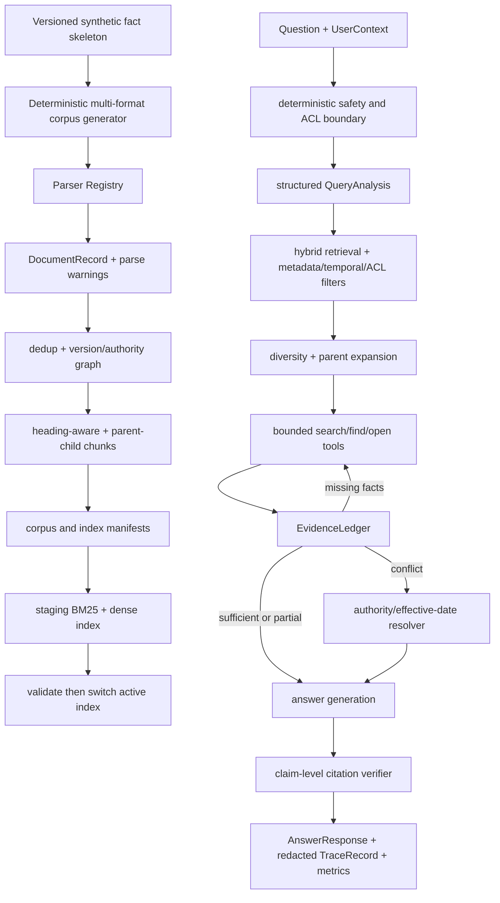

# Enterprise Agentic RAG v2 Design

审计日期：2026-07-16
审计阶段：E0，只读审计与设计
当前分支：`codex/rag-eval-system`
审计基线：`7aec4b950e012d3f24b8e1877d6391201e9b8f90`

## 1. 设计结论

项目当前已经具备一个真实可运行的 bounded adaptive RAG loop，但还不是 Resume-ready Enterprise Edition。最值得保留的能力是 BM25 + BGE-M3 + FAISS + RRF 基线、Python 控制的两次检索预算、结构化证据判断、跨轮证据累计、安全前置短路和 trace。最需要重做的不是“再加一个 Agent”，而是数据真实性、文档治理、ACL、可导航检索、证据账本、claim-level citation、评测 provenance 和服务工程。

R1 采用 **data/eval-first、兼容基线、逐阶段垂直切片**。旧 `/chat`、旧检索基线和旧数据集在 v2 验收前保持可运行，用于消融和回滚；新能力不通过一次大爆炸重构替换全部代码。

准确定位：

> Enterprise Knowledge Copilot - Evaluated Agentic RAG，是一个面向虚构企业档案的、带版本/权限/冲突意识的有界检索工作流；不是通用自主 Agent、真实企业生产系统或高并发平台。

## 2. E0 现场事实

### 2.1 Git 与公开入口

- 本地 `HEAD`、upstream 和远端功能分支均为 `7aec4b9`，ahead/behind 为 `0/0`，tracked/untracked 工作树干净。
- 审计开始时未发现 `.git/*.lock`，未发现其他项目 Python、pytest、Uvicorn、Streamlit、索引或评测进程。
- remote 为 `https://github.com/godofxuan/Attempt-of-enterprise-rag-copilot`。
- GitHub 默认分支仍是 `main`，远端 HEAD 为 `476c718`；本地缓存 `origin/main=cfba324` 已过期。
- GitHub 首页 README 仍只展示普通 RAG，并明确写着“尚未实现完整 Agentic workflow”。招聘者直接打开仓库首页看不到 `7aec4b9` 的功能分支能力。
- E0 不 fetch、不 merge、不 push、不改默认分支、不改仓库名。

### 2.2 当前数据与索引

| 项目 | 现场值 | 边界 |
|---|---:|---|
| 原始文档 | 15 | 全部为 Markdown |
| 原始文件总大小 | 18,332 bytes | 约 6 千中文字符，不是规模语料 |
| chunks | 75 | 每份文档恰好 5 个二级标题片段 |
| chunk 字段 | 4 | `chunk_id/source/section/text` |
| chunk 字符范围 | 44-121 | `chunk_size=500` 几乎未被真实压力测试 |
| FAISS | `IndexFlatIP`, dim 1024, ntotal 75 | 无 index manifest |
| BM25 | `BM25Okapi` token pickle | 无参数/语料哈希 manifest |
| 格式 | `.md` | 没有 PDF、DOCX、HTML、CSV/JSONL parser |
| 文档治理 | 无 | 无 doc_id、ACL、tenant、region、有效期、authority、版本链 |

当前唯一带版本含义的文件名是 `hr_remote_work_policy_2025.md`，但系统没有结构化版本对象，也不能执行 authority/effective-date 冲突解析。

### 2.3 当前评测证据

- `retrieval_dev/test` 分别为 40/70 题；`answer_dev/test` 与其文件 SHA256 完全相同，说明目前只是同一题集的不同运行入口。
- `adversarial_test` 为 10 个用户侧攻击问题。
- `agent_action_dev/test` 各 20 题；历史 test route accuracy 为 `0.55`。
- `agent_loop_dev/test` 各 16 题；test 已运行且回归复跑，不能再称 unseen held-out。
- 现场全量测试：`109 passed, 5 warnings in 5.21s`。
- 最终普通用户权限复跑为 `109 passed, 5 warnings in 1.67s`；Codex 沙箱内曾额外出现 1 条 `.pytest_cache` ACL 写入告警，属于运行环境告警，不是新增代码/依赖告警或测试失败。
- 现有 retrieval test：60 个 answerable case，Hit@1 `0.9333`、MRR `0.9639`、nDCG@5 `0.9678`。
- 现有 answer test：must-include `0.8083`、must-not-include OK `0.9286`、refusal `0.8`；它是 heuristic eval，不是完整 correctness。
- 现有 live Agent loop 的 outcome/policy/case-pass 为 `1.0`，retry/tool exact match 为 `0.75`；case-pass 不评分最终答案语义，也不检查 gold source coverage。
- 当前结果文件没有统一记录 Git SHA、数据集 SHA256、索引哈希、模型 digest、prompt/config 版本、开始/结束时间和机器环境；多数 evaluator 会覆盖固定文件名。

### 2.4 文档与求职主张

- 功能分支 README 基本符合 bounded Agentic RAG 的当前边界。
- 根 `PROJECT_STATUS.md` 和 `docs/AGENTIC_RAG_EVOLUTION_LOG.md` 写 `109 passed, 6 warnings`，现场为 5 warnings，应在后续文档收口阶段更正。
- `docs/PROJECT_STATUS.md` 已标记为历史快照，可以暂留，但最终公开文档应避免两个状态入口竞争。
- 2026-07-15 私人审计确认现有一页 AI/RAG 简历仍含 `102 tests` 和 `15/16`，已经过期；E0 不修改简历，也不把 `16/16` 替换进去冒充模型泛化能力。

## 3. 当前架构

### 3.1 真正改变行为的部分

- `hybrid_search()` 确实融合 dense 和 BM25 排名。
- unsafe route 在检索前执行 `guardrail.refuse`。
- `AdaptiveController` 根据 evidence verdict 选择 answer、rewrite/retry 或 no-answer。
- `latest_retrieved_chunks` 与累计 `retrieved_chunks` 解决了空重试和跨轮证据丢失。
- Python 强制最多两次 retrieval、一次 rewrite 和 10 个总 step。
- evidence JSON 经过 Pydantic `extra="forbid"` 校验，解析/transport 失败时 fail closed。

### 3.2 结构存在但价值有限的部分

- 非 unsafe 的 route 只改变 trace 中的标签和 reason，不改变检索参数、过滤器、prompt 或工具选择。
- 默认生产路径使用 `AdaptiveController`，不调用 `planner.build_plan()`；当前 planner 主要服务历史 `FixedPlanController` 评测。
- 工具集合没有文档内 `find/open`，所谓 Agentic retrieval 仍主要是一次 query rewrite。
- `EvidenceAssessment` 只有 verdict/reason/rewrite，不能表达 required facts、missing facts、conflicts、authority 或 coverage。
- trace 只随响应返回，没有 request ID、持久化、模型/索引版本和可回放事件。
- Streamlit 只调用 `/chat`，招聘者在 UI 中看不到 Agent 行为。

## 4. 方案比较

### 方案 A：数据与评测先行的兼容演进，推荐

先建立事实骨架、合成多源档案和冻结的 v2 eval，再逐步升级 ingestion、retrieval、Agent、安全和服务。每一步保留旧基线并做同数据消融。

优点：能证明每项复杂度带来的实际收益；最符合面试中“发现问题、提出假设、实验验证”的叙事。缺点：前两阶段 UI 变化不明显，需耐心完成数据与 schema 基础。

### 方案 B：框架优先的大重构，不采用

先引入完整 Agent/RAG 框架、向量数据库和 observability stack，再迁移现有逻辑。

优点：短期术语丰富。缺点：当前只有 75 chunks，无法证明框架复杂度必要；会破坏现有可比较基线，也增加本人无法解释的黑箱。

### 方案 C：演示 UI 优先，不采用为主线

先把现有 trace 做成漂亮页面，再补数据和工程。

优点：快速可见。缺点：UI 会放大现有 router/planner 的装饰性，仍无法回答 ACL、版本冲突、数据规模和评测可信度问题。UI 保留到 E6。

## 5. R1 目标架构

### 5.1 核心类型边界

| 类型 | 最小职责 |
|---|---|
| `DocumentRecord` | 规范化正文、sections/tables、来源、版本、有效期、authority、ACL、checksum、parser provenance |
| `ChunkRecord` | child text、parent reference、section/page locator、文档元数据、chunker version |
| `DocumentVersion` | 版本链、supersedes、status、effective interval、authority |
| `UserContext` | demo user/tenant/groups/roles/region；明确不等同真实 IAM |
| `QueryAnalysis` | intent、required facts、entities、时间/地区/部门过滤、比较/完整性/版本需求和 risk flags |
| `SearchRequest/Result` | 结构化 query、filters、预算、候选及各阶段分数/过滤原因 |
| `EvidenceItem/Ledger` | required fact 与 supporting/conflicting chunks、缺失事实、coverage 和推荐动作 |
| `AgentBudget/Action` | 各工具次数、deadline、context 上限、动作参数和停止原因 |
| `TraceRecord` | request ID、阶段 span、耗时、数量、版本、错误、脱敏摘要、final outcome |
| `AnswerResponse` | answer mode、claims、claim citations、可见 sources、warnings 和 trace reference |

所有关键状态必须由 Pydantic 校验；模型只提出结构化候选，Python 执行 ACL、预算、allowlist 和终止条件。

## 6. 保留、合并、替换和删除

### 保留并增强

- `BM25 only`、`dense only`、`hybrid RRF` 三个基线。
- `AdaptiveController` 的显式 phase、硬预算和 fail-closed 原则。
- allowlisted `ToolRegistry`、跨轮证据累计和 trace step。
- FastAPI、Streamlit、SQLite 和本地 Ollama 的 local-first 形态。
- retrieval/answer/agent 分层评测思想。

### 合并

- 将非安全 `router` 与生产中未生效的 `planner` 合并为一个结构化 `QueryAnalysis`；unsafe/越权规则仍在它之前确定性短路。
- 将 `classify_question_type()` 的生成格式意图并入 `QueryAnalysis`，避免 router、question classifier、prompt 分别猜意图。
- 将 evidence reason、required facts、conflicts、coverage 和下一动作统一到 `EvidenceLedger`。

### 替换

- `read_text_file()` + glob 替换为 Parser Registry 和结构化 parse result。
- 只含四字段的 chunk dict 替换为 `ChunkRecord`，但旧 adapter 保留到消融完成。
- 原地覆盖索引替换为 versioned build manifest；R1 先做安全全量重建，staging/active 切换在成本可控时纳入。
- 只返回 source list 的 citation 替换为 claim-to-chunk 支持关系和 verifier。
- 固定输出文件名替换为 `eval_runs/<run_id>/manifest.json + summary/details/failures`。

### 删除或归档候选

- `FixedPlanController`、`planner.py` 和 Stage 7 固定计划逻辑在 E3 保存基线后移入 legacy 测试适配层；不继续作为生产 Agent 能力宣传。
- `scripts/eval_retrieval.py`、`fill_eval_answers.py`、`patch_evidence_exact.py` 与 `scripts/test_*.py` 在 E4 做调用审计后归档或删除；E0 不删除。
- `docs/PROJECT_STATUS.md` 历史快照在 E6 合并到历史/演进文档，避免两个状态页竞争；E0 不删除。

## 7. R1 与 R2 边界

### R1 必须完成

- 可重复、固定 seed 的虚构企业事实骨架、demo/benchmark corpus 和冻结 v2 eval。
- Markdown/TXT/PDF/DOCX/HTML/CSV 或 JSONL parser，结构化 warning 和多格式 fixture。
- DocumentRecord、版本/authority/ACL metadata、heading-aware/parent-child chunking 和 index manifest。
- ACL/metadata/temporal-aware hybrid retrieval 与 bounded `search/find/open`。
- EvidenceLedger、partial/not-found/permission/conflict outcome 和 claim-level citation。
- retrieval/answer/agent/security 四层 eval、baseline-vs-v2 消融、run manifest 和本人抽检表。
- lifespan、health live/ready、request ID、timeout、结构化 trace、最小 CI 和小规模负载证据。
- 三页 Streamlit、公开文档和私人面试材料。

### R2 仅再次批准后进入

- 5,000+ 文档 stress profile。
- 增量 upsert/delete、原子 active pointer、rollback 的完整实现。
- OpenTelemetry exporter、专用 metrics backend。
- Docker、PostgreSQL/专用向量库适配层。
- 通过 admission gate 的 reranker 扩展。

R1 不加入 Redis、Kafka、Kubernetes、多 Agent、长期记忆或微服务拆分。

## 8. 依赖策略

| 候选依赖 | 用途 | 无新增依赖替代方案 | 决策门禁 |
|---|---|---|---|
| `pypdf` | PDF 文本/page locator | 明确标记 PDF unsupported | E2 parser fixture 必须证明稳定后加入 |
| `python-docx` | DOCX paragraphs/tables | 明确标记 DOCX unsupported | E2 表格与段落测试通过后加入 |
| `beautifulsoup4` + `lxml` | HTML 正文/表格 | stdlib `html.parser` | 只有 stdlib 结果无法保留结构时加入 |
| `rapidfuzz` | near-duplicate 相似度 | `difflib` + normalized hash | benchmark profile 显示性能/准确性不足时加入 |
| `prometheus-client` | `/metrics` | 进程内 counters + JSON diagnostics | E5 确认指标接口需求后加入 |
| `psutil` | memory/cold-start profile | PowerShell `Get-Process` | 跨平台报告需要时加入 |
| reranker runtime | 可选重排 | RRF + diversity/parent expansion | 只有 dev 重复失败和可复现收益才保留 |

依赖版本必须锁定或至少使用兼容范围；当前无版本的 `requirements.txt` 不足以支撑可复现声明。

## 9. 测试与评测策略

1. 每个行为变化先写失败测试并保存失败原因。
2. schema/生成器/parser/chunker/filter/budget/verifier 使用无模型 deterministic tests。
3. embedding/chat 通过协议和 fake transport 做 CI 测试；本地 Ollama 只用于手动 live run。
4. 旧 15 文档基线保持可运行；v2 在同一 runner 中报告 baseline 与增强配置。
5. E1 冻结 v2 test SHA256 后，不根据 test 失败调 prompt；后续重复运行称 regression。
6. 每个 eval run 新建目录并记录 Git SHA、数据/index/prompt/config/model/environment provenance。
7. answer success 同时检查 atomic facts、引用支持、unsupported claims、conflict/ACL/outcome，不能只看 source presence。
8. 人工抽检表由系统生成空模板，本人填写结论；Codex 不代填“人工正确”。

## 10. 风险与回滚

| 风险 | 控制 | 回滚 |
|---|---|---|
| 合成事实与 gold 同源导致评测过易 | 事实骨架、rendering、question generation、validator 分层；加入噪声和跨文档关系 | 保留 seed/config/manifest，重新生成 dev；冻结 test 不改标签刷分 |
| 新 pipeline 破坏旧基线 | baseline adapter 和 feature flag；每阶段同数据消融 | 切回 legacy config，不删除旧 evaluator/数据 |
| ACL 在融合后才过滤造成泄露 | candidate 进入 fusion/context/trace 前过滤；forbidden doc 测试 | fail closed 为 permission/no visible evidence |
| 索引构建中断损坏 active 文件 | versioned output、校验、明确 `--force=false` | active 不切换；保留上一版本 |
| 本地模型非确定和延迟波动 | deterministic/live 分层、固定 prompt/config、记录 model digest | 结果标为 NOT RUN/unstable，不放宽 gold |
| Windows 中文路径和 `localhost` | 使用 `Path`、UTF-8、显式 `127.0.0.1`，测试临时目录外置 | 保留无网络 deterministic path |
| 范围膨胀 | E0-E7 门禁、R1/R2 分离、禁止技术清单 | 阶段未过门禁不进入下一阶段 |
| 本人不能解释自动生成代码 | 每阶段学习卡、20 分钟实验、口述验收 | 不把学习状态标为已掌握，不生成对应简历主张 |

Git 回滚原则：每阶段独立提交，不改写 `7aec4b9`，不 force-push；生成语料、索引、eval runs 和私人材料不进入公开 Git。任何 merge、默认分支、tag、仓库重命名和 push 都需要本人明确确认。

## 11. 业务价值与招聘价值

| 能力 | 企业问题 | 招聘者可验证证据 |
|---|---|---|
| 版本化合成档案 | 企业资料有旧版、冲突、误归档和多来源 | facts/config/seed、data card、consistency tests |
| 多格式 ingestion | 制度、邮件、工单、会议、表格格式不同 | parser fixtures、warnings、manifest |
| ACL/temporal retrieval | 未授权或过期文档不能进入回答 | forbidden-doc tests、leakage metric、trace redaction |
| search/find/open | 一次 top-k 难以完成比较和完整性问题 | 动态 trace、工具预算、Agent eval |
| EvidenceLedger | 需要知道已支持、缺失和冲突的事实 | ledger schema、failure attribution、partial outcome |
| claim citations | source list 不代表每条结论有支持 | claim verifier、coverage/correctness/unsupported metrics |
| versioned eval runs | 固定结果文件无法复现实验 | manifest、hash、config、model、environment |
| health/trace/CI/load | Demo 能跑不等于工程可维护 | CI、readiness、request ID、p95、error report |

## 12. 候选简历主张

以下只定义方向，不预填数字，必须在 E7 claims-evidence matrix 通过后才能使用：

1. 设计固定 seed 的虚构企业多源档案生成与数据治理流程，覆盖多格式、版本链、冲突、近重复和 ACL metadata，并用 schema/consistency tests 固化数据质量。
2. 在 BM25 + dense + RRF 基线上实现受预算约束的 `search/find/open` Agentic retrieval 和 EvidenceLedger，支持比较、完整性、冲突、权限与无答案场景。
3. 建立 retrieval/answer/agent/security 四层评测、baseline-vs-v2 消融和带 provenance 的独立 run artifacts，并补充 CI、health、trace 和实际规模/延迟证据。

不得使用“生产级”“高并发”“准确率 100%”“真实企业内部数据”或任何未跑出的目标数字。

## 13. E0 不执行事项

- 不修改 Python、依赖、README、状态页和现有数据。
- 不生成 E1 语料或 v2 test。
- 不运行 `scripts.build_indexes --help`，因为源码和既有事故记录已证明它会触发建库。
- 不运行 live Ollama 评测，不再次消费旧 held-out。
- 不 merge/push/tag/release，不改 GitHub 仓库名、remote、默认分支或公开状态。

下一阶段只有在本人输入 `批准E0，执行E1档案与评估集` 后开始。
