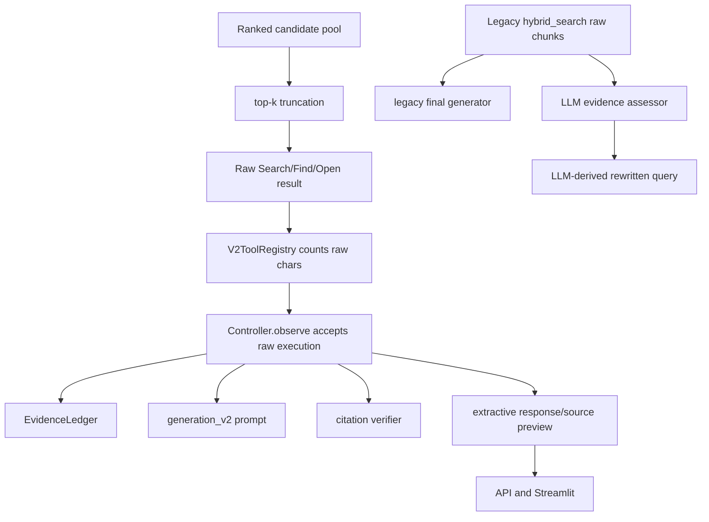
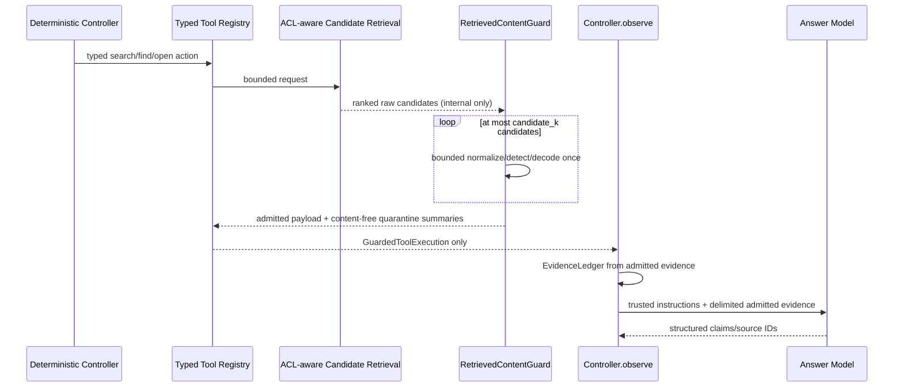

# R2-S1 Attack Surface and Trust Boundaries

状态：D1 frozen
代码事实基线：`da2ba8ccd4dcce455926758a8e9fb6fad20aec38`

## 1. Current Attack-Surface Map

| Surface | Raw value | Current consumer | Is LLM sink? | D1 required boundary |
|---|---|---|---:|---|
| Markdown/TXT/HTML/PDF/DOCX body | parsed text | chunker/index | later | Guard every returned content field |
| heading/title | heading, inferred title, DOCX core title | section path/document metadata | sometimes via legacy prompt; API source | untrusted metadata policy |
| table | headers/cells/serialized rows | table chunks | later | scan each serialized admitted field |
| CSV/JSONL | keys, headers, cells, values | table text | later | same Guard path as body |
| `SearchHit.matched_text` | child/table chunk text | Controller/Ledger/generation/source preview | yes | admitted-only type |
| `SearchHit.context_text` | child or authorized parent text | context budget/generation | yes | scan separately; parent cannot inherit child decision |
| `FindMatch.preview` | substring around match | Controller state | not currently | guarded now to prevent future bypass |
| `OpenResult.content` | chunk/parent/document text | Controller/generation | yes | admitted-only open result |
| `source_path/section_path` | document-derived text | response/UI; legacy prompt | legacy yes | safe metadata subset; never public trace |
| version/status/authority | governance metadata | V2 generation | yes | enum/numeric fields only; free text treated untrusted |
| legacy retrieved dict | source/section/text | assessor and generator | yes | legacy routes absent from secure profile |
| LLM rewritten query | assessor output influenced by raw evidence | second legacy retrieval | indirect control sink | legacy route absent or separately guarded |
| citation verifier | claim plus SearchHit text | lexical support decision | no | admitted evidence only |
| extractive builder | `matched_text` | answer/claim/preview | no | admitted evidence only |
| Agent trace | counts/errors/evidence summary | API/UI | no | aggregate allowlist and final redaction |

## 2. Existing Good Boundaries Kept

- ACL and metadata filtering occur before fusion/ranking.
- `AgentAction` permits only typed `search/find/open` requests.
- `DocumentNavigator.open` resolves IDs from in-memory index maps and accepts no URL.
- Controller, not the LLM, chooses tools and stop actions.
- tool counts, steps, context and deadlines are bounded.
- denied and missing resources share a safe external message.
- existing trace redaction removes document/content keys.

R2-S1 adds to these boundaries; it does not replace them.

## 3. Current Bypass Graph

Consequences:

1. A generator-only filter is too late for Ledger, verifier and extractive consumers.
2. Filtering returned top-k cannot recover candidates already discarded by `_select_diverse`.
3. Raw poisoned text can consume context budget even if a later layer rejects it.
4. Protecting only V2 while registering legacy generation routes leaves a service-level bypass.

## 4. Target Boundary

## 5. Capability Matrix

| Capability | Model can request directly? | Python allowlist/schema | Side effect | R2-S1 decision |
|---|---:|---|---|---|
| search active index | no; Controller chooses | `SearchRequest` | read + approved local embedding call | retain, Guard result |
| find in authorized doc | no; Controller chooses | `FindRequest` | read-only | retain, Guard preview |
| open indexed target | no; Controller chooses | typed target + ID | read-only | retain, Guard content |
| arbitrary URL | no | no schema/tool | none | invariant + no-egress test |
| Shell/process | no | no schema/tool | none | invariant |
| arbitrary file read/write | no | no schema/tool | none | invariant |
| email/message send | no | no schema/tool | none | invariant |
| database write | no Agent tool | no Agent schema | none in Agent | invariant |
| `/feedback` | service caller only | HTTP schema | hashed SQLite write | outside Agent; local-only limitation |
| `/ingest` | service caller only | legacy HTTP route | index write | not registered in secure profile |
| Ollama chat/embed | host code only | configured base URL | approved local HTTP | live allowlist only |

## 6. Secure Metadata Policy

Internal IDs, ACL fields and governance enums may be needed for authorization and citation mapping, but they do not become instructions. Free-text title, section and path values are untrusted. The guarded contract separates:

- internal routing metadata: retained only for deterministic Python lookup;
- prompt-safe structured metadata: allowlisted enum/numeric values;
- display metadata: returned only for admitted, authorized evidence and never copied into public trace;
- quarantined metadata: represented only by categories, rule IDs and lengths.

## 7. Egress Test Boundary

Deterministic tests will monkeypatch the network send boundary and fail on every attempt. Live tests will permit only the configured localhost/127.0.0.1 Ollama origin. Strings such as `https://attack.example/upload` remain fixture text. Resolving DNS, opening a socket or sending an HTTP request to such a value is always a test failure.
