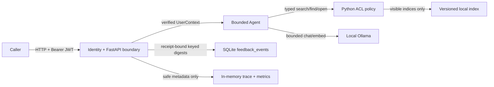

# Enterprise Agentic RAG v2 Security Threat Model

## R2-S5 identity update

The earlier caller-claimed `UserContext` boundary is retired. Secure HTTP
routes now accept only a short-lived RS256 access token verified against a
bounded, local, immutable public JWKS snapshot. The server constructs a strict
`Principal` and derives Agent identity from subject, tenant, region, and groups.
Deployment roles remain outside Agent state.

Protected assets now also include private signing keys, bearer tokens, the
feedback actor HMAC key, and verified identity claims. Controls include:

- exact algorithm, token type, issuer, scalar audience, bounded ASCII `kid`,
  required claims, integer timestamps, skew, and maximum lifetime;
- duplicate-key-rejecting JSON before cryptographic verification, with no
  remote key URL, critical, compression, or embedded key headers;
- regular-file snapshot reads with size limits and symlink/reparse rejection;
- authentication before request-body parsing and zero Agent/model/retrieval/
  feedback side effects on denied requests;
- 401 challenge, 403 role denial, and generic retryable 503 identity outage;
- HMAC actor/content pseudonyms, explicit target answer IDs, and a
  server-issued answer-binding receipt for feedback;
- managed manifest/journal commit semantics, owner/mode/DACL/hardlink checks,
  and durable incomplete-erasure markers;
- separate persona and operator credentials, exact numeric-loopback clients,
  disabled proxy inheritance, and disabled redirects;
- public-repository detection for JWT-shaped credentials and private keys.

Authentication failures may produce only low-sensitivity HTTP telemetry:
route template, status, latency, outcome, and zero model counters. They produce
no Agent trace, claims, token, question, evidence, document, or citation data.

Remaining boundary: the local issuer is a reproducible development substitute,
not SSO or a production identity provider. Host compromise, private-key theft,
OS-level egress control, revocation, MFA, and enterprise identity governance are
out of scope.

最后更新：2026-07-23

状态：E5 本地 R1 实现。本文描述当前代码真实强制的安全边界，不把尚未实现的 IAM、分布式追踪或公网部署冒充为已有能力。

## 1. 保护对象

本项目需要保护的对象包括：

- 不同 tenant、region、group 下不可见的文档、chunk、标题、路径和 ACL metadata；
- 用户问题、模型回答、prompt、模型原始响应和反馈正文；
- active index、manifest hash、版本和权威性/时效性 metadata；
- 模型与数据库的本机路径、错误正文、连接信息和未来可能加入的凭据；
- Agent 工具预算、授权判断和系统控制流；
- trace、metrics、logs 和 load artifacts 本身。

## 2. 信任边界



当前代码不再接受 HTTP body 自报 `UserContext`。本地 issuer 签发短期 token，
服务端以托管 JWKS 验签并派生 tenant/region/groups。该机制证明资源服务器边界，
但本地 issuer 仍不是真实企业 IAM；生产系统需要真实 OIDC/SSO、密钥托管、
revocation 和身份治理。

## 3. 数据流安全不变量

| 阶段 | 必须成立的不变量 | 实现位置 |
|---|---|---|
| API 输入 | request ID 只允许 1-64 位字母、数字、点、下划线和连字符 | `app/api/middleware.py` |
| Query 分析 | 明确 unsafe 请求在检索前终止 | `app/agent/query_analysis.py` |
| Retrieval | ACL 在 BM25/dense/RRF fusion 和 context 构建前执行 | `app/retrieval/pipeline.py` |
| Navigation | 工具只接收 typed ID，不接收任意文件系统路径 | `app/retrieval/navigation.py` |
| Generation | 只把 ledger 选中的可见证据交给模型 | `app/agent/generation_v2.py` |
| Citation | citation 必须引用当前可见 source ID | `app/agent/citation_verifier.py` |
| Error | HTTP 错误不包含 `str(exc)`、模型 body 或本机路径 | `app/api/errors.py`、`app/runtime/model_transport.py` |
| Trace/metrics | 不保存 question、answer、identity、doc/chunk/path/title/ACL | `app/observability/` |
| Feedback | receipt 必须匹配 verified actor/target/content；只保存 keyed HMAC、helpful、request ID、时间；同 actor/target 原子 upsert | `app/main.py`、`app/db.py` |
| Load artifact | 只保存状态、mode、request ID、延迟和安全错误码 | `scripts/load_profile.py` |

## 4. 威胁、控制和剩余风险

| 威胁 | 当前控制 | 验证证据 | 剩余风险 |
|---|---|---|---|
| 跨 tenant/region/group 数据泄露 | 服务端验证本地 JWT 后派生 `UserContext`；`AccessPolicy` 在候选生成和 parent expansion 前过滤；拒绝与不存在使用相同公开信息 | trusted identity matrix、`tests/security/test_acl_zero_leak.py`、`test_navigation_zero_leak.py` | 本地 issuer 不是真实 IAM；单机 metadata 配置错误仍可能授权错误 |
| 直接 prompt injection | rule-first unsafe 分类，unsafe 零工具调用；工具 allowlist、预算和 source-free refusal | `tests/security/test_agent_v2_unsafe.py`、E4 security evaluator | 规则可能被改写、编码或多语言绕过；不能声称完全防注入 |
| 文档内间接 prompt injection | 文档作为不可信证据数据处理；模型不能扩展工具集合；citation/visibility 验证 | injection fixture、security evaluator | 当前没有专门的内容净化器或模型级指令层级证明；复杂间接注入仍需人工红队 |
| system prompt 泄露 | prompt 不放凭据、连接串或 ACL truth；授权由 Python 执行 | generation/security tests | prompt 文本仍可能被推断或泄露，因此它从来不是秘密或权限边界 |
| 任意文件读取/工具滥用 | search/find/open 使用 snapshot 内 typed target；不接受 path；调用次数、context、deadline 有界 | navigation、budget、zero-leak tests | 没有进程级 sandbox；未来新增工具必须重新威胁建模 |
| 错误正文泄露 | 422/404/500 统一安全模型；transport 错误只保留 code/status/attempts | `tests/api_v2/test_errors.py`、transport tests | 开发者以后新增日志时仍可能误写正文；需要 code review 和持续测试 |
| 恶意 request ID 污染日志/trace | 白名单正则，不合法值替换为 UUID hex | `test_request_context_api.py` | 本地 R1 不实现跨服务 W3C Trace Context |
| retry storm/资源耗尽 | request deadline、模型 timeout、最多 2 次 transport attempt；只重试 timeout/connection/429/502/503/504 | `tests/runtime/test_model_transport.py` | Python 不能强杀已经进入第三方 native code 的线程；无全局队列/限流 |
| telemetry 高基数/内存增长 | route template 归一化、span allowlist、trace deque 和 latency deque 有上限 | observability tests | 单进程重启后 trace 丢失；无多实例聚合 |
| feedback 正文泄露 | `feedback_events` 只保存 SHA256，不再向旧 plaintext 表写入 | `test_feedback_privacy.py` | SHA256 不是加密；低熵或已知问题可能被字典枚举，hash 也可用于关联同一文本 |
| index 被篡改或半写 | immutable version directory、artifact hash、validated active pointer、staging publish | E2 index lifecycle tests | 本机管理员仍能替换全部文件；没有签名或远程可信存储 |
| observability endpoint 暴露 | 只返回低敏 metadata；文档要求仅本机使用 | API/trace zero-leak tests | `/observability/*` 当前没有认证，绝不能直接暴露公网 |
| 依赖/CI 漂移 | 直接依赖精确 pin、Python 3.11、frozen hash、deterministic CI | `tests/test_repository_config.py` | 不是带 wheel hash 的完整 lockfile，也没有 SBOM/漏洞扫描 |

## 5. Prompt injection 的正确表述

OWASP LLM01:2025 明确指出，RAG 和 fine-tuning 提升相关性，但不能彻底消除 prompt injection。因此当前策略是 defense in depth：

1. 输入先走 rule-first unsafe gate；
2. 授权在 Python 中执行，不让 LLM 决定可见性；
3. 工具和参数是 typed allowlist；
4. 工具次数、context 和时间有硬预算；
5. 文档内容只作为 evidence，不获得系统指令权限；
6. 输出再检查 citation/source visibility；
7. 失败时 source-free、fail closed。

这能降低攻击面，但不能证明任意注入都被阻止。参考：[OWASP LLM01:2025 Prompt Injection](https://genai.owasp.org/llmrisk/llm01-prompt-injection/)。

## 6. System prompt 不承担安全职责

OWASP LLM07:2025 的核心原则是：system prompt 不应被视为秘密，也不应承载凭据或严格授权。本项目据此把 tenant/region/group 判断放在 `AccessPolicy`，把模型名称/timeout 放在配置，把数据库写入放在 Python 函数；prompt 泄露不应直接带来权限绕过。参考：[OWASP LLM07:2025 System Prompt Leakage](https://genai.owasp.org/llmrisk/llm072025-system-prompt-leakage/)。

## 7. 公开与持久化矩阵

| 数据 | API answer | trace/metrics | logs | feedback DB | load artifact |
|---|---:|---:|---:|---:|---:|
| question/prompt | 仅业务请求内使用 | 否 | 否 | 否，只有 hash | 否 |
| answer/model body | answer endpoint 可返回 | 否 | 否 | 否，只有 hash | 否 |
| user/tenant/groups | 否 | 否 | 否 | 否 | 否 |
| doc/chunk/title/path/ACL | 授权 source 可返回 | 否 | 否 | 否 | 否 |
| request ID | 是 | 是 | 是 | 是 | 是 |
| route/status/duration | header/status | 是 | 是 | 否 | 聚合/明细 |
| model calls/retries/errors | 否 | 聚合 | 否 | 否 | 前后快照 |

## 8. 上线前必须补的控制

- 由真实 IAM 校验 token，并在可信服务端构造 `UserContext`；
- 给 `/observability/*`、`/feedback`、`/ingest` 增加独立权限；
- 增加请求体大小限制、速率限制、并发队列和租户配额；
- 将 secrets 放入 secret manager，任何 prompt/log/trace 都不持有；
- 增加间接 prompt injection 红队集和人工安全复核；
- 对依赖做 hash lock、SBOM、漏洞扫描和升级策略；
- 多实例时换成标准 telemetry exporter/collector，并制定 retention/access policy；
- 对 feedback hash 是否属于个人数据做法律与隐私评审。

## 9. 当前可以和不可以说什么

可以说：实现并测试了 pre-fusion ACL、unsafe zero-tool、typed bounded tools、统一安全错误、请求关联、内容零持久化 telemetry、hashed feedback 和不可覆盖负载证据。

不可以说：真实 IAM 已完成、完全防 prompt injection、system prompt 永不泄露、hash 等于匿名化、observability 可以公网开放、已达到生产合规或 SLA。

## 10. R2-S1 retrieved-content threat model status

R2-S1 D1 froze a dedicated indirect-injection threat model. D3 implemented the deterministic detector, and D4 made it mandatory on the default V2 `search/find/open` path before Controller state. The scope covers document body/title/version/heading/metadata, search snippets, parent context, find/open results, citation/extractive consumers, trace, API and UI serialization.

The approved target is defense in depth: deterministic quarantine, admitted-only runtime types, bounded candidate top-up, read-only capability confinement, explicit untrusted-evidence prompt boundaries, aggregate trace and separate deterministic/live evaluation. The complete documents are under [`docs/security/r2_s1/`](security/r2_s1/00_scope_and_threat_model.md).

Current status:

```text
threat model and protocol   D1 FROZEN
standalone Guard core       D3 GREEN / 64 TESTS
guarded V2 runtime path     D4 GREEN / 8 BOUNDARY PROBES
prompt/public counters      D5 GREEN / FULL 697 TESTS
indirect attack evaluation  NOT RUN
```

The D4/D5 result proves deterministic enforcement, prompt framing, aggregate-only trace, secure service composition and policy-lifecycle contracts, not universal resistance or attack success rate. The four existing direct user-prompt probes remain separately labeled, and the D6 dedicated indirect attack/benign OFF/ON runs have not started.
