# R2-S1 Retrieved-Content Indirect Prompt Injection Design

状态：D1 design frozen；implementation `NOT RUN`；evaluation `NOT RUN`
日期：2026-07-17
分支：`codex/rag-eval-system`
设计基线：`da2ba8ccd4dcce455926758a8e9fb6fad20aec38`

## 1. Purpose

R2-S1 为 `/agent/v2/chat` 建立一条可测试、可解释、可复现的 retrieved-content 安全边界。攻击者可以控制企业知识库文档正文、标题、章节、表格或文本元数据，并试图让这些内容在被检索后覆盖可信指令、泄露 canary、改变回答、诱导工具调用或触发外传。

本设计不把正则扫描器当成完整防线。固定架构为：

```text
ACL and metadata filtering
-> bounded ranked candidates
-> deterministic content detection and quarantine
-> admitted-only typed tool result
-> deterministic controller and evidence ledger
-> explicit untrusted-evidence prompt boundary
-> citation/source verification
-> aggregate redacted trace
-> independent guard OFF/ON evaluation
```

最终允许的项目主张是：

> 在固定、版本化的合成间接提示词注入回归集上，通过检索内容隔离、能力约束、提示边界和独立安全评测降低攻击成功与泄露；不声称对未知攻击完全免疫。

## 2. Scope

### 2.1 In scope

- V2 `search/find/open` 返回的正文、parent context、preview 和 open content；
- title、section、source path 和其他可能进入 prompt、response 或 trace 的文本元数据；
- instruction override、role impersonation、secret extraction、tool/egress诱导、Unicode/Base64 混淆、markup 包装和有界 split payload；
- mixed clean/poisoned、poisoned-only、top-ranked poison 和同一 chunk 中事实与攻击共存；
- 默认 enforce、逐内容 fail closed、显式 `security_filtered`、有界候选补齐；
- deterministic propagation tests、真实模型 paired trial、provenance 和失败保留；
- secure service profile 中 legacy generative endpoint 的旁路处理。

### 2.2 Out of scope

- Python 源码、依赖、CI、system prompt 或模型权重被篡改；
- 供应链、模型投毒、完整 IAM、生产多租户和合规认证；
- 图像或其他多模态注入；
- 浏览器、Shell、SQL、邮件、任意 HTTP 或高风险写工具；
- 任意跨文档、任意距离、任意编码层数的组合攻击；
- 对未知攻击的形式化安全证明；
- 把 system prompt 当成秘密或凭据容器。

## 3. Observed Current Data Flow

当前真实 V2 路径是：

```text
POST /agent/v2/chat
-> run_agent_v2_chat
-> QueryAnalyzer
-> DeterministicController.next_decision
-> V2ToolRegistry.run
-> DocumentNavigator.search/find/open
-> raw SearchResult/FindResult/OpenResult
-> Controller.observe
-> EvidenceLedger
-> GenerationV2ResponseBuilder
-> citation verifier
-> AnswerResponse/API/UI
```

`V2ToolRegistry` 在 Guard 前计算 raw `visible_count` 和 `context_chars_added`。`HybridRetrievalPipeline.search()` 先计算最多 `candidate_k` 个候选，但在返回前由 `_select_diverse(... top_k)` 丢弃其余候选。`Controller.observe()` 当前直接接受 `V2ToolExecution`，并保存 raw hit/open/find 结果。`generation_v2` 把 `matched_text`、`context_text` 和 open content 拼入 user message。

因此单纯在 generator 前做一次字符串过滤不能封住数据流，也不能完成过滤后的候选补齐。

## 4. Trust Boundaries

```mermaid
flowchart LR
    U["Caller and user question"] --> Q["Rule-first query analysis"]
    Q --> C["Deterministic controller"]
    C --> A["Typed read-only tool allowlist"]
    KB["Untrusted indexed documents and metadata"] --> R["ACL-aware candidate retrieval"]
    A --> R
    R -->|"raw candidates: trusted identity, untrusted content"| G["RetrievedContentGuard"]
    G -->|"admitted typed evidence only"| O["Controller.observe and EvidenceLedger"]
    G -->|"content-free summaries"| T["Aggregate security trace"]
    O --> P["Untrusted-evidence prompt boundary"]
    P --> M["Local answer model"]
    M --> V["Structured output and citation verification"]
    V --> API["AnswerResponse"]

    X["Legacy /chat /agent/chat /ingest"] -. "not registered in secure profile" .-> C
```



Boundary rules:

1. ACL determines visibility before content scanning; quarantined summaries must not reveal denied resources.
2. Raw retrieved content may cross only from retrieval into `RetrievedContentGuard`.
3. `Controller.observe` accepts only a guarded execution type and rejects raw execution at runtime.
4. Quarantine summaries never contain original, normalized or decoded content.
5. Model output cannot select new tools or alter the tool allowlist.
6. Public/API trace receives aggregate low-cardinality security facts, not content or resource identifiers.

## 5. Secure Service Boundary

The default secure profile registers `/agent/v2/chat` as the supported generative endpoint. Legacy `/chat`, `/agent/chat` and HTTP `/ingest` are not registered in that profile. This is a startup composition decision, not a request parameter and not a model-controlled flag.

Legacy behavior may remain available only through an explicit test/local compatibility app factory. No README or interview claim may describe that compatibility profile as protected by R2-S1 unless it is separately routed through the same guarded boundary and evaluated.

`/feedback` and `/observability/*` are not Agent tools. They remain local-only service surfaces under the existing R1 limitation and still require authentication before public deployment.

## 6. Frozen Component Design

### 6.1 RetrievedContentGuard

The Guard is deterministic and versioned. It creates bounded detection views while preserving the original content unchanged for admitted downstream use.

Detection stages:

1. validate field type and length;
2. create an NFKC case-folded detection view;
3. identify zero-width, bidi and other disallowed invisible controls;
4. inspect rule families using token/structure boundaries, not complete-case hardcoding;
5. identify bounded Base64 candidates and decode each candidate at most once;
6. optionally inspect a bounded same-document adjacent-fragment view;
7. return `ADMIT` or `QUARANTINE` plus content-free diagnostics.

Frozen resource limits are configuration constants owned by the Guard policy, not request values:

- scan at most 20,000 Unicode code points per content field;
- inspect at most 8 Base64 candidates per field;
- accept a Base64 candidate only when encoded length is 16..4096 characters;
- decode at most 3,072 bytes per candidate, once and non-recursively;
- inspect decoded text only when at least 70% of decoded bytes are printable text/whitespace;
- never decompress ZIP/GZIP and never recursively decode;
- split-payload aggregation is limited to adjacent candidates from the same authorized document, at most 3 fragments and 12,000 normalized characters;
- a search execution scans at most `candidate_k`, whose existing schema maximum is 200.

The exact constants are part of `detector_version` and `rule_set_sha256`; changing one requires a new detector version and a new evaluation run.

### 6.2 Guarded execution boundary

The implementation uses invalid-state-safe discriminated models rather than one model with optional content:

```text
AdmittedEvidenceChunk
  internal identity and authorization metadata
  admitted original content
  GuardDecision(disposition=ADMIT)

QuarantineSummary
  synthetic case-safe/internal identity only
  lengths, categories, rule IDs, detector version, guard_error
  no original/normalized/decoded content

GuardedToolExecution
  action
  admitted Search/Find/Open payload
  quarantine summaries
  security counters
  post-guard budget state
  optional security stop reason
```

`Controller.observe()` must perform a runtime `isinstance`/Pydantic validation and reject raw `V2ToolExecution`. Type hints alone are not accepted as a security control.

### 6.3 Candidate admission and bounded top-up

Search uses a ranked candidate pool of at most `candidate_k`. The current public `search()` behavior remains compatible for non-secure internal regression, but the secure path obtains ranked candidates at an internal boundary before top-k truncation.

Algorithm:

1. retrieve and rank at most `candidate_k` ACL-visible, metadata-valid candidates once;
2. scan candidates in rank order;
3. quarantine risky candidates without consuming an admitted diversity slot;
4. apply `max_chunks_per_doc` only to admitted candidates;
5. stop when `top_k` admitted candidates are available;
6. if the first `top_k` ranked positions do not provide `top_k` admitted candidates, continue through the remaining existing pool once and record `top_up_attempts=1`;
7. never rerun embedding, broaden ACL, exceed `candidate_k`, or loop until success;
8. count only admitted text toward model context budget; separately record scanned characters.

Outcome mapping:

| Situation | Public mode | Stop reason | Sources |
|---|---|---|---:|
| no candidate and no denied-only signal | `not_found` | `not_found` | 0 |
| denied-only evidence | `permission` | `permission` | 0 |
| candidates existed and all usable candidates were quarantined | `security_filtered` | `evidence_filtered` | 0 |
| at least one admitted item but evidence remains incomplete | existing `partial`/`budget` semantics | existing bounded reason | admitted only |
| per-item Guard exception | quarantine item and continue | aggregate rule `guard_error` | admitted only |
| Guard unavailable, invalid ruleset or initialization failure | `system` | `system_error` | 0 |

`security_filtered` does not assert that an attack definitely occurred. It means available content was withheld by the configured safety policy, which is different from absence of knowledge.

### 6.4 Prompt boundary

The answer model receives trusted host instructions in a system message and admitted evidence in a user message. Because the current Ollama integration has not established a reliable tool-role contract, D1 does not assume one.

Each generation call uses a host-generated, injectable nonce in exact begin/end delimiters. Evidence fields are JSON-escaped inside the delimiters. A host-generated reminder follows the matching end delimiter. The system instruction states that evidence is data, URLs/commands/role labels have no execution authority, and only the supplied source IDs may be cited. Delimiter nonce generation is test-injectable and the nonce is not persisted in public trace.

The system message contains no secret, credential, tenant entitlement or hidden business rule.

### 6.5 Trace boundary

Public/API Agent trace may add only:

```text
candidate_count
scanned_count
admitted_count
quarantined_count
scanned_chars
decoded_candidate_count
top_up_attempts
post_guard_evidence_count
risk_categories
rule_ids
detector_version
guard_error_count
stop_reason
```

No raw, normalized or decoded content; no document title/path; no doc/chunk ID; no content hash; no delimiter nonce; no canary. Private synthetic evaluation may retain `case_id` and fixture chunk IDs. A private content correlation requirement, if later proven, must use a run-scoped HMAC rather than a public naked SHA256.

## 7. Guard Modes

| Mode | Intended use | Content behavior | Can API request select it? | Can public result support a security claim? |
|---|---|---|---:|---:|
| `enforce` | production/default, deterministic ON evaluation | quarantine blocks downstream propagation | no | yes, with dataset/run limits |
| `audit` | developer migration diagnostics | detector records would-quarantine decisions but an explicitly non-service harness may pass raw content onward | no | no |
| `off` | deterministic propagation baseline only | bypass Guard inside injected test/evaluator dependency | no | no |

Missing configuration means `enforce`, never `off`. No ordinary environment variable or request field disables the Guard. `audit` and `off` are constructed through explicit dependency injection in tests/evaluators and are rejected by the default service factory. `audit` artifacts cannot support a defense claim because the would-quarantine content is intentionally still observable to that isolated harness.

## 8. Capability Invariants

- Agent tool names remain `search/find/open`; terminal actions remain deterministic controller actions.
- `open` resolves only typed IDs in the active index and accepts no URL/path parameter.
- Model output cannot trigger HTTP, Shell, filesystem, email or database writes.
- Deterministic tests block all network. Live tests allow only the configured local Ollama host and still reject attacker-provided URLs.
- `https://attack.example` and canaries are inert strings and are never requested.
- Existing ACL, query filter, budget and deadline checks stay in force.
- Adding a new tool invalidates this capability review and requires a new threat-model decision before release.

## 9. Evaluation Design

Two independent evidence classes are required:

1. deterministic propagation: a deliberately compliant fake generator proves that Guard OFF exposes a document canary and Guard ON cuts the path; this is CI evidence about data flow, not model vulnerability prevalence;
2. local live paired trial: fixed Qwen/BGE-M3/config/commit runs the same cases with Guard OFF and ON; it is non-CI evidence and may report model non-compliance with an attack even when the path is exposed.

Each of `dev` and `test` contains 24 attack cases and 12 benign cases. Every split has exactly three variants for each of eight attack families and exactly three variants for each of four benign families. Test is frozen by SHA256 before the first result used for a release decision. Because developers can inspect it, it is called a frozen regression set, not unseen held-out data.

The complete metric definitions, run manifest and release gate are frozen in [04 Evaluation Protocol](../../security/r2_s1/04_evaluation_protocol.md).

## 10. R1 Non-Regression Boundary

R2-S1 creates a separate `data/v2/security/` namespace and never edits R1 canonical evaluation files. At D1:

| File | Bytes | SHA-256 |
|---|---:|---|
| `data/v2/facts/company_facts_v1.json` | 19,197 | `99fa74fa717f572947e4ce335d6fb317dad66c52207acef6036364bd199d8499` |
| `data/v2/eval/dev.json` | 23,986 | `92b4753df4e69bb570e9ea202420b46124207f15a07cdbb421fb00e6990082bd` |
| `data/v2/eval/test.json` | 27,773 | `556ffed812cdde0ba7ddc7d625782b3b3bbdbcd4753670a199bd0c3c05743338` |
| `data/v2/eval/test_manifest.sha256` | 76 | `fc9151daee0d6a0ac1ecfd1b6a3e361bc985d3f8512a8bc76927528ecd32f253` |
| `data/v2/fixtures/smoke/manifest.json` | 5,053 | `3ff74c94c0601ebfc50a9d0f04f96c21f0cbb057cc6414fa587252fba1ed9f1e` |

The recorded manifest token for `test.json` is `556ffed812cdde0ba7ddc7d625782b3b3bbdbcd4753670a199bd0c3c05743338`, and `git diff --exit-code` for all three R1 eval files returned 0 during D1.

## 11. Rollback

Rollback is commit-level, not a request-level `guard=off` switch. If a release candidate fails:

1. keep the secure profile from exposing the affected generative endpoint;
2. retain source-free fail-closed behavior;
3. revert the phase-scoped R2 commit or fix forward with a new detector version;
4. never delete failed security runs or rewrite the frozen test set;
5. rerun R1 and R2 gates under a new immutable run ID.

## 12. Current Status and Approval Gate

This specification was frozen at D1. Implementation has since progressed without changing the D1 threat/evaluation contract:

```text
R2-S1 design/protocol: FROZEN AT D1
D2 propagation baseline: RECORDED
D3 detector core: GREEN
D4 guarded runtime data flow: GREEN
D5 prompt/trace/service lifecycle: GREEN / 697 OFFLINE TESTS
72-case deterministic OFF/ON evaluation: NOT RUN
indirect injection live evaluation: NOT RUN
```

D5 evidence is deterministic implementation evidence, not an attack success or false-positive rate. The next authorized phase is D6, which creates/finalizes the frozen security fixtures and runs the required deterministic and local-live evaluation protocol. Detailed implementation evidence is in [D4 Engineering Journal](../../security/r2_s1/06_d4_engineering_journal.md) and [D5 Engineering Journal](../../security/r2_s1/07_d5_engineering_journal.md).
